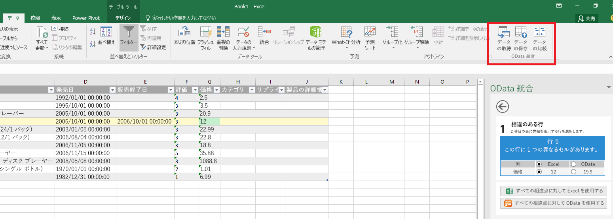
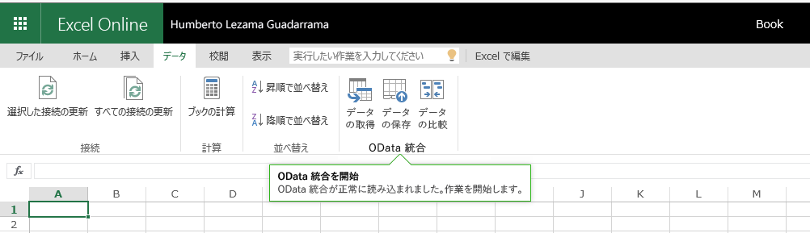

# Excel、Word および PowerPoint のアドイン コマンド

アドイン コマンドは Office UI を拡張する UI 要素であり、アドインのアクションを開始します。リボンにボタンを追加したり、コンテキスト メニューに項目を追加したりできます。ユーザーがアドイン コマンドを選択すると、JavaScript コードの実行や、作業ウィンドウでのアドインのページの表示といったアクションを開始します。アドイン コマンドにより、アドインを検索して利用できるようになり、アドインの導入と再利用性が向上し、顧客維持が向上します。

機能の概要については、ビデオ「[Office リボンのアドイン コマンド](https://channel9.msdn.com/events/Build/2016/P551)」を参照してください。

>**注:**SharePoint カタログは、アドイン コマンドをサポートしません。[集中展開](https://support.office.com/en-ie/article/Deploy-Office-Add-ins-in-the-Office-365-new-Admin-Center-737e8c86-be63-44d7-bf02-492fa7cd9c3f?ui=en-US&rs=en-IE&ad=IE) または [Office ストア](https://msdn.microsoft.com/en-us/library/jj220033.aspx) でアドイン コマンドを展開するか、または [サイドロード](https://dev.office.com/docs/add-ins/testing/create-a-network-shared-folder-catalog-for-task-pane-and-content-add-ins) を使ってテストのためのアドイン コマンドを展開できます。 

**Excel デスクトップで実行するコマンドを含むアドイン**

**Excel Online で実行するコマンドを含むアドイン**

## コマンドの機能
現在は、次のコマンド機能がサポートされています。

**拡張点**

- リボン タブ: 組み込みのタブを拡張するか、新しいカスタム タブを作成します。
- コンテキスト メニュー: 選択されたコンテキスト メニューを拡張します。 

**コントロールの種類**

- 単純なボタン: 特定のアクションをトリガーします。
- メニュー: アクションをトリガーするボタン付きの単純なメニューのドロップダウン。

**アクション**

- ShowTaskpane: カスタムの HTML ページをロードする 1 つまたは複数のウィンドウを表示します。
- ExecuteFunction: 非表示の HTML ページをロードして、JavaScript 関数を実行します。関数内で UI を表示するには (エラー、進行状況、追加入力など)、[displayDialog](http://dev.office.com/reference/add-ins/shared/officeui) API を使用できます。  

## サポートされるプラットフォーム
現在、アドイン コマンドは次のプラットフォームでサポートされています。

- Windows デスクトップ版 Office 2016 (ビルド 16.0.6769.0000 以降)
- 個人のアカウントを使用した Office Online
- 職場/学校のアカウントを使用した Office Online (プレビュー)

その他のプラットフォームは近日公開します。

## アドイン コマンドの使用を開始する

はじめて使うのに最適なのは、**サンプル**からアドイン コマンドを使う方法です。GitHub の「[Office アドイン コマンドのサンプル](https://github.com/OfficeDev/Office-Add-in-Commands-Samples/)」を参照してください。

マニフェスト参照情報について詳しくは、「[マニフェストでアドイン コマンドを定義する](http://dev.office.com/docs/add-ins/outlook/manifests/define-add-in-commands)」をご覧ください。

