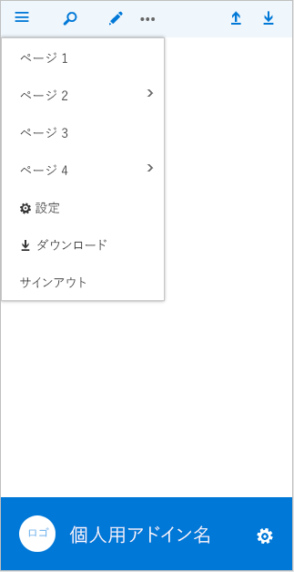
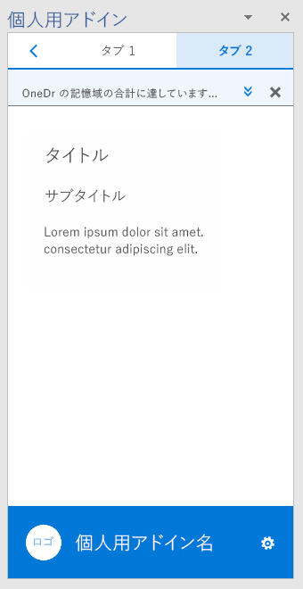

# Office アドインの UX 設計パターン テンプレート 

[Office アドインの UX 設計パターン プロジェクト](https://github.com/OfficeDev/Office-Add-in-UX-Design-Patterns-Code "Office アドインの UX 設計パターン プロジェクト")には、アドインの UX を作成できる HTML、JavaScript、および CSS ファイルが含まれています。   

UX 設計パターン プロジェクトは、次に使用できます。

* よくある顧客のシナリオにソリューションとして適用する。
* 設計のベスト プラクティスとして適用する。
* [Office UI Fabric](https://dev.office.com/fabric/getting-started/) のコンポーネントとスタイルを組み込む。
* Office の既定の UI に視覚的に溶け込むアドインをビルドする。  

## UX 設計パターンの使用

[UX デザイナー仕様](https://github.com/OfficeDev/Office-Add-in-Design-Patterns/blob/master/Patterns/Source%20Files)を独自の UX 設計を作成する際のガイドとして使用することも、[ソース コード](https://github.com/OfficeDev/Office-Add-in-UX-Design-Patterns-Code/tree/master/templates)をプロジェクトに直接追加することもできます。

この仕様を使用して、独自のアドイン UI に模擬表示をビルドするには、次を実行します。

1. [UX 設計パターン](https://github.com/OfficeDev/Office-Add-in-UX-Design-Patterns)をダウンロードします。
2. [Word](https://github.com/OfficeDev/Office-Add-in-UX-Design-Patterns/blob/master/Helpful%20Templates/AddIn_Template_Word_Desktop_reference.pdf)、[Excel](https://github.com/OfficeDev/Office-Add-in-UX-Design-Patterns/blob/master/Helpful%20Templates/AddIn_Template_Excel_Desktop_reference.pdf)、または [PowerPoint](https://github.com/OfficeDev/Office-Add-in-UX-Design-Patterns/blob/master/Helpful%20Templates/AddIn_Template_PowerPoint_Desktop_reference.pdf) テンプレートを使用して、デスクトップまたはタブレット用に拡張点を模擬表示します。
3. [ux 設計パターン](https://github.com/OfficeDev/Office-Add-in-UX-Design-Patterns/tree/master/Patterns)をコピーして、固有のニーズに合うよう変更します。
4. [Office UI Fabric アイコン マスター シート](https://github.com/OfficeDev/Office-Add-in-UX-Design-Patterns/blob/master/Helpful%20Templates/OfficeUIFabric_icon_mastersheet.pdf)を確認するためにテンプレートを表示し、Word、Excel、および PowerPoint の拡張点 (たとえば、[Excel iPad](https://github.com/OfficeDev/Office-Add-in-UX-Design-Patterns/blob/master/Helpful%20Templates/AddIn_Template_Excel_iPad_reference.pdf) と [Excel Windows Desktop](https://github.com/OfficeDev/Office-Add-in-UX-Design-Patterns/blob/master/Helpful%20Templates/AddIn_Template_Excel_Desktop_reference.pdf)) を参照するか、[アドイン コマンド用のアイコンを完了します](https://github.com/OfficeDev/Office-Add-in-UX-Design-Patterns/blob/master/Helpful%20Templates/Icon_production.pdf)。

ソース コードを追加するには、次のようにします。

1. [Office アドインの UX 設計パターン プロジェクト リポジトリ](https://github.com/OfficeDev/Office-Add-in-UX-Design-Patterns-Code "Office アドインの UX 設計パターン プロジェクト")を複製します。 
2. [資産フォルダー](https://github.com/OfficeDev/Office-Add-in-UX-Design-Pattern-Code/tree/master/assets)と、アドイン プロジェクトに対して選ぶ個々のパターンのコード フォルダーをコピーします。  
3. 個々のパターンをアドインに組み込みます。たとえば次のようにします。
    - マニフェスト内で、ソースの場所またはアドイン コマンドの URL を編集します。
    - 他のページのテンプレートとして、UX 設計パターンを使用します。
    - UX 設計パターンとの間にリンクを設定します。

## UX 設計パターンの種類
### 汎用ページ

汎用ページ テンプレートは、アドインの任意のページに適用でき、特定の目的を持ちません。 特定の目的を持つページの例は、すべての初回実行時のパターンです。 使用可能な汎用ページの一覧は、以下のとおりです。

* **ランディング ページ**: 初回実行時またはサインイン時にユーザーに対して表示される標準のアドイン ページです。 
    * [ランディング ページの仕様](https://github.com/OfficeDev/Office-Add-in-Design-Patterns/blob/master/Helpful%20Templates/AddIn_Template_Standard_Layout.pdf "PDF")
    * [ランディング ページのコード](https://github.com/OfficeDev/Office-Add-in-UX-Design-Patterns-Code/tree/master/templates/generic/landing-page)
* **ブランド バーのブランド イメージ**: フッターに自分のブランドを表す画像を付加されたランディング ページです。 
    * [ブランド バーの仕様](https://github.com/OfficeDev/Office-Add-in-UX-Design-Patterns/blob/master/Patterns/Brand_Bar.md)
    * [ブランド バーのコード](https://github.com/OfficeDev/Office-Add-in-UX-Design-Patterns-Code/tree/master/templates/generic/brand-bar)

<table>
 <tr><th>ランディング</th><th>ブランド バー</th></tr>
 <tr><td></td>
<td></td></tr>
 </table>
 
### 初回実行時エクスペリエンス

初回実行時エクスペリエンスとは、ユーザーが最初にアドインを開いたときのエクスペリエンスです。 初回実行時の設計パターン テンプレートは、以下のとおりです。 

* **開始手順**: アドインの使用を開始する手順の、順序付きリストをユーザーに提供します。 
    * [開始手順の仕様](https://github.com/OfficeDev/Office-Add-in-Design-Patterns/blob/master/Patterns/FirstRun_StepsToStart.md)
    * [開始手順のコード](https://github.com/OfficeDev/Office-Add-in-UX-Design-Patterns-Code/tree/master/templates/first-run/instruction-step)
* **価値**: アドインの価値提供を明確にします。
    * [価値の仕様](https://github.com/OfficeDev/Office-Add-in-Design-Patterns/blob/master/Patterns/FirstRun_ValuePlacemat.md)
    * [価値のコード](https://github.com/OfficeDev/Office-Add-in-UX-Design-Patterns-Code/tree/master/templates/first-run/value-placemat)
* **ビデオ**: アドインの使用を開始する前に、ユーザーにビデオを表示します。
    * [ビデオの仕様](https://github.com/OfficeDev/Office-Add-in-Design-Patterns/blob/master/Patterns/FirstRun_VideoPlacemat.md)
    * [ビデオのコード](https://github.com/OfficeDev/Office-Add-in-UX-Design-Patterns-Code/tree/master/templates/first-run/video-placemat)
* **チュートリアル**: アドインの使用を開始する前に、ユーザーに一連の機能または情報を体験させます。
    * [チュートリアルの仕様](https://github.com/OfficeDev/Office-Add-in-Design-Patterns/blob/master/Patterns/FirstRun_PagingPanel.md)
    * [チュートリアルのコード](https://github.com/OfficeDev/Office-Add-in-UX-Design-Patterns-Code/tree/master/templates/first-run/walkthrough)


  [Office ストア](https://msdn.microsoft.com/en-us/library/office/jj220033.aspx)には、アドインの試用版を管理するシステムが存在しますが、アドインの試用版エクスペリエンスの UI を自分で管理したい場合は、次のパターンを使用します。

* **試用**: アドインの試用版で開始する方法をユーザーに示します。
    * [試用の仕様](https://github.com/OfficeDev/Office-Add-in-Design-Patterns/blob/master/Patterns/FirstRun_TrialVersion.md)
    * [試用のコード](https://github.com/OfficeDev/Office-Add-in-UX-Design-Patterns-Code/tree/master/templates/first-run/trial-placemat)
* **試用版の機能**: ユーザーが試用を考えている機能がアドインの試用版では使用できないことをユーザーに示します。 または、無料のアドインにサブスクリプションを必要とする機能も含まれる場合は、このパターンの使用を検討します。 このパターンでは、試用期間の終了後にダウングレードしたエクスペリエンスを提供することもできます。
    * [試用版の機能の仕様](https://github.com/OfficeDev/Office-Add-in-UX-Design-Patterns/blob/master/Patterns/FirstRun_TrialFeature.md)
    * [試用版の機能のコード](https://github.com/OfficeDev/Office-Add-in-UX-Design-Patterns-Code/tree/master/templates/first-run/trial-placemat-feature)

> **重要:**自分で試用版を管理し、試用版を管理するために Office ストアを使用しないと決定した場合、販売者ダッシュボードのテスト用メモに **[追加購入が必要になる場合があります]** タグを必ず組み込んでください。

ユーザーに初回実行時エクスペリエンスを 1 回示すか、何回も示すかを検討することがシナリオにとって重要かどうかを検討します。 たとえば、ユーザーがアドインを定期的に使用する場合は、使用方法を忘れる可能性があるため、初回実行エクスペリエンスを複数回確認できた方がよいでしょう。 

 <table>
 <tr><th>開始手順</th><th>値</th><th>ビデオ</th></tr>
 <tr>
<td></td>
<td></td>
<td></td></tr>
 </table>

 <table>
 <tr><th>チュートリアルの最初のページ</th><th>試用</th><th>試用版の機能</th></tr>
 <tr>
<td></td>
<td></td>
<td></td></tr>
 </table> 

### ナビゲーション

ユーザーは、アドインの別のページ間を移動する必要があります。 次のナビゲーション テンプレートには、アドインのページおよびコマンドの整理に使用できるさまざまなオプションがあります。

* **[戻る] ボタンと [次のページ]**: [戻る] ボタンと [次のページ] がある作業ウィンドウを表示します。 ユーザーが順序のある一連の手順に従えるようにするには、このパターンを使用します。
    * [[戻る] ボタンと [次のページ] の仕様](https://github.com/OfficeDev/Office-Add-in-UX-Design-Patterns/blob/master/Patterns/Back_Button.md)
    * [[戻る] ボタンと [次のページ] のコード](https://github.com/OfficeDev/Office-Add-in-UX-Design-Patterns-Code/tree/master/templates/navigation/back-button) 
* **ナビゲーション**: 作業ウィンドウにページのメニュー項目がある、一般にハンバーガー メニューと呼ばれるメニューを表示します。 
    * [ナビゲーションの仕様](https://github.com/OfficeDev/Office-Add-in-UX-Design-Patterns/blob/master/Patterns/Navigation.md)
    * [ナビゲーションのコード](https://github.com/OfficeDev/Office-Add-in-UX-Design-Patterns-Code/tree/master/templates/navigation/navigation) 
* **コマンド付きナビゲーション**: 作業ウィンドウにコマンド (またはアクション) ボタンが付いたハンバーガー メニューを表示します。 ナビゲーションにコマンド オプションも必要な場合は、このパターンを使用します。  
    * [コマンド付きナビゲーションの仕様](https://github.com/OfficeDev/Office-Add-in-UX-Design-Patterns/blob/master/Patterns/Navigation_%26_Commands.md)
    * [コマンド付きナビゲーションのコード](https://github.com/OfficeDev/Office-Add-in-UX-Design-Patterns-Code/tree/master/templates/navigation/navigation-commands)
* **ピボット**: 作業ウィンドウにピボットでのナビゲーションを表示します。 ピボット ナビゲーションを使用すると、ユーザーは異なるコンテンツ間を移動できます。
    * [ピボットの仕様](https://github.com/OfficeDev/Office-Add-in-UX-Design-Patterns/blob/master/Patterns/Pivot.md)
    * [ピボットのコード](https://github.com/OfficeDev/Office-Add-in-UX-Design-Patterns-Code/tree/master/templates/navigation/pivot)
* **タブ バー**: テキストとアイコンが縦に並んだボタンが使用されたナビゲーションを表示します。 タブ バーを使用すると、短くてわかりやすいタイトルのタブが使用されたナビゲーションを表示できます。
    * [タブ バーの仕様](https://github.com/OfficeDev/Office-Add-in-UX-Design-Patterns/blob/master/Patterns/Tab_Bar.md)
    * [タブ バーのコード](https://github.com/OfficeDev/Office-Add-in-UX-Design-Patterns-Code/tree/master/templates/navigation/tab-bar) 

<table>
<tr><th>[戻る] ボタン</th><th>ナビゲーション</th><th>コマンド付きナビゲーション</th></tr>
<tr>
    <td>
        
    </td>
    <td>
        
    </td>
    <td>
        
    </td>
</tr>
 </table>

<table>
<tr><th>ピボット</th><th>タブ バー</th></tr>
<tr><td></td>
<td></td>
</tr>
 </table>

### 通知

アドインでは、ユーザーにさまざまな方法で、エラーなどのイベントや進捗状況を通知できます。 使用可能な通知テンプレートは次のとおりです。 

* **埋め込みダイアログ ボックス**: ボタンまたはその他のコントロールを使用して、情報や必要に応じて対話型エクスペリエンスを提供するダイアログ ボックスを作業ウィンドウ内に表示します。 いずれか 1 つを使用して、ユーザーにアクションの確認を促すことを検討します。 ユーザー エクスペリエンスを作業ウィンドウに維持したい場合は、埋め込みダイアログ パターンを使用します。
    * [埋め込みダイアログ ボックスの仕様](https://github.com/OfficeDev/Office-Add-in-Design-Patterns/blob/master/Patterns/Embedded_Dialog.md)
    * [埋め込みダイアログ ボックスのコード](https://github.com/OfficeDev/Office-Add-in-UX-Design-Patterns-Code/tree/master/templates/notifications/embedded-dialog)
* **インライン メッセージ**: エラー、成功、情報を示します。メッセージは作業ウィンドウ内の指定した場所に表示できます。 たとえば、ユーザーがテキスト ボックスに不適切な書式の電子メール アドレスを入力すると、テキスト ボックスの真下にエラー メッセージが表示されます。 
    * [インライン メッセージの仕様](https://github.com/OfficeDev/Office-Add-in-Design-Patterns/blob/master/Patterns/Notification_Inline_Message.md)
    * [インライン メッセージのコード](https://github.com/OfficeDev/Office-Add-in-UX-Design-Patterns-Code/tree/master/templates/notifications/inline-message)
* **メッセージ バナー**: 情報や必要に応じてアクションの単純な呼び出しを、単一の行に折りたたんだり、複数の行に展開したり、非表示にできるバナーで提供します。 メッセージ バナーは、サービスの更新またはアドインを開始するときに役に立つヒントの報告に使用します。 
    * [メッセージ バナーの仕様](https://github.com/OfficeDev/Office-Add-in-UX-Design-Patterns/blob/master/Patterns/Notification_MessageBanner.md)
    * [メッセージ バナーのコード](https://github.com/OfficeDev/Office-Add-in-UX-Design-Patterns-Code/tree/master/templates/notifications/message-banner)
* **進行状況バー**: ユーザーが以降のアクションを行う前に完了する必要がある、実行時間の長い、同期プロセス (構成タスクなど) の進行状況を示します。 これは別のスポット ページであり、アドインのブランド化を強化します。 進行状況バーは、アドインに戻るまでの定期的な評価をプロセスが送信する際に使用します。
    * [進行状況バーの仕様](https://github.com/OfficeDev/Office-Add-in-UX-Design-Patterns/blob/master/Patterns/Notification_Progress.md)
    * [進行状況バーのコード](https://github.com/OfficeDev/Office-Add-in-UX-Design-Patterns-Code/tree/master/templates/notifications/progress-bar)
* **スピナー**: 実行時間の長い、同期プロセスが進行中だが、どの程度進んでいるのかは提示されていないことを示します。 これは別のスポット ページであり、アドインのブランド化を強化します。 スピナーは、プロセスがどの程度進んでいるかをアドインが確実に知ることができない場合に使用します。 
    * [スピナーの仕様](https://github.com/OfficeDev/Office-Add-in-UX-Design-Patterns/blob/master/Patterns/Notification_Progress.md)
    * [スピナーのコード](https://github.com/OfficeDev/Office-Add-in-UX-Design-Patterns-Code/tree/master/templates/notifications/spinner)
* **トースト**: 数秒で消える簡単なメッセージを提供します。 ユーザーがメッセージに気づかない場合があるため、トーストは重要ではない情報にのみ使用します。 これは、電子メールの受信など、リモート システムでユーザーにイベントを通知する場合に優れた選択になります。
    * [トーストの仕様](https://github.com/OfficeDev/Office-Add-in-UX-Design-Patterns/blob/master/Patterns/Notification_Toast.md)
    * [トーストのコード](https://github.com/OfficeDev/Office-Add-in-UX-Design-Patterns-Code/tree/master/templates/notifications/toast)

 <table>
 <tr><th>埋め込みのダイアログ</th><th>インライン メッセージ</th><th>メッセージ バナー</th></tr>
 <tr><td></td>
<td></td>
<td></td></tr>
 </table>

 <table>
 <tr><th>進行状況バー</th><th>スピナー</th><th>トースト</th></tr>
 <tr><td></td>
<td></td>
<td></td></tr>
 </table>
 

### 一般的なコンポーネント

以下に、さまざまなシナリオで使用できるアドイン用の一般的なコンポーネントを示します。  

#### クライアント ダイアログ ボックス

クライアント ダイアログ ボックスは、ユーザーが作業ウィンドウ外でアドインを操作できる別の方法を提供します。 使用可能なダイアログ ボックス テンプレートは次のとおりです。

* **Typeramp ダイアログ ボックス**: テキスト コンテンツを含むダイアログ ボックスを表示します。 Typeramp ダイアログを使用すると、ユーザーに詳細な情報を表示できます。 
    * [Typeramp ダイアログ ボックスの仕様](https://github.com/OfficeDev/Office-Add-in-UX-Design-Patterns/blob/master/Patterns/Client_Dialog.md)
    * [Typeramp ダイアログ ボックスのコード](https://github.com/OfficeDev/Office-Add-in-UX-Design-Patterns-Code/tree/master/templates/dialog/typeramp)
* **警告ダイアログ ボックス**: ユーザーへのエラーや通知などの重要な情報を含む警告ボックスを表示します。  
    * [警告ダイアログ ボックスの仕様](https://github.com/OfficeDev/Office-Add-in-UX-Design-Patterns/blob/master/Patterns/Client_Dialog.md)
    * [警告ダイアログ ボックスのコード](https://github.com/OfficeDev/Office-Add-in-UX-Design-Patterns-Code/tree/master/templates/dialog/alert)
* **ナビゲーション ダイアログ ボックス**: ナビゲーションを含むダイアログ ボックスを表示します。 ナビゲーション ダイアログ ボックスを使用すると、ユーザーは異なるコンテンツ間を移動できます。 
    * [ナビゲーション ダイアログ ボックスの仕様](https://github.com/OfficeDev/Office-Add-in-UX-Design-Patterns/blob/master/Patterns/Client_Dialog.md)
    * [ナビゲーション ダイアログ ボックスのコード](https://github.com/OfficeDev/Office-Add-in-UX-Design-Patterns-Code/tree/master/templates/dialog/navigation)

<table>
 <tr><th>Typeramp ダイアログ</th><th>警告ダイアログ</th></tr>
<tr>
<td></td>
<td></td>
</tr></tr>
 </table>
 
 <table>
 <tr><th>ナビゲーション ダイアログ</th></tr>
<tr><td></td></tr>
</tr>
 </table>

#### フィードバックおよび評価

アドインがより目に入ったり、またそれを導入しやすくするには、Office ストアでユーザーがアドインを評価およびレビューできる機能を提供するとよいでしょう。 このパターンには、アドインからフィードバックおよび評価を提示できる次の 2 つの方法があります。

- ユーザー側からのフィードバック: ([**フィードバックの送信**] リンクなどの) ナビゲーション メニューまたはフッターのアイコンを使用し、ユーザーがフィードバックの送信を選択します。
- システム側からのフィードバック: アドインが 3 回実行された後、メッセージ バナーを介してフィードバックを行うようユーザーが促されます。

いずれの方法でも、Office ストアのアドイン用のページを含むダイアログ ボックスが開きます。

* [フィードバックおよび評価の仕様](https://github.com/OfficeDev/Office-Add-in-UX-Design-Patterns/blob/master/Patterns/Notification_Feedback.md)
* [フィードバックおよび評価のコード](https://github.com/OfficeDev/Office-Add-in-UX-Design-Patterns-Code/tree/master/templates/feedback/office-store)

>**重要:**このパターンは、現在、Office ストア ホーム ページを指しています。 この URL は、Office ストアのご自分のアドインのページの URL に更新するようにしてください。

 <table>
 <tr><th>フィードバックおよび評価</th></tr>
<tr><td></td></tr>
</tr>
 </table>

#### 設定およびプライバシー

アドインには、アドインの動作をユーザーが制御する設定を構成できる設定ページが必要な場合もあります。 また、ご自分のアドインが準拠しているプライバシー ポリシーをユーザーに提供したい場合もあるでしょう。 

* **設定**: アドインの動作を制御する構成コンポーネントがある作業ウィンドウを表示します。 設定ページには、ユーザーが選択可能なオプションがあります。
    * [設定の仕様](https://github.com/OfficeDev/Office-Add-in-UX-Design-Patterns/blob/master/Patterns/Settings.md)
    * [設定のコード](https://github.com/OfficeDev/Office-Add-in-UX-Design-Patterns-Code/tree/master/templates/settings)
* **プライバシー ポリシー**: プライバシー ポリシーに関する重要な情報が含まれる作業ウィンドウを表示します。 
    * [プライバシー ポリシーの仕様](https://github.com/OfficeDev/Office-Add-in-UX-Design-Patterns/blob/master/Patterns/Settings.md)
    * [プライバシー ポリシーのコード](https://github.com/OfficeDev/Office-Add-in-UX-Design-Patterns-Code/tree/master/templates/settings)

<table>
 <tr><th>設定</th><th>プライバシー ポリシー</th></tr>
<tr>
<td></td>
<td></td>
</tr></tr>
 </table>

## その他のリソース

* [Office アドイン開発のベスト プラクティス](https://dev.office.com/docs/add-ins/overview/add-in-development-best-practices)
* [Office UI Fabric](http://dev.office.com/fabric/)
