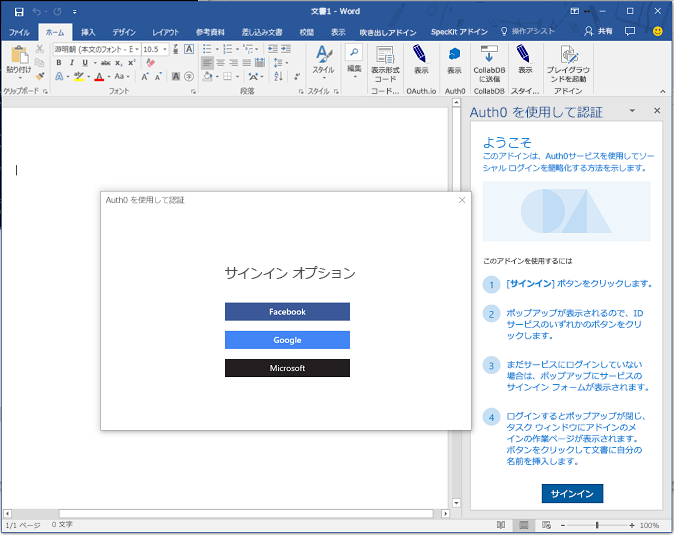
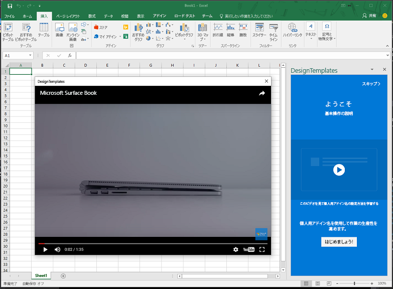

# <a name="use-the-dialog-api-in-your-office-add-ins"></a>Office アドインでダイアログ API を使用する 

[ダイアログ API](../../reference/shared/officeui.md) を使用して、Office アドインでダイアログ ボックスを開くことができます。この記事では、Office アドインでダイアログ API を使用するためのガイダンスを提供します。

> **注:**ダイアログ API の現在のサポート状態に関する詳細は、「[ダイアログ API の要件セット](../../reference/requirement-sets/dialog-api-requirement-sets.md)」を参照してください。現在、ダイアログ API は Word、Excel、PowerPoint、および Outlook でサポートされています。

作業ウィンドウ、コンテンツ アドイン、または[アドイン コマンド](https://dev.office.com/docs/add-ins/design/add-in-commands)からダイアログ ボックスを開いて、次の操作を実行できます。 

- 作業ウィンドウで直接開くことができないサインイン ページを表示する。
- アドインの作業用に画面領域 (全画面表示であっても) を広げる。
- ビデオが作業ウィンドウに限定されている場合に、小さすぎるビデオをホストする。

>**注:**UI が重なっていると使い勝手が悪いため、シナリオで必要な場合を除き、ダイアログ ボックスが作業ウィンドウから開かないようにします。作業ウィンドウのセキュリティを使用する方法を検討するときは、作業ウィンドウをタブ表示できるようにすることを考慮してください。例については、[Excel アドイン JavaScriptSalesTracker](https://github.com/OfficeDev/Excel-Add-in-JavaScript-SalesTracker) のサンプルを参照してください。

次の画像は、ダイアログ ボックスの例を示します。 



ダイアログ ボックスが常に画面の中央に開くことに注意してください。ユーザーはダイアログ ボックスの移動とサイズ変更ができます。ウィンドウは*モードレス*です。ホスト Office アプリケーションのドキュメントの操作と、作業ウィンドウのホスト ページ (存在する場合) の操作の両方を続行できます。

## <a name="dialog-api-scenarios"></a>ダイアログ API のシナリオ

Office JavaScript API は、[Dialog](../../reference/shared/officeui.dialog.md) オブジェクトと [Office.context.ui 名前空間](../../reference/shared/officeui.md)の 2 つの関数を使用する次のシナリオをサポートしています。 

### <a name="opening-a-dialog-box"></a>ダイアログ ボックスを開く

ダイアログ ボックスを開くには、作業ウィンドウのコードで [displayDialogAsync](../../reference/shared/officeui.displaydialogasync.md) メソッドを呼び出して、開かれるページの URL に渡します。次に簡単な例を示します。

```js
Office.context.ui.displayDialogAsync('https://myAddinDomain/myDialog.html'); 
```

> **メモ:**

> - URL には HTTP**S** プロトコルを使用します。これは、読み込まれる最初のページだけでなく、ダイアログ ボックスに読み込まれるすべてのページに対して必須です。
> - ドメインはホスト ページのドメインと同じです。ホスト ページは、作業ウィンドウ内のページまたはアドイン コマンドの[関数ファイル](https://dev.office.com/reference/add-ins/manifest/functionfile)にすることができます。これはダイアログ ボックスに読み込まれる最初のページでは必須ではありません。ただし、最初のページがアドインの同じドメイン上にない場合は、アドイン マニフェストの [`<AppDomains>`](../../reference/manifest/appdomains.md) 要素でそのドメインを一覧表示する必要があります。

最初のページが読み込まれると、ユーザーは HTTPS を使用する任意の Web サイトに移動できます。また、すぐに別のサイトにリダイレクトするように最初のページを設計することもできます。 

既定では、ダイアログ ボックスのサイズはデバイス画面の高さと幅の 80% ですが、次の例に示すように、メソッドに構成オブジェクトを渡すことによってさまざまな割合を設定できます。

```js
Office.context.ui.displayDialogAsync('https://myDomain/myDialog.html', {height: 30, width: 20}); 
```

これを実行するサンプル アドインについては、「[Office アドイン ダイアログ API の例](https://github.com/OfficeDev/Office-Add-in-Dialog-API-Simple-Example)」を参照してください。

全画面表示で効率的に操作するには、両方の値を 100% に設定します。(最大有効値は 99.5% であり、最大有効値にしても、ウィンドウは移動とサイズ変更が可能です。)

>**注:**ホスト ウィンドウから開くことができるのは、1 つのダイアログ ボックスのみです。別のダイアログ ボックスを開こうとすると、エラーが発生します。(詳細については、「[displayDialogAsync のエラー](#errors-from-displaydialogAsync)」を参照してください。)このため、たとえばユーザーが作業ウィンドウからダイアログ ボックスを開いた場合には、作業ウィンドウの別のページから 2 番目のダイアログ ボックスを開くことができません。ただし、[アドイン コマンド](https://dev.office.com/docs/add-ins/design/add-in-commands)からダイアログ ボックスを開く場合は、選択するたびにコマンドによって新しい (ただし非表示) HTML ファイルが開かれます。これにより、新しい (非表示) ホスト ウィンドウが作成されるため、これらの各ウィンドウは独自のダイアログ ボックスを起動できます。 

### <a name="sending-information-from-the-dialog-box-to-the-host-page"></a>情報をダイアログ ボックスからホスト ページに送信する

ダイアログ ボックスは、以下の場合を除いて、作業ウィンドウのホスト ページと通信できません。

- ダイアログ ボックスの現在のページがホスト ページと同じドメインにある。
- Office JavaScript ライブラリがページに読み込まれている。(Office JavaScript ライブラリを使用するすべてのページと同様に、ページのスクリプトは `Office.initialize` プロパティにメソッドを割り当てる必要があります (空のメソッドでもかまいません)。詳細については、「[アドインの初期化](http://dev.office.com/docs/add-ins/develop/understanding-the-javascript-api-for-office#initializing-your-add-in)」を参照してください。) 

ダイアログ ページのコードは、`messageParent` 関数を使用して、ブール値または文字列メッセージのいずれかをホスト ページに送信します。文字列には、単語、文、XML BLOB、文字列に変換された JSON、または文字列にシリアル化できるすべてのものを指定できます。次に例を示します。

```js
if (loginSuccess) {
    Office.context.ui.messageParent(true); 
}
```

>**メモ:** 

> - `messageParent` 関数は、ダイアログ ボックスで呼び出すことができる*たった* 2 つの Office API のうちの 1 つです。(もう 1 つは `Office.context.requirements.isSetSupported` です。詳しくは、「[Office のホストと API の要件を指定する](https://github.com/OfficeDev/office-js-docs/blob/master/docs/overview/specify-office-hosts-and-api-requirements.md)」を参照してださい。
> - `messageParent` 関数を呼び出せるのは、ホスト ページと同じドメイン (プロトコルとポートを含む) を持つページ上のみです。

次の例では、`googleProfile` は文字列に変換されたバージョンのユーザーの Google プロファイルです。

```js
if (loginSuccess) {
    Office.context.ui.messageParent(googleProfile); 
}
```

ホスト ページは、メッセージを受信するように構成する必要があります。これを構成するには、`displayDialogAsync` の元の呼び出しにコールバック パラメーターを追加します。コールバックはハンドラーを `DialogMessageReceived` イベントに割り当てます。次に例を示します。このコードについては、以下に注意してください。

- Office は [AsyncResult](https://dev.office.com/reference/add-ins/shared/asyncresult) オブジェクトをコールバックに渡します。Office はダイアログ ボックスを開こうとした結果を表します。ただし、ダイアログ ボックスでのイベントの結果は表しません。この違いの詳細については、「[エラーとイベントの処理](#handling-errors-and-events)」セクションを参照してください。 
- `asyncResult` の `value` プロパティは [Dialog](https://dev.office.com/reference/add-ins/shared/officeui.dialog) オブジェクトに設置されます。このオブジェクトはダイアログ ボックスの実行コンテキストではなく、ホスト ページに存在します。
- `processMessage` はイベントを処理する関数です。任意の名前を指定できます。 
- `dialog` 変数は、`processMessage` でも参照されるため、コールバックよりも広い範囲で宣言されます。

```js
var dialog;
Office.context.ui.displayDialogAsync('https://myDomain/myDialog.html', {height: 30, width: 20},
    function (asyncResult) {
        dialog = asyncResult.value;
        dialog.addEventHandler(Office.EventType.DialogMessageReceived, processMessage);
    }
); 
```

`DialogMessageReceived` イベントのハンドラーの簡単な例を次に示します。このコードについては、以下に注意してください。

- Office は `arg` オブジェクトをハンドラーに渡します。その `message` プロパティは、ダイアログの `messageParent` の呼び出しで送信されるブール値または文字列です。この例では、Microsoft アカウントまたは Google などのサービスからのユーザーのプロファイルの文字列に変換された表記です。このため、`JSON.parse` を含むオブジェクトに逆シリアル化されます。
- `showUserName` 実装は表示されません。作業ウィンドウ上に個人用のウェルカム メッセージが表示される場合があります。

```js
function processMessage(arg) {
    var messageFromDialog = JSON.parse(arg.message);
    showUserName(messageFromDialog.name);
}
```

ダイアログ ボックスのユーザー操作が完了すると、次の例に示すようにメッセージ ハンドラーはダイアログ ボックスを閉じます。このコードについては、以下に注意してください。

- `dialog` オブジェクトは `displayDialogAsync` の呼び出しによって返されるものと同じである必要があります。 
- `dialog.close` の呼び出しは、直ちにダイアログ ボックスを閉じるよう Office に指示します。

```js
function processMessage(arg) {
    dialog.close();
    // message processing code goes here;
}
```

これらの手法を使用するサンプル アドインについては、「[Office アドイン ダイアログ API の例](https://github.com/OfficeDev/Office-Add-in-Dialog-API-Simple-Example)」を参照してください。

メッセージを受信した後、アドインで作業ウィンドウの別のページを開く必要がある場合は、ハンドラーの最後の行として `window.location.replace` メソッド (または `window.location.href`) を使用できます。次に例を示します。

```js
function processMessage(arg) {
    // message processing code goes here;
    window.location.replace("/newPage.html");
    // Alternatively ...
    // window.location.href = "/newPage.html";
}
```

これを実行するアドインの例については、「[PowerPoint アドインで Microsoft Graph を使用した Excel グラフの挿入](https://github.com/OfficeDev/PowerPoint-Add-in-Microsoft-Graph-ASPNET-InsertChart)」のサンプルを参照してください。 

#### <a name="conditional-messaging"></a>条件付きのメッセージング

ダイアログ ボックスから複数の `messageParent` 呼び出しを送信できますが、`DialogMessageReceived` イベントのホスト ページにあるハンドラーは 1 つのみのため、ハンドラーは条件ロジックを使用してさまざまなメッセージを区別する必要があります。たとえば、ユーザーに対して Microsoft アカウントまたは Google などの ID プロバイダーにサインインするよう求めるダイアログ ボックスが表示されると、ダイアログ ボックスはユーザーのプロファイルをメッセージとして送信します。認証が失敗した場合、次の例のように、ダイアログ ボックスはホスト ページにエラー情報を送信します。このコードについては、以下に注意してください。

- `loginSuccess` 変数は、ID プロバイダーからの HTTP 応答を読み取ることによって初期化されます。
- `getProfile` 関数と `getError` 関数の実装は表示されません。両方の関数はそれぞれ、クエリ パラメーターまたは HTTP 応答の本文からデータを取得します。
- サインインが成功したかどうかに応じて、さまざまな種類の匿名のオブジェクトが送信されます。両方の関数に `messageType` プロパティがありますが、一方には `profile` プロパティ、もう一方には `error` プロパティがあります。

```js
if (loginSuccess) {
    var userProfile = getProfile();
    var messageObject = {messageType: "signinSuccess", profile: userProfile};            
    var jsonMessage = JSON.stringify(messageObject);
    Office.context.ui.messageParent(jsonMessage); 
} else {
    var errorDetails = getError();
    var messageObject = {messageType: "signinFailure", error: errorDetails};            
    var jsonMessage = JSON.stringify(messageObject);
    Office.context.ui.messageParent(jsonMessage); 
}
```

条件付きメッセージを使用するサンプルについては、次を参照してください。 

- [Auth0 サービスを使用してソーシャル ログインを簡略化する Office アドイン](https://github.com/OfficeDev/Office-Add-in-Auth0)
- [OAuth.io サービスを使用して大手のオンライン サービスへのアクセスを簡素化する Office アドイン](https://github.com/OfficeDev/Office-Add-in-OAuth.io)

次の例に示すように、ホスト ページのハンドラー コードは分岐に `messageType` プロパティの値を使用します。`showUserName` 関数は上記の例と同じであり、`showNotification` 関数はホスト ページの UI にエラーを表示することに注意してください。 

```js
function processMessage(arg) {
    var messageFromDialog = JSON.parse(arg.message);
    if (messageFromDialog.messageType === "signinSuccess") {
        dialog.close();
        showUserName(messageFromDialog.profile.name);
        window.location.replace("/newPage.html");
    } else {
        dialog.close();
        showNotification("Unable to authenticate user: " + messageFromDialog.error);
    }
}
```

### <a name="closing-the-dialog-box"></a>ダイアログ ボックスを閉じる

ダイアログ ボックスを閉じるボタンをダイアログ ボックス内に実装できます。これを実行するには、ボタンのクリック イベント ハンドラーは `messageParent` を使用して、ボタンがクリックされたことをホスト ページに通知する必要があります。次に例を示します。

```js
function closeButtonClick() {
    var messageObject = {messageType: "dialogClosed"};            
    var jsonMessage = JSON.stringify(messageObject);
    Office.context.ui.messageParent(jsonMessage); 
}
``` 

`DialogMessageReceived` のホスト ページ ハンドラーは、この例のように `dialog.close` を呼び出します。(ダイアログ オブジェクトを初期化する方法を示すこの記事で前述の例を参照してください。)


```js
function processMessage(arg) {
    var messageFromDialog = JSON.parse(arg.message);
    if (messageFromDialog.messageType === "dialogClosed") {
       dialog.close();
    }
}
```

この手法を使用するサンプルについては、「[Office アドインの UX 設計パターン](https://github.com/OfficeDev/Office-Add-in-UX-Design-Patterns-Code)」リポジトリの[ダイアログ ナビゲーション設計パターン](https://github.com/OfficeDev/Office-Add-in-UX-Design-Patterns-Code/tree/master/templates/dialog/navigation)を参照してください。

独自の終了ダイアログ UI がない場合でも、エンド ユーザーは右上隅にある **X** を選択してダイアログ ボックスを閉じることができます。この操作により `DialogEventReceived` イベントがトリガーされます。イベントがトリガーされたときに、ホスト ウィンドウに通知する必要がある場合、ホスト ウィンドウはこのイベントのハンドラーを宣言する必要があります。詳細については、「[ダイアログ ウィンドウでのエラーとイベント](#errors-and-events-in-the-dialog-window)」セクションを参照してください。

## <a name="handling-errors-and-events"></a>エラーとイベントの処理 

コードでイベントの 2 つのカテゴリを処理する必要があります。

- ダイアログ ボックスを作成できないために `displayDialogAsync` の呼び出しによって返されるエラー。 
- ダイアログ ウィンドウでのエラーと他のイベント。

### <a name="errors-from-displaydialogasync"></a>displayDialogAsync のエラー

一般的なプラットフォームやシステムのエラーの他に、`displayDialogAsync` の呼び出しに特有の次のエラーがあります。

|コード番号|意味|
|:-----|:-----|
|12004|`displayDialogAsync` に渡される URL のドメインは信頼されていません。ドメインは、ホスト ページと同じドメイン (プロトコルとポート番号を含む) にするか、**または**アドイン マニフェストの `<AppDomains>` セクションで登録する必要があります。|
|12005|`displayDialogAsync` に渡される URL には HTTP プロトコルを使用します。HTTPS が必要です。(Office の一部のバージョンでは、12004 で返されるのと同じエラー メッセージが 12005 でも返されます。)|
|12007|ダイアログ ボックスは、このホスト ウィンドウで既に開いています。作業ウィンドウなどのホスト ウィンドウで一度に開けるダイアログ ボックスは 1 つだけです。|

`displayDialogAsync` が呼び出されると、常に [AsyncResult](https://dev.office.com/reference/add-ins/shared/asyncresult) オブジェクトがコールバック関数に渡されます。呼び出しが成功した場合 (つまり、ダイアログ ウィンドウが開いた場合)、`AsyncResult` オブジェクトの `value` プロパティは [Dialog](https://dev.office.com/reference/add-ins/shared/officeui.dialog) オブジェクトです。この例は、「[情報をダイアログからホスト ページに送信する](#sending-information-from-the-dialog-to-the-host-page)」セクションで参照できます。`displayDialogAsync` への呼び出しが失敗した場合は、ウィンドウは作成されず、`AsyncResult` オブジェクトの `status` プロパティが "失敗" に設定され、オブジェクトの `error` プロパティが設定されます。`status` をテストして、エラーが発生したときに応答するコールバックを常に設定しておく必要があります。コード番号に関係なくエラー メッセージのみを報告する例を次に示します。 

```js
var dialog;
Office.context.ui.displayDialogAsync('https://myDomain/myDialog.html', 
function (asyncResult) {
    if (asyncResult.status === "failed") { 
        showNotification(asynceResult.error.code = ": " + asyncResult.error.message); 
    } else {
        dialog = asyncResult.value;
        dialog.addEventHandler(Office.EventType.DialogMessageReceived, processMessage);
    }
}); 
```

### <a name="errors-and-events-in-the-dialog-window"></a>ダイアログ ウィンドウでのエラーとイベント

ダイアログ ボックス内の、コード番号で知られている 3 つのエラーとイベントによって、ホスト ページで `DialogEventReceived` イベントがトリガーされます。 

|コード番号|意味|
|:-----|:-----|
|12002|以下のいずれか:<br> - `displayDialogAsync` に渡された URL にページが存在しない。<br> - `displayDialogAsync` に渡されたページが読み込まれたが、ダイアログ ボックスが見つからないか読み込むことができないページを指していたか、またはダイアログ ボックスが無効な構文を含む URL を指している。|
|12003|ダイアログ ボックスが HTTP プロトコルを使用している URL を指していました。HTTPS が必要です。|
|12006|ダイアログ ボックスが閉じられました。通常は、ユーザーが **X** ボタンを選択したためです。|

コードで、呼び出し内の `DialogEventReceived` イベントのハンドラーを `displayDialogAsync` に割り当てることができます。次に簡単な例を示します。

```js
var dialog;
Office.context.ui.displayDialogAsync('https://myDomain/myDialog.html', 
    function (result) {
        dialog = result.value;
        dialog.addEventHandler(Office.EventType.DialogEventReceived, processDialogEvent);
    }
); 
```

以下は、各エラー コードのカスタム エラー メッセージを作成する `DialogEventReceived` イベントのハンドラーの例です。 

```js
function processDialogEvent(arg) {
    switch (arg.error) {
        case 12002:
            showNotification("The dialog box has been directed to a page that it cannot find or load, or the URL syntax is invalid.");
            break;
        case 12003:
            showNotification("The dialog box has been directed to a URL with the HTTP protocol. HTTPS is required.");
            break;
        case 12006:
            showNotification("Dialog closed.");
            break;
        default:
            showNotification("Unknown error in dialog box.");
            break;
    }
}
```

この方法でエラーを処理するサンプル アドインについては、「[Office アドイン ダイアログ API の例](https://github.com/OfficeDev/Office-Add-in-Dialog-API-Simple-Example)」を参照してください。

  
## <a name="passing-information-to-the-dialog-box"></a>情報をダイアログ ボックスに渡す

ホスト ページがダイアログ ボックスに情報を渡す必要がある場合もあります。これは主に 2 つの方法で実行することができます。

- `displayDialogAsync` に渡される URL にクエリ パラメーターを追加します。 
- ホスト ウィンドウとダイアログ ボックスの両方にアクセス可能な場所に情報を格納します。2 つのウィンドウは共通のセッション ストレージを共有しませんが、ポート番号 (存在する場合) を含む*ドメインが同じである場合*は、共通の[ローカル ストレージ](http://www.w3schools.com/html/html5_webstorage.asp)を共有します。

### <a name="using-local-storage"></a>ローカル ストレージの使用

ローカル ストレージを使用するには、次の例に示すように、`displayDialogAsync` 呼び出しの前に、コードはホスト ページで `window.localStorage` オブジェクトの `setItem` メソッドを呼び出します。

```js
localStorage.setItem("clientID", "15963ac5-314f-4d9b-b5a1-ccb2f1aea248");
```

ダイアログ ウィンドウ内のコードは、次の例に示すように、必要に応じて項目を読み取ります。

```js
var clientID = localStorage.getItem("clientID");
// You can also use property syntax:
// var clientID = localStorage.clientID;
```

この方法でローカル ストレージを使用するサンプル アドインについては、次を参照してください。 

- [Auth0 サービスを使用してソーシャル ログインを簡略化する Office アドイン](https://github.com/OfficeDev/Office-Add-in-Auth0)
- [OAuth.io サービスを使用して大手のオンライン サービスへのアクセスを簡素化する Office アドイン](https://github.com/OfficeDev/Office-Add-in-OAuth.io)

### <a name="using-query-parameters"></a>クエリ パラメーターの使用

次の例は、クエリ パラメーターを使用してデータを渡す方法を示します。

```js
Office.context.ui.displayDialogAsync('https://myAddinDomain/myDialog.html?clientID=15963ac5-314f-4d9b-b5a1-ccb2f1aea248'); 
```

この手法を使用するサンプルについては、「[PowerPoint アドインで Microsoft Graph を使用した Excel グラフの挿入](https://github.com/OfficeDev/PowerPoint-Add-in-Microsoft-Graph-ASPNET-InsertChart)」を参照してください。

ダイアログ ウィンドウ内のコードは、URL を解析し、パラメーター値を読み取ります。

>**注:**Office は、`_host_info` というクエリ パラメーターを `displayDialogAsync` に渡される URL に自動的に追加します。(カスタム クエリ パラメーターが存在する場合は、その後に追加されます。ダイアログ ボックスが移動する先の後続の URL には追加されません。)Microsoft は、将来、この値の内容を変更したり、完全に削除する可能性があるため、コードでこの値の内容を読み取らないでください。ダイアログ ボックスのセッション ストレージには、同じ値が追加されます。この場合も、*コードではこの値に対する読み取りも書き込みも行わないでください*。

## <a name="using-the-dialog-apis-to-show-a-video"></a>ダイアログ API を使用してビデオを表示する

ダイアログ ボックスでビデオを表示するには

1.  コンテンツのみが iframe であるページを作成します。iframe の `src` 属性はオンライン ビデオをポイントします。ビデオの URL のプロトコルは HTTP**S** である必要があります。この記事では、このページを "video.dialogbox.html" と呼びます。マークアップの例を次に示します。

        <iframe class="ms-firstrun-video__player"  width="640" height="360" 
            src="https://www.youtube.com/embed/XVfOe5mFbAE?rel=0&autoplay=1" 
            frameborder="0" allowfullscreen>
        </iframe>

2.  　　
3.   Video.dialogbox.html ページは、ホスト ページと同じドメイン、またはアドイン マニフェストの  セクションで登録したドメインのいずれかにある必要があります。
3.  ホスト ページで `displayDialogAsync` の呼び出しを使用して、video.dialogbox.html を開きます。
4.  ユーザーがダイアログ ボックスを閉じたときに、アドインに通知する必要がある場合は、`DialogEventReceived` イベントのハンドラーを登録して、12006 イベントを処理します。詳しくは、「[ダイアログ ウィンドウでのエラーとイベント](#errors-and-events-in-the-dialog-window)」セクションを参照してください。

ダイアログ ボックスにビデオを表示するサンプルについては、「[Office アドインの UX 設計パターン](https://github.com/OfficeDev/Office-Add-in-UX-Design-Patterns-Code)」リポジトリの[ビデオ プレースマット設計パターン](https://github.com/OfficeDev/Office-Add-in-UX-Design-Patterns-Code/tree/master/templates/first-run/video-placemat)を参照してください。



## <a name="using-the-dialog-apis-in-an-authentication-flow"></a>認証フローでダイアログ API を使用する

ダイアログ API の主要なシナリオは、Microsoft アカウント、Office 365、Google、Facebook など、iframe でサインイン ページが開かないようにするリソースまたは ID プロバイダーを使用して認証を有効にすることです。シンプルで標準的な認証フローを、次に示します。

1. ユーザーはホスト ページ上の UI 要素を選択して、サインインします。要素のハンドラーは `displayDialogAsync` を呼び出して、ID プロバイダーのサインイン ページの URL を渡します。*これはダイアログ ボックスで開かれる最初のページであり、またドメインがホスト ウィンドウと同じドメインでないため、そのドメインをアドイン マニフェストの `<AppDomains>` セクションに一覧表示する必要があります。*URL には、ユーザーがサインインすると、ダイアログ ウィンドウを特定のページにリダイレクトするように ID プロバイダーに指示するクエリ パラメーターが含まれています。この記事では、このページを "redirectPage.html" と呼びます。(*このページはホスト ウィンドウと同じドメイン内のページにする必要があります*。これは、ダイアログ ウィンドウがサインイン試行の結果を渡すための唯一の方法が、ホスト ウィンドウと同じドメインのページのみを呼び出すことができる `messageParent` の呼び出しを使用するためです。) 
2. ID プロバイダーのサービスは、ダイアログ ウィンドウからの着信 GET 要求を処理します。ユーザーが既にログオンしている場合は、直ちにウィンドウを redirectPage.html にリダイレクトして、ユーザー データをクエリ パラメーターとして含めます。ユーザーがまだサインインしていない場合は、プロバイダーのサインイン ページがウィンドウに表示され、ユーザーがサインインします。ほとんどのプロバイダーでは、ユーザーが正常にサインインできない場合、プロバイダーはダイアログ ウィンドウにエラー ページを表示して、redirectPage.html にはリダイレクトしません。ユーザーは隅にある **X** を選択して、ウィンドウを閉じる必要があります。ユーザーが正常にサインインした場合は、ダイアログ ウィンドウが redirectPage.html にリダイレクトされ、ユーザー データがクエリ パラメーターとして含まれます。
3. edirectPage.html ページが開くと、`messageParent` を呼び出して、成功または失敗をホスト ページに報告し、また必要に応じて、ユーザー データまたはエラー データも報告します。 
4. `DialogMessageReceived` イベントがホスト ページで発生し、そのハンドラーはダイアログ ウィンドウを閉じ、メッセージの他の処理を必要に応じて実行します。 

このパターンを使用するサンプル アドインについては、「[ASP.NET と QuickBooks を使用する Excel アドイン](https://github.com/OfficeDev/Excel-Add-in-ASPNET-QuickBooks)」を参照してください。

### <a name="alternate-authentication-and-authorization-scenarios"></a>認証および承認システムの代替シナリオ

#### <a name="addressing-slow-network"></a>低速ネットワークへの対処

ネットワークまたは ID プロバイダーが低速の場合は、ユーザーが UI 要素を選択して開くときに、ダイアログ ボックスがすぐに開かない可能性があります。この場合、何も起こっていないという印象を与えることになります。エクスペリエンスを確実に向上させる方法の 1 つは、ダイアログ ボックスで開く最初のページをアドインのドメインでホストされているローカル ページ (つまり、ホスト ウィンドウのドメイン) にすることです。このページには、"*NAME-OF-PROVIDER* にサインインが可能なページにリダイレクトしていますので、お待ちください。" という簡単な UI を含めることができます。 

「[情報をダイアログ ボックスに渡す](#passing-information-to-the-dialog-box)」に記載されているように、このページのコードは、ダイアログ ボックスに渡される情報を使用して、ID プロバイダーのサインイン ページの URL を構築します。次に、サインイン ページにリダイレクトします。この設計では、プロバイダーのページはダイアログ ボックスで開かれる最初のページではないため、アドイン マニフェストの `<AppDomains>` セクションにプロバイダーのドメインを一覧表示する必要はありません。

このパターンを使用するサンプル アドインについては、以下を参照してください。

- [PowerPoint アドインで Microsoft Graph を使用した Excel グラフの挿入](https://github.com/OfficeDev/PowerPoint-Add-in-Microsoft-Graph-ASPNET-InsertChart)
- [Office アドイン Office 365 のクライアント認証 AngularJS 用](https://github.com/OfficeDev/Word-Add-in-AngularJS-Client-OAuth)。

#### <a name="supporting-multiple-identity-providers"></a>複数の ID プロバイダーのサポート

アドインによってユーザーが Microsoft アカウント、Google、Facebook などのプロバイダーを選択できる場合は、ユーザーがプロバイダーを選択するための UI を提供するローカルの最初のページ (前述のセクションを参照) が必要です。選択すると、サインイン URL とその URL へのリダイレクトの構築がトリガーされます。 

このパターンを使用するサンプルについては、「[Auth0 サービスを使用してソーシャル ログインを簡略化する Office アドイン](https://github.com/OfficeDev/Office-Add-in-Auth0)」を参照してください。

#### <a name="authorization-of-the-add-in-to-an-external-resource"></a>外部リソースへのアドインの承認

最新の Web では、Web アプリケーションはユーザと同等の重要なセキュリティ プリンシパルであり、アプリケーションは Office 365、Google+、Facebook、LinkedIn などのオンライン リソースに対する独自の ID とアクセス許可を持っています。アプリケーションは、展開前にリソース プロバイダーに登録されます。登録には以下が含まれています。 

- アプリケーションが必要とする、ユーザーのリソースへのアクセス許可の一覧。
- アプリケーションがサービスにアクセスするときに、リソース サービスがアクセス トークンを返す宛て先の URL。  

リソース サービスのユーザーのデータにアクセスするアプリケーションでユーザーが関数を呼び出すと、ユーザーはサービスにサインインするように求められ、アプリケーションが必要とするユーザーのリソースへのアクセス許可をアプリケーションに付与するように求められます。次に、サービスはサインイン ウィンドウを既に登録済みの URL にリダイレクトし、アクセス トークンを渡します。アプリケーションはアクセス トークンを使用して、ユーザーのリソースにアクセスします。 

ユーザーのサインイン用に示されているフローと類似しているフロー、または「[低速ネットワークへの対処](#addressing-a-slow-network)」に記載されているバリエーションを使用すると、ダイアログ API を使って、このプロセスを管理できます。違いは次の点のみです。

- ユーザーがアプリケーションが必要とするアクセス許可をアプリケーションに付与したことがない場合は、サインインすると、ユーザーに対してこれを実行するよう求めるメッセージがダイアログ ボックスに表示されます。 
- ダイアログ ウィンドウは、`messageParent` を使用して文字列に変換されたアクセス トークンを送信するか、またはホスト ウィンドウがアクセス トークンを取得できる場所にアクセス トークンを格納することで、アクセス トークンをホスト ウィンドウに送信します。トークンには制限時間がありますが、制限時間内であれば追加のメッセージを表示することなく、ホスト ウィンドウはトークンを使用して、ユーザーのリソースに直接アクセスできます。

これを実現するため、次のサンプルはダイアログ API を使用します。

- [PowerPoint アドインで Microsoft Graph を使用した Excel グラフの挿入](https://github.com/OfficeDev/PowerPoint-Add-in-Microsoft-Graph-ASPNET-InsertChart) - データベースにアクセス トークンを格納します。
- [ASP.NET と QuickBooks を使用する Excel アドイン](https://github.com/OfficeDev/Excel-Add-in-ASPNET-QuickBooks) - `messageParent` のアクセス トークンを渡します。
- [OAuth.io サービスを使用して大手のオンライン サービスへのアクセスを簡素化する Office アドイン](https://github.com/OfficeDev/Office-Add-in-OAuth.io)

#### <a name="more-information-about-authentication-and-authorization-in-add-ins"></a>アドインにおける認証と承認の詳細について

- [Office アドインで外部サービスを承認する](https://dev.office.com/docs/add-ins/develop/auth-external-add-ins)
- [Office の JavaScript API ヘルパーのライブラリ](https://github.com/OfficeDev/office-js-helpers) 


## <a name="using-the-office-dialog-api-with-single-page-applications-and-client-side-routing"></a>単一ページ アプリケーションとクライアント側ルーティングで Office ダイアログ API を使用する

単一ページ アプリケーションが通常使用するように、アドインがクライアント側ルーティングを使用している場合は、HTML の完了ページと個別ページの URL の代わりに、ルートの URL を [displayDialogAsync](http://dev.office.com/reference/add-ins/shared/officeui.displaydialogasync) メソッドに渡すこともできます。 

> **重要:**ダイアログ ボックスは、独自の実行コンテキストを含む新しいウィンドウ内にあります。ルートを渡すと、ダイアログ ウィンドウで、この新しいコンテキストに対して基本ページとそのすべての初期化、およびブートストラップ コードを再度実行し、すべての変数が初期値に設定されます。この手法により、ダイアログ ウィンドウで、アプリケーションの 2 番目のインスタンスが起動します。ダイアログ ウィンドウ内の変数を変更するコードは、同じ変数の作業ウィンドウのバージョンは変更しません。同様に、ダイアログ ウィンドウには、それ自体にセッション ストレージがあり、作業ウィンドウからコードでそこにアクセスすることはできません。 

