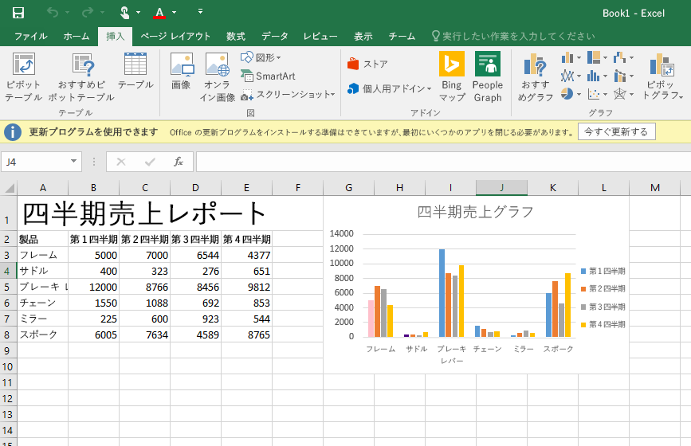
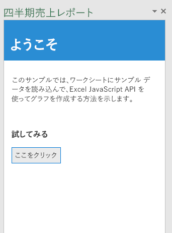

# <a name="build-your-first-excel-add-in"></a>最初の Excel アドインをビルドする

この記事では、Excel JavaScript API を使用して Excel 2016 または Excel Online のアドインをビルドする方法について説明します。次に示す手順では、Excel 2016 でデータをワークシートに読み込んで基本的なグラフを作成する、簡単な作業ウィンドウ アドインを作成します。




最初に、HTML と JQuery を使用して Web アプリを作成します。次に、Web アプリを配置する場所と Excel 内でのアプリの表示方法を指定する XML マニフェスト ファイルを作成します。


### <a name="code-it"></a>コード化する

1- QuarterlySalesReport という名前のローカル ドライブにフォルダーを作成します (例: C:\\QuarterlySalesReport)。以下の手順で作成されるファイルはすべてこのフォルダーに保存します。

2- 作業ウィンドウ アドインに読み込む HTML ページを作成します。ファイルの名前を **Home.html** と指定し、次のコードをそのファイルに貼り付けます。

```html

    <!DOCTYPE html>
    <html>
    <head>
        <meta charset="UTF-8" />
        <meta http-equiv="X-UA-Compatible" content="IE=Edge" />
        <title>Quarterly Sales Report</title>

        <script src="https://ajax.aspnetcdn.com/ajax/jQuery/jquery-2.1.4.min.js"></script>

        <link href="Office.css" rel="stylesheet" type="text/css" />

        <script src="https://appsforoffice.microsoft.com/lib/1/hosted/office.js" type="text/javascript"></script>

        <link href="Common.css" rel="stylesheet" type="text/css" />
        <script src="Notification.js" type="text/javascript"></script>

        <script src="Home.js" type="text/javascript"></script>

        <link rel="stylesheet" href="https://appsforoffice.microsoft.com/fabric/1.0/fabric.min.css">
        <link rel="stylesheet" href="https://appsforoffice.microsoft.com/fabric/1.0/fabric.components.min.css">

    </head>
    <body class="ms-font-m">
        <div id="content-header">
            <div class="padding">
                <h1>Welcome</h1>
            </div>
        </div>
        <div id="content-main">
            <div class="padding">
                <p>This sample shows how to load some sample data into the worksheet, and then create a chart using the Excel JavaScript API.</p>
                <br />
                <h3>Try it out</h3>
                <button class="ms-Button" id="load-data-and-create-chart">Click me!</button>
            </div>
        </div>
    </body>
    </html>

```

3- ユーザー設定のスタイルを格納する **Common.css** という名前のファイルを作成し、次のコードをそのファイルに貼り付けます。

```css
    /* Common app styling */

    #content-header {
        background: #2a8dd4;
        color: #fff;
        position: absolute;
        top: 0;
        left: 0;
        width: 100%;
        height: 80px; /* Fixed header height */
        overflow: hidden; /* Disable scrollbars for header */
    }

    #content-main {
        background: #fff;
        position: fixed;
        top: 80px; /* Same value as #content-header's height */
        left: 0;
        right: 0;
        bottom: 0;
        overflow: auto; /* Enable scrollbars within main content section */
    }

    .padding {
        padding: 15px;
    }

    #notification-message {
        background-color: #818285;
        color: #fff;
        position: absolute;
        width: 100%;
        min-height: 80px;
        right: 0;
        z-index: 100;
        bottom: 0;
        display: none; /* Hidden until invoked */
    }

        #notification-message #notification-message-header {
            font-size: medium;
            margin-bottom: 10px;
        }

        #notification-message #notification-message-close {
            background-image: url("../../images/Close.png");
            background-repeat: no-repeat;
            width: 24px;
            height: 24px;
            position: absolute;
            right: 5px;
            top: 5px;
            cursor: pointer;
        }


```

4 - jQuery のアドインのプログラミング ロジックを格納するファイルを作成します。ファイルの名前を **Home.js** と指定し、そのファイルに次のスクリプトを貼り付けます。

```js

    (function () {
        "use strict";

        // The initialize function must be run each time a new page is loaded
        Office.initialize = function (reason) {
            $(document).ready(function () {
                app.initialize();

                $('#load-data-and-create-chart').click(loadDataAndCreateChart);
            });
        };

        // Load some sample data into the worksheet and then create a chart
        function loadDataAndCreateChart() {
            // Run a batch operation against the Excel object model
            Excel.run(function (ctx) {

                // Create a proxy object for the active worksheet
                var sheet = ctx.workbook.worksheets.getActiveWorksheet();

                //Queue commands to set the report title in the worksheet
                sheet.getRange("A1").values = "Quarterly Sales Report";
                sheet.getRange("A1").format.font.name = "Century";
                sheet.getRange("A1").format.font.size = 26;

                //Create an array containing sample data
                var values = [["Product", "Qtr1", "Qtr2", "Qtr3", "Qtr4"],
                              ["Frames", 5000, 7000, 6544, 4377],
                              ["Saddles", 400, 323, 276, 651],
                              ["Brake levers", 12000, 8766, 8456, 9812],
                              ["Chains", 1550, 1088, 692, 853],
                              ["Mirrors", 225, 600, 923, 544],
                              ["Spokes", 6005, 7634, 4589, 8765]];

                //Queue a command to write the sample data to the specified range
                //in the worksheet and bold the header row
                var range = sheet.getRange("A2:E8");
                range.values = values;
                sheet.getRange("A2:E2").format.font.bold = true;

                //Queue a command to add a new chart
                var chart = sheet.charts.add("ColumnClustered", range, "auto");

                //Queue commands to set the properties and format the chart
                chart.setPosition("G1", "L10");
                chart.title.text = "Quarterly sales chart";
                chart.legend.position = "right"
                chart.legend.format.fill.setSolidColor("white");
                chart.dataLabels.format.font.size = 15;
                chart.dataLabels.format.font.color = "black";
                var points = chart.series.getItemAt(0).points;
                points.getItemAt(0).format.fill.setSolidColor("pink");
                points.getItemAt(1).format.fill.setSolidColor('indigo');

                //Run the queued commands, and return a promise to indicate task completion
                return ctx.sync();
            })
              .then(function () {
                  app.showNotification("Success");
                  console.log("Success!");
              })
            .catch(function (error) {
                // Always be sure to catch any accumulated errors that bubble up from the Excel.run execution
                app.showNotification("Error: " + error);
                console.log("Error: " + error);
                if (error instanceof OfficeExtension.Error) {
                    console.log("Debug info: " + JSON.stringify(error.debugInfo));
                }
            });
        }
    })();
```


5 -アドインでエラーが発生した場合に通知をするプログラミング ロジックを格納するファイルを作成します。これはデバッグ時に役立ちます。ファイルの名前を **Notification.js** と指定し、そのファイルに次のスクリプトを貼り付けます。

```js

    /* Notification functionality */

    var app = (function () {
        "use strict";

        var app = {};

        // Initialization function (to be called from each page that needs notification)
        app.initialize = function () {
            $('body').append(
                '<div id="notification-message">' +
                    '<div class="padding">' +
                        '<div id="notification-message-close"></div>' +
                        '<div id="notification-message-header"></div>' +
                        '<div id="notification-message-body"></div>' +
                    '</div>' +
                '</div>');

            $('#notification-message-close').click(function () {
                $('#notification-message').hide();
            });


            // After initialization, expose a common notification function
            app.showNotification = function (header, text) {
                $('#notification-message-header').text(header);
                $('#notification-message-body').text(text);
                $('#notification-message').slideDown('fast');
            };
        };

        return app;
    })();
```

6 - Web アプリを配置する場所と、Excel でのアプリの表示方法を指定する XML マニフェスト ファイルを作成します。ファイルの名前を **QuarterlySalesReportManifest.xml** と指定し、そのファイルに次の XML を貼り付けます。

```xml
    <?xml version="1.0" encoding="UTF-8"?>
    <!--Created:cb85b80c-f585-40ff-8bfc-12ff4d0e34a9-->
    <OfficeApp xmlns="http://schemas.microsoft.com/office/appforoffice/1.0" xmlns:xsi="http://www.w3.org/2001/XMLSchema-instance" xsi:type="TaskPaneApp">
      <Id>ab2991e7-fe64-465b-a2f1-c865247ef434</Id>
      <Version>1.0.0.0</Version>
      <ProviderName>Microsoft</ProviderName>
      <DefaultLocale>en-US</DefaultLocale>
      <DisplayName DefaultValue="Quarterly Sales Report Sample" />
      <Description DefaultValue="Quarterly Sales Report Sample"/>
      <Capabilities>
        <Capability Name="Workbook" />
      </Capabilities>
      <DefaultSettings>
        <SourceLocation DefaultValue="\\MyShare\QuarterlySalesReport\Home.html" />
      </DefaultSettings>
      <Permissions>ReadWriteDocument</Permissions>
    </OfficeApp>
```

7 - 任意のオンライン ジェネレーターを使用して GUID を生成します。次に、前述の手順で示した **Id** タグの値をその GUID に置き換えます。

8-  すべてのファイルを保存します。これで、最初の Excel アドインが作成できました。

### <a name="try-it-out"></a>お試しください。

アドインを展開してテストする最も簡単な方法は、ファイルをネットワーク共有にコピーすることです。

1-  ネットワーク共有にフォルダーを作成し (例: \\\MyShare\\QuarterlySalesReport)、そのフォルダーにすべてのファイルをコピーします。

2-  マニフェスト ファイルの **SourceLocation** 要素を編集して、この要素が手順 1 の .html ページの共有場所を指すようにします。

3-  マニフェスト (QuarterlySalesReportManifest.xml) をネットワーク共有 (例: \\\MyShare\\MyManifests) にコピーします。

4 - Excel で信頼されたアプリ カタログとしてマニフェストを格納する共有の場所を追加します。Excel を起動し、空のスプレッドシートを開きます。

5 - **[ファイル]** タブを選択して、**[オプション]** を選択します。

6 - **[セキュリティ センター]** を選択して、**[セキュリティ センターの設定]** ボタンを選択します。

7 - **[信頼されているアドイン カタログ]** を選択します。

8 - **[カタログの URL]** ボックスに手順 3. で作成したネットワーク共有のパスを入力して、**[カタログの追加]** を選択します。**[メニューに表示する]** チェック ボックスをオンにして、**[OK]** を選択します。これらの設定は Office を次回起動したときに適用されることを示すメッセージが表示されます。

9 - アドインをテストして実行します。Excel 2016 の **[挿入]** タブで、**[マイ アドイン]** を選択します。

10 - **[Office アドイン]** ダイアログ ボックスで、**[共有フォルダー]** を選択します。

11 - **[四半期売上レポートのサンプル]** > **[挿入]** の順に選択します。次の図に示すように、現在のワークシートの右側の作業ウィンドウでアドインが開きます。

 

12 - **[ここをクリック]** ボタンをクリックして、次の図に示されているように、ワークシート内のデータとグラフを表示します。グラフが動的に更新されるようにするには、範囲に含まれるデータを変更します。


### <a name="additional-resources"></a>その他のリソース

*  [Excel アドインのプログラミングの概要](excel-add-ins-javascript-programming-overview.md)
*  [Excel のスニペット エクスプローラー](http://officesnippetexplorer.azurewebsites.net/#/snippets/excel)
*  [Excel アドインのコード サンプル](http://dev.office.com/code-samples#?filters=excel,office%20add-ins)
*  [Excel アドインの JavaScript API リファレンス](excel-add-ins-javascript-api-reference.md)
