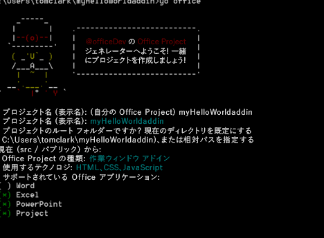
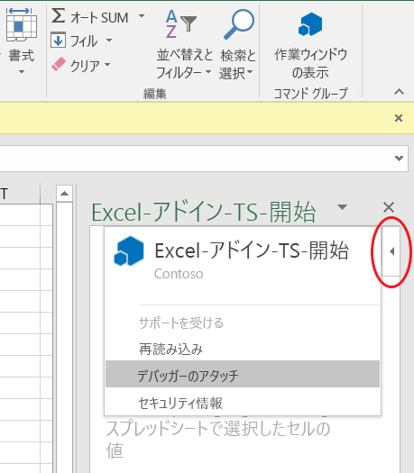
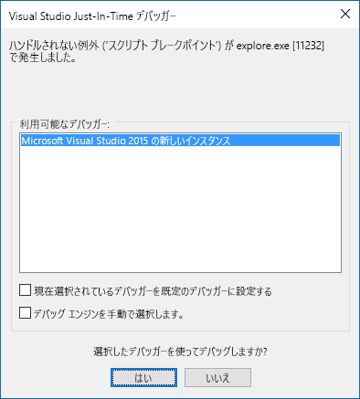

# <a name="create-an-office-add-in-using-any-editor"></a>任意のエディターを使用して Office アドインを作成する

Office アドインに Yeoman ジェネレーターを使用することができます。Yeoman ジェネレーターは、プロジェクトのスキャフォールディングとビルドの管理を提供します。`manifest.xml` ファイルで、アドインが格納されている場所と表示方法を Office アプリケーションに指示します。Office アプリケーションは Office 内でホスティングを行います。

 >**注:**この手順では、Windows コマンド プロンプトを使いますが、その他のシェル環境を使うこともできます。 


## <a name="prerequisites-for-yeoman-generator"></a>Yeoman ジェネレーターの前提条件

Yeoman Office ジェネレーターを実行するには、以下が必要です。


- [Git](https://git-scm.com/downloads)  
- [npm](https://www.nodejs.org/en/download)
- [Bower](http://bower.io/)
- [Yeoman Office ジェネレーター](https://www.npmjs.com/package/generator-office)
- [Gulp](http://gulpjs.com/)
- [TSD](http://definitelytyped.org/tsd/)
    
Git と npm のみ、別途インストールが必要です。その他は npm を使用してインストールできます。

Git をインストールする場合は、次のオプションを選択する以外、既定の設定を使用します。 

- Windows コマンド プロンプトから Git を使用する
- Windows の既定のコンソール ウィンドウを使用する
    
既定値を使用して npm をインストールします。管理者としてコマンド プロンプトを開き、他のソフトウェアをグローバルにインストールします。

```
npm install -g bower yo generator-office gulp tsd
```


## <a name="create-the-default-files-for-your-add-in"></a>アドインの既定のファイルを作成する

Office アドインを開発する前に、プロジェクト用のフォルダーを作成し、そこでジェネレーターを実行する必要があります。プロジェクトをスキャホールディングするディレクトリで Yeoman ジェネレーターを実行します。 

コマンド プロンプトで、プロジェクトを作成する親フォルダーに移動します。次のコマンドを使用して、 _myHelloWorldaddin_ という名前の新しいフォルダーを作成し、そこを現在のディレクトリにします。


```
mkdir myHelloWorldaddin
cd myHelloWorldaddin
```

Yeoman ジェネレーターを使用して、任意のアドイン(Outlook アドイン、コンテンツ アドイン、または作業ウィンドウ アドイン) を作成します。この記事の手順では、作業ウィンドウ アドインを作成します。ジェネレーターを実行するには、次の命令を入力します。


```
yo office
```

ジェネレーターは、確認を求める以下のメッセージを表示します。 


- アドインの名前 --  _myHelloWorldaddin_ を使用します 
- プロジェクトのルート フォルダー -  _現在のフォルダー_ を使用します
- アドインの種類 -  _作業ウィンドウ_ を使用します
- アドインを作成するテクノロジ - _HTML、CSS&amp; JavaScript_ を使用します
- サポートされている Office アプリケーション - 任意のアプリケーションを選択できます
    

**アドイン用の Yeoman ジェネレーターの入力**



これは、アドインの構造および基本的なファイルを作成します。


## <a name="hosting-your-office-add-in"></a>Office アドインのホスティング

Office アドインは、HTTPS 経由で提供する必要があります。HTTP では、Office アプリケーションは、アドインとして Web アプリを読み込めません。アドインをローカルで開発、デバッグ、およびホスティングするには、HTTPS を使用してローカルで Web アプリケーションを作成し、提供する手段が必要になります。Gulp (次のセクションで説明) で自己ホスト型の HTTPS サイトを作成するか、Azure を使用することができます。 


### <a name="using-a-self-hosted-https-site"></a>自己ホスト型の HTTPS サイトの使用

gulp-webserver プラグインは、自己ホスト型の HTTPS サイトを作成します。Office ジェネレーターは、生成されるプロジェクトの serve-static という名前のタスクとして gulpfile.js にこのサイトを追加します。次のステートメントを使用して、自己ホスト型 Web サーバーを開始します。 


```
gulp serve-static
```

これは、https://localhost:8443 にある HTTPS サーバーを開始します。


## <a name="develop-your-office-add-in"></a>Office アドインの開発

任意のテキスト エディターを使用して、カスタム Office アドインのファイルを開発できます。


### <a name="javascript-project-support"></a>JavaScript のプロジェクトのサポート

プロジェクトを作成するとき、Office ジェネレーターは、jsconfig.json ファイルを作成します。このファイルを使用すると、プロジェクト内のすべての JavaScript ファイルを推論し、反復的な /// <reference path="../App.js" /> コード ブロックを含める必要がなくなります。

[JavaScript 言語](https://code.visualstudio.com/docs/languages/javascript#_javascript-projects-jsconfigjson) ページの jsconfig.json ファイルについて説明します。


### <a name="javascript-intellisense-support"></a>JavaScript の intellisense サポート

また、プレーンな JavaScript を作成している場合でも、TypeScript 型定義ファイル ( `*.d.ts`) を使用して、追加の IntelliSense のサポートを提供することができます。Office ジェネレーターは、選択したプロジェクト型によって使用されるすべてのサード パーティのライブラリへの参照を持つ作成済みファイルに、 `tsd.json` ファイルを追加します。

Yeoman Office ジェネレーターを使用してプロジェクトを作成したら、あとは次のコマンドを実行して、参照される型定義ファイルをダウンロードするだけです。


```
tsd install
```


### <a name="create-a-hello-world-office-add-in"></a>Hello World Office アドインの作成


この例では、Hello World アドインを作成します。アドインの UI は、必要に応じて JavaScript プログラミング ロジックを記述できる HTML ファイルから提供されます。 


### <a name="to-create-the-files-for-a-hello-world-add-in"></a>Hello World アドインのファイルを作成するには


- プロジェクト フォルダーで、_[project folder]/app/home_ (この例では myHelloWorldaddin/app/home) に移動し、home.html を開いて、既存のコードを次のコードで置き換えます。このコードは、アドインの UI を表示するための、最小限の HTML タグのセットを提供します。
    
```HTML
        <!DOCTYPE html>  
      <html> 
        <head> 
           <meta charset="UTF-8" /> 
           <meta http-equiv="X-UA-Compatible" content="IE=Edge"/> 
           <link rel="stylesheet" type="text/css" href="program.css" />
         </head> 
   
        <body> 
           <p>Hello World!</p> 
        </body> 
      
       </html> 
```

  
    
- 次に、同じフォルダーにある home.css ファイルを開いて、次の CSS コードを追加します。
    
```css
     body 
   { 
        position:relative; 
   } 
   li :hover 
   { 
        text-decoration: underline; 
        cursor:pointer; 
   } 
   h1,h3,h4,p,a,li 
   { 
        font-family: "Segoe UI Light","Segoe UI",Tahoma,sans-serif; 
        text-decoration-color:#4ec724; 
   } 
```
    
- 親プロジェクト フォルダーに戻り、manifest-myHelloWorldaddin.xml という名前の XML ファイルに次の XML コードが含まれていることを確認します。
    
     >**重要:**`<id>` タグの値は、Yeoman ジェネレーターがプロジェクト生成時に作成する GUID です。アドイン用に Yeoman ジェネレーターが作成した GUID は変更しないでください。ホストが Azure の場合、`SourceLocation` の値は _https:// [Web アプリの名前].azurewebsites.net/[アドインのパス]_ のような URL です。この例のように、自己ホスト型のオプションを使用する場合は、_https://localhost:8443/[アドインのパス]_ になります。

```XML
     <?xml version="1.0" encoding="utf-8"?> 
   <OfficeApp xmlns="http://schemas.microsoft.com/office/appforoffice/1.1" 
              xmlns:xsi="http://www.w3.org/2001/XMLSchema-instance" 
              xsi:type="TaskPaneApp"> 
   <Id>[GUID-for-your-add-in]</Id> 
   <Version>1.0</Version> 
   <ProviderName>Microsoft</ProviderName> 
   <DefaultLocale>EN-US</DefaultLocale> 
   <DisplayName DefaultValue="myHelloWorldaddin"/> 
   <Description DefaultValue="My first app."/> 
    
   <Hosts> 
     <Host Name="Document"/> 
     <Host Name="Workbook"/> 
   </Hosts>
    
   <DefaultSettings> 
     <SourceLocation DefaultValue="https://localhost:8443/app/home/home.html"/> 
   </DefaultSettings> 
   
   <Permissions>ReadWriteDocument</Permissions>
    
   </OfficeApp> 
```


### <a name="running-the-add-in-locally"></a>アドインをローカルで実行する


アドインをローカルでテストするには、ブラウザーを開き、home.html ファイルの URL を入力します。これは、Web サーバーまたは自己ホスト型の HTTPS サイトのいずれかで行います。ローカルにホスティングしている場合は、ただブラウザーにその URL を入力します。この例では、`https://localhost:8443/app/home/home.html` となります。 

「このWeb サイトのセキュリティ証明書には問題があります」のようなエラーが表示されます。「この Web サイトの閲覧を続行する...」を選択すると、"Hello World!" というテキストが表示されます。


 >**注:**生成されたアドインには、自己署名証明書とキーが付属します。これらを証明書の信頼できる証明機関リストに追加して、ブラウザーが証明書に関する警告を発行しないようにします。独自の自己署名証明書を使用する場合は、[gulp-webserver](https://www.npmjs.com/package/gulp-webserver) のドキュメントを参照してください。OS X Yosemite の証明書を信頼する方法の詳細については、「[OS X Yosemite: 証明書が受け入れられない場合](https://support.apple.com/kb/PH18677?locale=en_US)」を参照してください。


## <a name="install-the-add-in-for-testing"></a>テスト用にアドインをインストールする

サイドロードを使用して、テストのためにアドインをインストールできます。

- [テスト用に Office アドインをサイドロードする](../testing/create-a-network-shared-folder-catalog-for-task-pane-and-content-add-ins.md)
- [テスト用に iPad と Mac で Office アドインをサイドロードする](../testing/sideload-an-office-add-in-on-ipad-and-mac.md)   
- [テスト用に Outlook アドインをサイドロードする](../outlook/testing-and-tips.md)
    

## <a name="debug-your-add-in"></a>アドインのデバッグ

アドインをデバッグするには、いくつかの方法があります。

- 作業ウィンドウからデバッガーをアタッチする (Office 2016 for Windows)。
- ブラウザーの開発者ツールを使用する。
- Windows 10 で F12 開発者ツールを使用する。

### <a name="attach-debugger-from-the-task-pane"></a>作業ウィンドウからデバッガーをアタッチする

Office 2016 for Windows のビルド 77xx.xxxx 以降では、作業ウィンドウからデバッガーをアタッチすることができます。 

**デバッガーのアタッチ** ツールを起動するのには、作業ウィンドウの右上隅を選択して**パーソナリティ** メニューを有効にします (以下の図の赤い円で示す通り)。   



**デバッガーのアタッチ** を選択するこれにより、次の図のように、**Visual Studio Just-in-Time デバッガー** ダイアログ ボックスが起動します。 



これで Visual Studio でアタッチとデバッグを行えるようになりました。   

  >  **注**:現在サポートされているデバッガー ツールは、[Visual Studio 2015](https://www.visualstudio.com/downloads/) with [Update 3](https://msdn.microsoft.com/en-us/library/mt752379.aspx) だけです。Visual Studio をインストールしていない場合、**デバッガーのアタッチ** オプションを選択しても何も起こりません。  
  
詳細については、以下のトピックを参照してください。

-   DOM Explorer を Visual Studio で起動して使用するには、ブログ記事「[新しいプロジェクト テンプレートを使って見栄えの良い Office 用アプリをビルドする](https://blogs.msdn.microsoft.com/officeapps/2013/04/16/building-great-looking-apps-for-office-using-the-new-project-templates)」の[ヒントとコツ](https://blogs.msdn.microsoft.com/officeapps/2013/04/16/building-great-looking-apps-for-office-using-the-new-project-templates/#tips_tricks) セクションのヒント 4 を参照してください。
-   ブレークポイントの設定については、「[ブレークポイントの使用](https://msdn.microsoft.com/en-US/library/5557y8b4.aspx)」を参照してください。
-   F12 を使用するには、「[F12 開発者ツールの使用](https://msdn.microsoft.com/en-us/library/bg182326(v=vs.85).aspx)」を参照してください。

### <a name="browser-developer-tools"></a>ブラウザーの開発者ツール 

Office Web クライアントを使用して、ブラウザーの開発者ツールを開き、ほかのクライアント側 JavaScript アプリケーションをデバッグした方法で、アドインをデバッグします。 

### <a name="f12-developer-tools-on-windows-10"></a>Windows 10 の F12 開発者ツール

Windows 10 で Office のデスクトップ クライアントを使用している場合、[Windows 10 で F12 開発者ツールを使用してアドインをデバッグする](../testing/debug-add-ins-using-f12-developer-tools-on-windows-10.md)ことが可能です。
    
## <a name="additional-resources"></a>追加リソース


- [Visual Studio での Office アドインの作成とデバッグ](../../docs/get-started/create-and-debug-office-add-ins-in-visual-studio.md)
    
