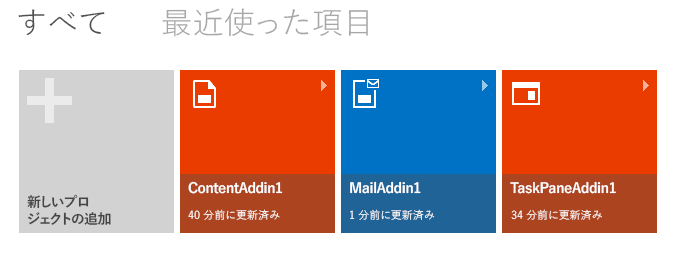

# Napa で Office アドインを作成する

[Office アドイン](../../docs/overview/office-add-ins.md)は、ブラウザー コントロールまたは iframe でホストされる Web アプリケーションで、Office アプリケーションのコンテキストで実行されます。アドインでは、現在のドキュメントまたはメール アイテム内のデータにアクセスし、Web サービスやその他の Web ベースのリソースに接続できます。アドインを開発するには、HTML5、JavaScript、CSS3、XML、REST API などの Web 標準に基づいたテクノロジを使用します。アドインが、Office ホスト アプリケーションを実行するコンピューター上に実際にインストールされることはありません。アドインの実装は Web サーバー上でホストされるため、サーバーから簡単に保守と更新を行えます。

Napa を使用して、簡単な Office アドインを作成できます。これを行うには、以下が必要です。

- [Microsoft アカウント](http://www.microsoft.com/en-us/account/default.aspx)
    
- [Napa](https://www.napacloudapp.com) Web アプリの URL

>**注:**OneNote 用のアドインを使い始めるには、「[最初の OneNote 用アドインをビルドする](../onenote/onenote-add-ins-getting-started.md)」を参照してください。

## 基本的なアドインの作成

1. ブラウザーで [Napa](https://www.napacloudapp.com) を開きます。
    
2. **[新しいプロジェクトの追加]** タイルを選択します。
    
     **注:** **[新しいプロジェクトの追加]** タイルは、他のプロジェクトを既に作成している場合にのみ表示されます。これが最初のプロジェクトの場合は、次の手順に進んでください。
    
    

3. 作成するアドインの種類を選択し、プロジェクトに名前を付けて **[作成]** ボタンをクリックします。
    
    

    コード エディターが開き、既定の Web ページが表示されます。このページには、何も作業しなくても実行できるサンプル コードが既に含まれています。
    
4. ページの横側にある [実行] ボタン (
![[実行] ボタン](../../images/Apps_NAPA_Run_Button.png)) を選択します。
    
    選択したアドインの種類に関連付けられている Office アプリケーションが開き、サンプル アドインが表示されます。アドインの機能を試せるようになります。
    

## その他のリソース

- [Office アドインの概要](../../docs/overview/office-add-ins.md)
    
- [Office デベロッパー プラットフォームに関するフィードバックの送信](http://officespdev.uservoice.com/)
    
- [Office アドインのフォーラムに質問を投稿する](http://social.msdn.microsoft.com/Forums/officeapps/en-US/home?forum=appsforoffice%2Cofficestore&amp;filter=alltypes&amp;sort=lastpostdesc)
    
