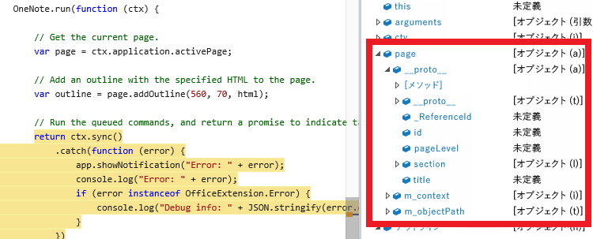

# <a name="build-your-first-onenote-add-in"></a>最初の OneNote 用アドインをビルドする

この記事では、いくつかのテキストを OneNote ページに追加する簡単な作業ウィンドウ アドインのビルドについて説明します。

次の画像は、作成するアドインを示しています。

   

<a name="setup"></a>
## <a name="step-1-set-up-your-dev-environment-and-create-an-add-in-project"></a>手順 1:開発環境をセットアップし、アドイン プロジェクトを作成する
指示に従って、[任意のエディターを使用して Office アドインを作成](../get-started/create-an-office-add-in-using-any-editor.md)して必要な前提条件をインストールし、Office Yeoman ジェネレーターを実行して新しいアドイン プロジェクトを作成します。次の表に、Yeoman ジェネレーターで選択するプロジェクト属性を示します。

| オプション | 値 |
|:------|:------|
| 新しいサブフォルダ― | (既定値の適用) |
| アドイン名 | OneNote アドイン |
| サポートされている Office アプリケーション | (OneNote の選択) |
| 新しいアドインの作成 | はい、新しいアドインを作成します |
| [TypeScript](https://www.typescriptlang.org/) の追加 | いいえ |
| フレームワークの選択 | Jquery |

<a name="develop"></a>
## <a name="step-2-modify-the-add-in"></a>手順 2:アドインを変更する
任意のテキスト エディターや IDE を使ってアドイン ファイルを編集できます。まだ Visual Studio Code をお試しいただいていない場合は、Linux、Mac OSX、Windows で[無料でダウンロード](https://code.visualstudio.com/)できます。

1 - プロジェクト ディレクトリの **index.html** を開きます。 

2 - `<main>` 要素を次のコードに置き換えます。これは、[Office UI Fabric コンポーネント](http://dev.office.com/fabric/components)を使用してテキスト領域とボタンを追加します。

```html
<main class="ms-welcome__main">
   <br />
   <p class="ms-font-l">Enter content below</p>
   <div class="ms-TextField ms-TextField--placeholder">
       <textarea id="textBox" rows="5"></textarea>
   </div>
   <button id="addOutline" class="ms-welcome__action ms-Button ms-Button--hero ms-u-slideUpIn20">
        <span class="ms-Button-label">Add Outline</span>
        <span class="ms-Button-icon"><i class="ms-Icon"></i></span>
        <span class="ms-Button-description">Adds the content above to the current page.</span>
    </button>
</main>
```

3 - プロジェクト ディレクトリの **app.js** (TypeScript を使用している場合は app.ts) を開きます。次に示すように、**Office.initialize** 関数を編集し、**[アウトラインの追加]** ボタンにクリック イベントを追加します。

```js
// The initialize function is run each time the page is loaded.
Office.initialize = function (reason) {
   $(document).ready(function () {
       app.initialize();
       
       // Set up event handler for the UI.
       $('#addOutline').click(addOutlineToPage);
   });
};
```
 
4 - **run** メソッドを次の **addOutlineToPage** メソッドに置き換えます。これにより、テキスト領域からコンテンツを取得し、そのコンテンツがページに追加されます。

```js
// Add the contents of the text area to the page.
function addOutlineToPage() {        
   OneNote.run(function (context) {
      var html = '<p>' + $('#textBox').val() + '</p>';
      
       // Get the current page.
       var page = context.application.getActivePage();
       
       // Queue a command to load the page with the title property.             
       page.load('title'); 
       
       // Add an outline with the specified HTML to the page.
       var outline = page.addOutline(40, 90, html);
       
       // Run the queued commands, and return a promise to indicate task completion.
       return context.sync()
           .then(function() {
               console.log('Added outline to page ' + page.title);
           })
           .catch(function(error) {
               app.showNotification("Error: " + error); 
               console.log("Error: " + error); 
               if (error instanceof OfficeExtension.Error) { 
                   console.log("Debug info: " + JSON.stringify(error.debugInfo)); 
               } 
           }); 
       });
}
```

<a name="test"></a>
## <a name="step-3-test-the-add-in-on-onenote-online"></a>手順 3:OneNote Online でのアドインのテスト
1 - HTTPS サーバーを起動します。  

  a.**cmd** プロンプト / Terminal を開き、アドイン プロジェクトのフォルダーに移動します。 
  
  b.以下に示すコマンドを実行します。

  ```
  C:\your-local-path\onenote add-in\> npm start
  ```

2 - 自己署名証明書を信頼された証明書としてインストールします。Office Yeoman ジェネレーターを使って作成されたすべてのアドイン プロジェクトに対しては、コンピューターに一度だけインストールする必要があります。詳しくは、「[自己署名証明書を信頼されたルート証明書として追加する](https://github.com/OfficeDev/generator-office/blob/master/src/docs/ssl.md)」をご覧ください。

3 - [OneNote Online](https://www.onenote.com/notebooks) でノートブックを開きます。

4 - **[挿入] > [Office アドイン]** を選択します。これで、[Office アドイン] ダイアログが開きます。

  -コンシューマー アカウントでログインしている場合は、**[マイ アドイン]** タブを選択し、**[マイ アドインのアップロード]** を選択します。
  
  -職場または学校アカウントでログインしている場合は、**[自分の所属組織]** タブを選択し、**[マイ アドインのアップロード]** を選択します。 
  
  次の図は、コンシューマー ノートブックの **[マイ アドイン]** タブを示しています。

  ![[マイ アドイン] タブを示す [Office アドイン] ダイアログ](../../images/onenote-office-add-ins-dialog.png)

5 - [アドインのアップロード] ダイアログで、プロジェクト フォルダー内の **onenote-add-in-manifest.xml** を参照し、**[アップロード]** を選択します。テスト中に、マニフェスト ファイルはブラウザーのローカル ストレージに保存されます。

6 - アドインは、OneNote ページの横にある iFrame で開きます。テキスト領域にテキストを入力し、**[アウトラインの追加]** をクリックします。入力したテキストは、ページに追加されます。 

## <a name="troubleshooting-and-tips"></a>トラブルシューティングとヒント
-ブラウザーの開発者ツールを使ってアドインをデバッグできます。Gulp Web サーバーを使っており、Internet Explorer や Chrome でデバッグしている場合は、ローカルで変更を保存してから、アドインの iFrame を更新するだけです。

-OneNote オブジェクトを調べる場合、現在使用可能なプロパティに実際の値が表示されます。読み込む必要のあるプロパティには、*undefined* と表示されます。`_proto_` ノードを展開し、オブジェクトで定義されているものの、まだ読み込まれていないプロパティを確認します。



-アドインで任意の HTTP リソースを使っている場合は、ブラウザーで混在したコンテンツを有効にする必要があります。運用アドインでは、セキュリティで保護された HTTPS リソースのみを使う必要があります。

-作業ウィンドウ アドインは、任意の場所から開くことができますが、コンテンツ アドインは、通常のページ コンテンツ (タイトル、画像、iframe などは含まない) の内部にのみ挿入できます。 

## <a name="additional-resources"></a>その他のリソース

-[OneNote の JavaScript API のプログラミングの概要](onenote-add-ins-programming-overview.md)

-[OneNote JavaScript API リファレンス](../../reference/onenote/onenote-add-ins-javascript-reference.md)

-[Rubric Grader のサンプル](https://github.com/OfficeDev/OneNote-Add-in-Rubric-Grader)

-[Office アドイン プラットフォームの概要](https://dev.office.com/docs/add-ins/overview/office-add-ins)
