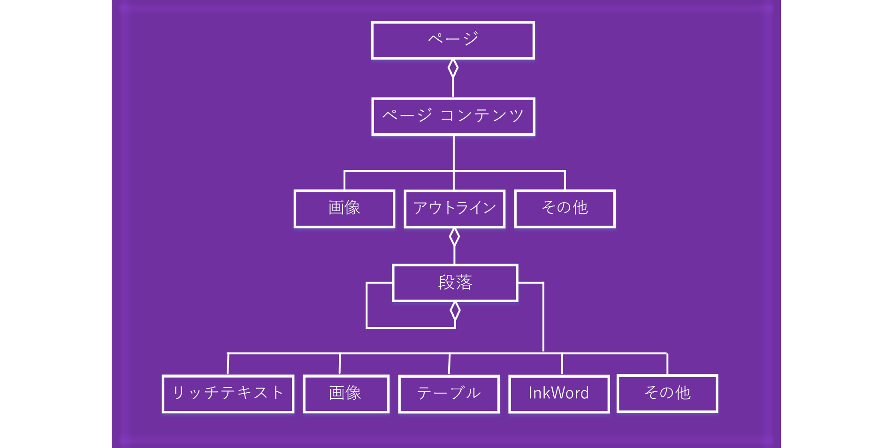

# OneNote ページ コンテンツを使用する 

OneNote アドインの JavaScript API では、ページ コンテンツは次のようなオブジェクト モデルで表されます。

  

- ページ オブジェクトには、PageContent オブジェクトのコレクションが含まれています。
- PageContent オブジェクトには、アウトライン、イメージ、その他のコンテンツ タイプが含まれています。
- アウトライン オブジェクトには、Paragraph オブジェクトのコレクションが含まれています。
- Paragraph オブジェクトには、RichText、Image、Table、Other のコンテンツ タイプが含まれています。

空の OneNote ページを作成するには、次の方法のいずれかを使用します。

- [Section.addPage](../../reference/onenote/section.md#addpagetitle-string)
- [Page.insertPageAsSibling](../../reference/onenote/page.md#insertpageassiblinglocation-string-title-string)

その後、次のオブジェクトのメソッドを使用して、Page.addOutline や Outline.appendHtml などのページのコンテンツを操作します。 

- [Page](../../reference/onenote/page.md)
- [Outline](../../reference/onenote/outline.md)
- [Paragraph](../../reference/onenote/paragraph.md)

OneNote ページのコンテンツと構造は、HTML で表されます。 次に説明するように、ページ コンテンツの作成や更新には、HTML のサブセットだけがサポートされています。

## サポートされている HTML

ページ コンテンツを作成して更新するために、OneNote アドインの JavaScript API では次の HTML がサポートされています。

- `<html>`, `<body>`, `
`, ``, ` ` 
- `
`
- ``
- `<a>`
- `<ul>`, `<ol>`, `<li>` 
- `<table>`, `<tr>`, `<td>`
- `<h1>` ... `<h6>`
- `<b>`, `<em>`, `<strong>`, `<i>`, `<u>`, `<del>`, ``, ``, `<cite>`

## ページ コンテンツへのアクセス

現在アクティブなページの `Page#load` による*ページ コンテンツ*へのアクセスだけが可能です。 アクティブなページを変更するには、`navigateToPage($page)` を呼び出します。

タイトルなどのメタデータは、どのページでも照会できます。

## その他のリソース

- [OneNote の JavaScript API のプログラミングの概要](onenote-add-ins-programming-overview.md)
- [OneNote JavaScript API リファレンス](../../reference/onenote/onenote-add-ins-javascript-reference.md)
- [Rubric Grader のサンプル](https://github.com/OfficeDev/OneNote-Add-in-Rubric-Grader-Preview)
- [Office アドイン プラットフォームの概要](https://dev.office.com/docs/add-ins/overview/office-add-ins)
