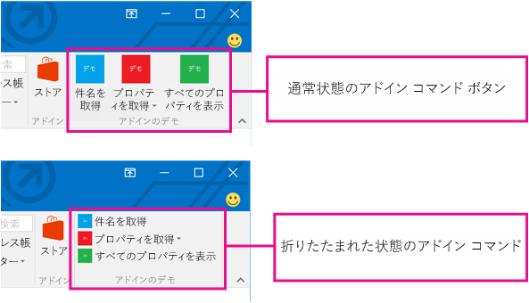
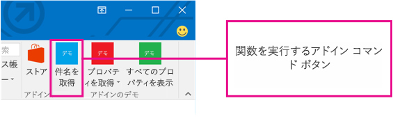
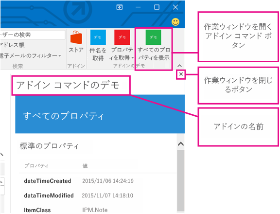
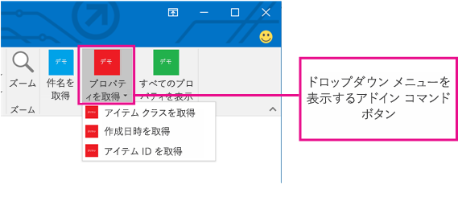

# Outlook のアドイン コマンド

Outlook アドイン コマンドを作成して、ボタンまたはドロップダウン メニューとしてリボンに追加すると、リボンから特定のアドイン操作を開始できるようになり、ユーザーが簡単、直観的、かつ自然にアドインにアクセスできるようになります。アドイン コマンドを採用すれば、シームレスに機能性が向上するので、より魅力的なソリューションを作成することができます。

> **注**:アドイン コマンドは、Windows 版 Outlook 2016 と Outlook 2013、Outlook on the web for Office 365 と Outlook.com でのみ使用できます。Outlook 2013 でのアドイン コマンドのサポートには [2016 年 3 月 8 日のセキュリティ更新プログラム](https://support.microsoft.com/en-us/kb/3114829)が必要になります。

アドイン コマンドは、アクティブ化するアイテムの種類を制限する [ItemHasAttachment、ItemHasKnownEntity、または ItemHasRegularExpressionMatch ルール](manifests/activation-rules.md)を使用しないコンテキスト アドインに対してのみ使用できます。ただし、コンテキスト アドインは、現在選択されているアイテムがメッセージか予定かに応じて異なるコマンドを表示でき、閲覧シナリオまたは作成シナリオのどちらで表示するかを選択できます。可能な場合はアドイン コマンドを使用するのが[ベスト プラクティス](../../docs/overview/add-in-development-best-practices.md)です。

## アドイン コマンドの作成

アドイン コマンドは、 **VersionOverrides** 要素のアドイン マニフェストで宣言されます。この要素はマニフェスト スキーマ v1.1 に追加されたもので、下位互換性が保証されています。 **VersionOverrides** をサポートしていないクライアントでも、既存のアドインは引き続きアドイン コマンドのないときと変わらずに機能します。

**VersionOverrides** マニフェストのエントリでは、アドイン コマンドについての多くの事柄 (ホスト、リボンに追加されるコントロールの種類、テキスト、アイコン、関連する機能など) を指定します。詳細については、「[Outlook アドイン マニフェストでアドイン コマンドを定義する](../outlook/manifests/define-add-in-commands.md)」を参照してください。 

アドインから進捗状況の更新 (進行状況インジケータやエラー メッセージなど) を提供する必要がある場合は、 [通知 API](../../reference/outlook/NotificationMessages.md) を介して行う必要があります。さらに通知の処理が、マニフェストの **FunctionFile** ノードで指定された別個の HTML ファイルで定義されている必要があります。

アドイン コマンドがリボンに合わせて適正に配置されるように、開発者は必要なサイズのアイコンをすべて定義する必要があります。アイコンのサイズは、80 x 80 ピクセル、32 x 32 ピクセル、および 16 x 16 ピクセルです。

## アドイン コマンドが表示される方法

アドイン コマンドは、リボン上にボタンとして表示されます。ユーザーがアドインをインストールすると、アドインのコマンドはアドイン名のラベルが付いたボタン グループとして UI に表示されます。これは、リボンの既定のタブまたはカスタム タブのいずれかに表示されます。メッセージの場合、既定のタブは **[ホーム]** タブまたは **[メッセージ]**タブのいずれかです。予定表の場合、既定のタブは **[会議]** タブ、**[個別の会議]** タブ、**[定期的な会議]** タブ、または **[予定]** タブです。モジュール拡張機能の場合、既定のタブはカスタム タブです。既定タブでは、それぞれのアドインは 1 つのリボン グループを持つことができ、1 つのリボン グループに含まれるコマンドの数は 6 個までです。カスタム タブには、アドインのグループを 10 個まで含めることができ、1 つのグループにコマンドが 6 個まで表示されます。アドインに使用できるカスタム タブは 1 つのみに制限されています。

リボン内が密集してくると、アドイン コマンドは適正な方法で調整されます (折りたたまれます)。どのような場合でも 1 つのアドインのアドイン コマンドはグループにまとめられます。

アドインにアドイン コマンドが追加されると、アドイン名は、アプリ バーから削除されます。リボン上のアドイン コマンド ボタンだけが残ります。

## アドイン コマンドの UX シェイプの目的

アドイン コマンドの UX シェイプは、さまざまな機能を実行できるボタンを含むホスト アプリケーションのリボン タブで構成されています。現時点では、次の 3 つの UI シェイプがサポートされています。

- JavaScript 関数を実行するボタン
        
- 他の 2 種類のボタンが 1 つ以上含まれるドロップダウン メニューを示すボタン

さらに、コンテキスト アドインは次をサポートしています:  
- 作業ウィンドウを起動するボタン

### JavaScript 関数の実行

JavaScript 関数を実行するアドイン コマンド ボタンは、操作を開始するためにユーザーが追加の選択をする必要のないシナリオで使用します。追跡や通知、印刷などの操作が該当します。また、ユーザーがサービスからより詳細な情報を取得するシナリオでも使用します。 

モジュール拡張機能では、メイン ユーザー インターフェイスのコンテンツを操作する JavaScript 関数をアドイン コマンド ボタンで実行できます。

### 作業ウィンドウの起動

作業ウィンドウを起動するアドイン コマンド ボタンは、ユーザーが長時間アドインとの対話式操作を行う必要があるシナリオで使用します。たとえば、アドインでは設定の変更や多数のフィールドへの入力が必要になることがあります。 

垂直作業ウィンドウの既定の幅は 300 px です。垂直作業ウィンドウのサイズは、Outlook エクスプローラーとインスペクターの両方で変更できます。このウィンドウのサイズは、To Do ウィンドウやリスト ビューのサイズを変更するときと同じ方法で変更することができます。

このスクリーンショットは、垂直作業ウィンドウの例を示しています。このウィンドウには、アドイン コマンドの名前が左上隅に表示されます。ウィンドウの右上隅には **[X]** ボタンがあり、ユーザーはアドインの使用後に、このボタンでアドインを閉じることができます。このウィンドウは、メッセージ間で保持されません。作業ウィンドウに表示される、アドイン名と閉じるボタン以外のすべての UI 要素は、アドインによって提供されます。

ユーザーが作業ウィンドウを開く別のアドイン コマンドを選択すると、作業ウィンドウは直近に使用されたコマンドに置き換えられます。作業ウィンドウが開いているときにユーザーが、関数を実行するアドイン コマンド ボタンまたはドロップダウン メニューをクリックすると、操作が完了して、作業ウィンドウは開いたままになります。

### ドロップダウン メニュー

ドロップダウン メニュー アドイン コマンドでは、ボタンの静的リストを定義します。メニューには、機能を実行するボタンや作業ウィンドウを開くボタンを自由に組み合わせて含めることができます。サブメニューはサポートされません。

## UI でアドイン コマンドが表示される場所

アドイン コマンドは次の 4 つのシナリオでサポートされています。

### メッセージの閲覧

ユーザーがメッセージを閲覧している間は、既定のタブに追加されたアドイン コマンドは、 **[ホーム]** タブ (閲覧ウィンドウでメッセージを表示している場合) とポップアウト閲覧フォームの **[メッセージ]** タブに表示されます。

### メッセージの作成

ユーザーがメッセージを作成している間は、既定のタブに追加されたアドイン コマンドが  **[メッセージ]** タブに表示されます。

### 開催者として予定または会議を作成または表示する

開催者として予定または会議を作成または表示する場合、既定のタブに追加されたアドイン コマンドは、ポップアウト フォームの  **[会議]**、 **[個別の会議]**、 **[定期的な会議]**、または  **[予定]** のタブに表示されます。ただし、ユーザーが予定表のアイテムを選択してもポップ アウトを開かなければ、そのアドインのリボン グループはリボンに表示されません。

### 出席者として会議を表示する

出席者として会議を表示する場合、既定のタブに追加されたアドイン コマンドは、ポップアウト フォームの  **[会議]**、 **[個別の会議]**、または  **[定期的な会議]** のタブに表示されます。ただし、ユーザーが予定表のアイテムを選択してもポップ アウトを開かなければ、そのアドインのリボン グループはリボンに表示されません。

### モジュール拡張機能の使用

モジュール拡張機能を使用すると、モジュールのカスタム タブにアドイン コマンドが表示されます。

## その他のリソース

- [Outlook アドイン マニフェストでアドイン コマンドを定義する](../outlook/manifests/define-add-in-commands.md)
    
- [アドイン コマンドのデモ: Outlook アドイン](https://github.com/jasonjoh/command-demo)
    
