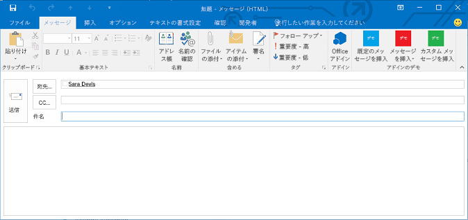
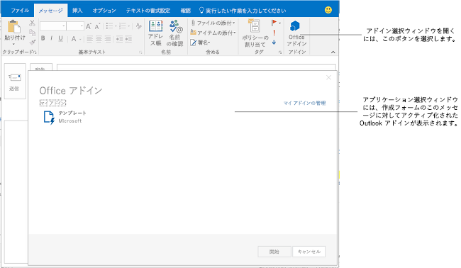

# 新規作成フォーム用の Outlook アドインを作成する

Office アドイン マニフェストのスキーマのバージョン 1.1 と office.js の v1.1 から、新規作成フォームでアクティブ化される Outlook アドインである、新規作成アドインを作成できるようになりました。閲覧アドイン (ユーザーがメッセージや予定を表示するとき閲覧モードでアクティブ化される Outlook アドイン) とは対照的に、新規作成アドインは以下のユーザー シナリオで使用できます。

- 新しいメッセージ、会議出席依頼または予定を新規作成フォームで作成している。
    
- 既存の予定またはユーザーが開催者になっている会議アイテムを表示または編集している。
    
     >**注**  ユーザーが Outlook 2013 および Exchange 2013 の RTM リリースを使用していて、ユーザー別の会議アイテムを表示している場合は、使用可能な閲覧アドインを検索できます。Office 2013 SP1 リリース以降では、同じシナリオにおいて作成アドインのみをアクティブ化して使用できるような変更が行われています。
- インライン応答メッセージを作成しているか、別の新規作成フォームでメッセージに返信している。
    
- 会議出席依頼または会議アイテムに対する応答 ([ **承諾**]、[ **仮承諾**]、または [ **拒否**]) を編集している。
    
- 会議アイテム用に新しい時間を提案している。
    
- 会議出席依頼や会議アイテムを転送するか、それらに返信している。
    
これらの新規作成シナリオのそれぞれで、アドインによって定義されているアドイン コマンド ボタンが表示されます。アドイン コマンドが実装されていない古いアドインの場合は、ユーザーはリボンの **[Office アドイン]** を選択してアドイン選択ウィンドウを開いてから、新規作成アドインを選択して開始することができます。次の図は、新規作成フォームのアドイン コマンドを示しています。

次の図は、ユーザーが Outlook でインライン応答を作成するときにアクティブ化される、アドイン コマンドが実装されていない 2 つの新規作成アドインが含まれたアドイン選択ウィンドウを示しています。

## 新規作成モードで使用できるアドインの種類

新規作成アドインは [Outlook のアドイン コマンド](../outlook/add-in-commands-for-outlook.md)として実装されます。

## 新規作成アドインに使用できる API の機能

- 新規作成フォームでアドインをアクティブ化する場合は、「[マニフェストでのアクティブ化ルールの指定](../outlook/manifests/activation-rules.md#specify-activation-rules-in-a-manifest)」の表 1 を参照してください。
    
- [Outlook で新規作成フォームのアイテムに添付ファイルを追加および削除する](../outlook/add-and-remove-attachments-to-an-item-in-a-compose-form.md)
    
- [Outlook で新規作成フォームのアイテム データを取得および設定する](../outlook/get-and-set-item-data-in-a-compose-form.md)
    
- [Outlook の予定またはメッセージを作成するときに受信者を取得、設定、または追加する](../outlook/get-set-or-add-recipients.md)
    
- [Outlook で予定またはメッセージを作成するときに件名を取得または設定する](../outlook/get-or-set-the-subject.md)
    
- [Outlook で予定またはメッセージを作成するときに本文にデータを挿入する](../outlook/insert-data-in-the-body.md)
    
- [Outlook で予定を作成するときに場所を取得または設定する](../outlook/get-or-set-the-location-of-an-appointment.md)
    
- [Outlook で予定を作成するときに時刻を取得または設定する](../outlook/get-or-set-the-time-of-an-appointment.md)
    
- [Outlook-Power-Hour_Code-Samples](https://github.com/OfficeDev/Outlook-Power-Hour-Code-Samples):  `ComposeAppDemo`
    

## その他のリソース

- [Office 365 の Outlook アドインを使用する](https://dev.outlook.com/MailAppsGettingStarted/GetStarted)
    
- [Outlook アドイン](../outlook/outlook-add-ins.md)
    
