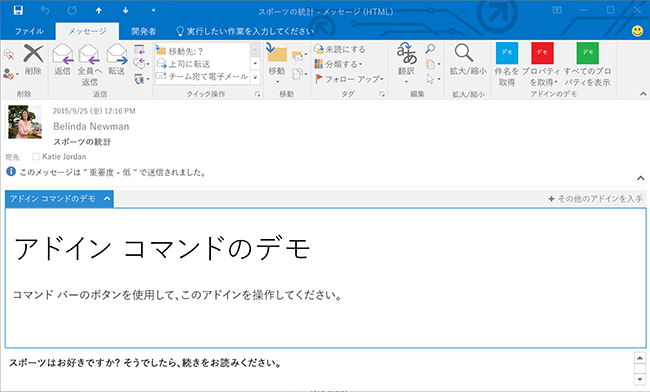

# カスタム ウィンドウの Outlook アドイン

カスタム ウィンドウは、現在選択されているアイテムで特定の条件が満たされたときにアクティブになるアドインの拡張点です。これは、アドインが実装するアドイン コマンドと共に、アドイン マニフェストの **VersionOverrides** 要素で定義されます。詳細については、「[Outlook アドイン マニフェストでアドイン コマンドを定義する](../outlook/manifests/define-add-in-commands.md)」を参照してください。カスタム ウィンドウは、メッセージ閲覧ビューまたは予定出席者ビューにのみ表示できます。アドイン バーにはエントリが表示されます。ユーザーがエントリをクリックすると、カスタム ウィンドウはアイテム本文の上側に水平方向に表示されます。外観と動作は、アドイン コマンドを実装していない閲覧モードのアドインと同じです。

**閲覧モードのカスタム ウィンドウのあるアドイン**



次の例では、メッセージであるアイテム、添付ファイルがあるアイテム、またはアドレスが含まれたアイテム用のカスタム ウィンドウを定義しています。 


```
<ExtensionPoint xsi:type="CustomPane">
  <RequestedHeight>100< /RequestedHeight> 
  <SourceLocation resid="residReadTaskpaneUrl"/>
  <Rule xsi:type="RuleCollection" Mode="Or">
    <Rule xsi:type="ItemIs" ItemType="Message"/>
    <Rule xsi:type="ItemHasAttachment"/>
    <Rule xsi:type="ItemHasKnownEntity" EntityType="Address"/>
  </Rule>
</ExtensionPoint>
```


-  **RequestedHeight** は、デスクトップ コンピューターで実行するときのこのメール アドインの希望する高さをピクセル単位で指定します。それ以外の場合は無視されます。値は 32 から 450 の間にすることができます。設定されていない場合、既定値は 350 px です。省略可能。
    
-  **SourceLocation** は、カスタム ウィンドウの UI を提供する HTML ページを指定します。**resid** 属性は、**Resources**要素の **Url** 要素 の**id** 属性の値に設定されます。必須。
    
-  
  **Rule** は、アドインがアクティブ化されるときを指定するルールまたはルールのコレクションを指定します。[Outlook アドインのマニフェスト](../outlook/manifests/manifests.md)の定義と同じですが、[ItemIs](http://msdn.microsoft.com/en-us/library/f7dac4a3-1574-9671-1eda-47f092390669%28Office.15%29.aspx) ルールに次の変更点があります。**ItemType** は "Message" または "AppointmentAttendee" のいずれかで、**FormType** 属性がありません。詳細については、「[Outlook アドインのアクティブ化ルール](../outlook/manifests/activation-rules.md)」を参照してください。
    

## その他のリソース


- [Office 365 の Outlook アドインを使用する](https://dev.outlook.com/MailAppsGettingStarted)
    
- [Outlook アドインのアクティブ化ルール](../outlook/manifests/activation-rules.md)
    
- [Outlook アドインのマニフェスト](../outlook/manifests/manifests.md)
    
- [Outlook アドイン マニフェストでアドイン コマンドを定義する](../outlook/manifests/define-add-in-commands.md)
    
