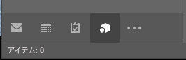
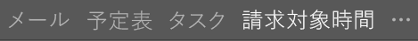
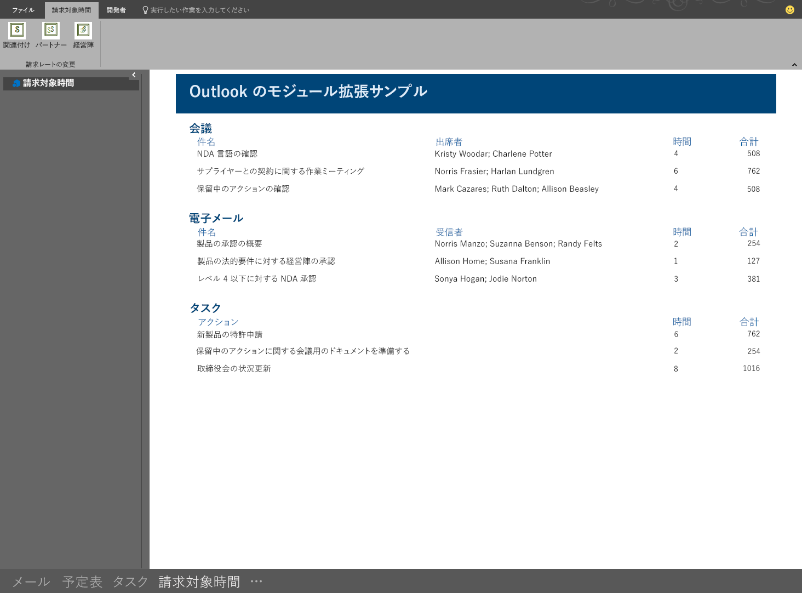

# Outlook のアドイン モジュールの拡張機能

モジュール拡張機能アドインは、Outlook のナビゲーション バーのメール、タスク、および予定表の横に表示されます。モジュール拡張機能は、メールと予定の情報を使用するために限られるものではありません。Outlook の内部で実行することで、ユーザーが Outlook から簡単にビジネスの情報や生産性ツールにアクセスできるようにするアプリケーションを作成できます。

> **注**:モジュール拡張機能は、Office 2016 でのみ使用できます。

モジュール拡張機能を開くには、ユーザーは Outlook ナビゲーション バーのモジュール名またはアイコンをクリックします。ユーザーがコンパクト ナビゲーションを選択している場合、ナビゲーション バーには拡張機能がロードされていることを示すアイコンが表示されます。

ユーザーがコンパクト ナビゲーションを使用していない場合、ナビゲーション バーは 2 通りの方法で表示されます。ロードされた拡張機能が 1 つのときには、ナビゲーション バーにアドインの名前が表示されます。

複数のアドインがロードされている場合は、[アドイン] という文字が表示されます。どちらをクリックしても、拡張機能のユーザー インターフェイスが開きます。

拡張機能をクリックすると、組み込みのモジュールは Outlook によってカスタム モジュールに置き換えられ、そのアドインはユーザーが対話的に操作できるようになります。アドインでは Outlook JavaScript API のすべての機能を使用できます。また、Outlook のリボンにコマンド ボタンを作成することで、アドインの内容を対話的に操作できます。このサンプル アドインは、Outlook のナビゲーション バーに統合されます。このアドインには、アドインの内容を更新するリボン コマンドがあります。

次に示すマニフェスト ファイルのセクションでは、モジュール拡張機能を定義しています。

    <!-- Add Outlook module extension point -->
    <VersionOverrides xmlns="http://schemas.microsoft.com/office/mailappversionoverrides"
                      xsi:type="VersionOverridesV1_0">
       <VersionOverrides xmlns="http://schemas.microsoft.com/office/mailappversionoverrides/1.1"
                         xsi:type="VersionOverridesV1_1">

         <!-- Begin override of existing elements -->
         <Description resid="residVersionOverrideDesc" />
    
         <Requirements>
           <bt:Sets DefaultMinVersion="1.3">
              <bt:Set Name="Mailbox" />
            </bt:Sets>
          </Requirements>
          <!-- End override of existing elements -->

          <Hosts>
            <Host xsi:type="MailHost">
              <DesktopFormFactor>
                <!-- Set the URL of the file that contains the
                     JavaScript function that controls the extension -->
                <FunctionFile resid="residFunctionFileUrl" />
    
                <!--New Extension Point - Module for a ModuleApp -->
                <ExtensionPoint xsi:type="Module">
                  <SourceLocation resid="residExtensionPointUrl" />
                  <Label resid="residExtensionPointLabel" />
    
                  <CommandSurface>
                    <CustomTab id="idTab">
                      <Group id="idGroup">
                        <Label resid="residGroupLabel" />
    
                        <Control xsi:type="Button" id="group.changeToAssociate">
                          <Label resid="residChangeToAssociateLabel" />
                          <Supertip>
                            <Title resid="residChangeToAssociateLabel" />
                            <Description resid="residChangeToAssociateDesc" />
                          </Supertip>
                          <Icon>
                            <bt:Image size="16" resid="residAssociateIcon16" />
                            <bt:Image size="32" resid="residAssociateIcon32" />
                            <bt:Image size="80" resid="residAssociateIcon80" />
                          </Icon>
                          <Action xsi:type="ExecuteFunction">
                            <FunctionName>changeToAssociateRate</FunctionName>
                          </Action>
                        </Control>
                        
                    </Group>
                      <Label resid="residCustomTabLabel" />
                    </CustomTab>
                  </CommandSurface>
                </ExtensionPoint>
              </DesktopFormFactor>
            </Host>
          </Hosts>
    
          <Resources>
            <bt:Images>
              <bt:Image id="residAddinIcon16" 
                        DefaultValue="https://localhost:8080/Executive-16.png" />
              <bt:Image id="residAddinIcon32" 
                        DefaultValue="https://localhost:8080/Executive-32.png" />
              <bt:Image id="residAddinIcon80" 
                        DefaultValue="https://localhost:8080/Executive-80.png" />
            
              <bt:Image id="residAssociateIcon16" 
                        DefaultValue="https://localhost:8080/Associate-16.png" />
              <bt:Image id="residAssociateIcon32" 
                        DefaultValue="https://localhost:8080/Associate-32.png" />
              <bt:Image id="residAssociateIcon80" 
                        DefaultValue="https://localhost:8080/Associate-80.png" />
            </bt:Images>
    
            <bt:Urls>
              <bt:Url id="residFunctionFileUrl" 
                      DefaultValue="https://localhost:8080/" />
              <bt:Url id="residExtensionPointUrl" 
                      DefaultValue="https://localhost:8080/" />
            </bt:Urls>
    
            <!--Short strings must be less than 30 characters long -->
            <bt:ShortStrings>
              <bt:String id="residExtensionPointLabel" 
                         DefaultValue="Billable Hours" />
              <bt:String id="residGroupLabel" 
                         DefaultValue="Change billing rate" />
              <bt:String id="residCustomTabLabel" 
                         DefaultValue="Billable hours" />
    
              <bt:String id="residChangeToAssociateLabel" 
                         DefaultValue="Associate" />
            </bt:ShortStrings>
    
            <bt:LongStrings>
              <bt:String id="residVersionOverrideDesc" 
                         DefaultValue="Version override description" />
    
              <bt:String id="residChangeToAssociateDesc" 
                         DefaultValue="Change to the associate billing rate: $127/hr" />
            </bt:LongStrings>
          </Resources>
        </VersionOverrides>
      </VersionOverrides>

## その他のリソース

* [Outlook アドインのマニフェスト](manifests/manifests.md)
* [Outlook アドイン マニフェストでアドイン コマンドを定義する](manifests/define-add-in-commands.md)
* [Outlook モジュール拡張機能 "請求対象時間" のサンプル](https://github.com/OfficeDev/Outlook-Add-in-JavaScript-ModuleExtension)
