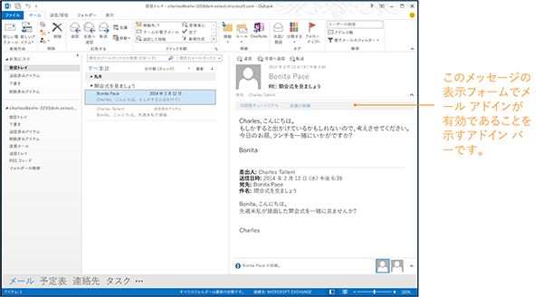

# <a name="activation-rules-for-outlook-addins"></a>Outlook アドインのアクティブ化ルール

Outlook では、ユーザーが読み取りや作成をしようとしているメッセージまたは予定が、アドインのアクティブ化のルールに準ずる場合に、ある種類のアドインをアクティブにします。これは、1.1 マニフェストのスキーマを使用するすべてのアドインについて同様です。ユーザーは、Outlook UI からアドインを選び、現在のアイテムに、そのアドインを起動することができます。

次の図は、閲覧ウィンドウにあるアドイン バーでアクティブ化されたメッセージ用の Outlook アドインを示しています。 




## <a name="specify-activation-rules-in-a-manifest"></a>マニフェストでのアクティブ化ルールの指定


Outlook に特定の条件でアドインをアクティブ化させるには、アドインのマニフェストにアクティブ化ルールを指定します。このルールの指定には、次に示すどちらかの **Rule** 要素を使用します。

- [Rule 要素 (MailApp complexType)](../../../reference/manifest/rule.md): 個別のルールを指定します。
- [Rule 要素 (RuleCollection complexType)](#rulecollection-rule): 論理演算子を使用して複数のルールを結合します。
    

 > **注:**個別のルールを指定するために使用する **Rule** 要素は、抽象 [Rule](../../../reference/manifest/rule.md) 複合型です。次のルールの各型は、この抽象 **Rule** 複合型を拡張します。したがって、マニフェストで個別のルールを指定するときは、[xsi:type](http://www.w3.org/TR/xmlschema-1/) 属性を使用してルールの次の型の 1 つをさらに定義する必要があります。たとえば、次のルールは [ItemIs](#itemis-rule) ルールを定義します。`<Rule xsi:type="ItemIs" ItemType="Message" />`**FormType** 属性は、マニフェスト v1.1 のアクティブ化ルールに適用されますが、**VersionOverrides** v1.0 では定義されていません。したがって、[Itemls](#itemis-rule) を **VersionOverrides** ノードで使用するときは使用できません。

次の表は、使用できるルールの種類を示しています。詳細については、この表の後の説明と、「[閲覧フォーム用の Outlook アドインを作成する](../../outlook/read-scenario.md)」の該当記事を参照してください。


|**ルール名**|**該当するフォーム**|**説明**|
|:-----|:-----|:-----|
|[ItemIs](#itemis-rule)|読み取り、作成|現在選択されているアイテムは指定された種類のアイテム (メッセージまたは予定) かどうかを調べます。また、アイテム クラス、フォームの種類、さらにはオプションでアイテム メッセージ クラスも調べることができます。|
|[ItemHasAttachment](#itemhasattachment-rule)|読み取り|選択されているアイテムに添付ファイルが含まれるかどうかを調べます。|
|[ItemHasKnownEntity](#itemhasknownentity-rule)|読み取り|選択されているアイテムに 1 つ以上の一般的なエンティティが含まれるかどうかを調べます。詳細: 「[Outlook アイテム内の文字列を既知のエンティティとして照合する](../../outlook/match-strings-in-an-item-as-well-known-entities.md)」。|
|[ItemHasRegularExpressionMatch](#itemhasregularexpressionmatch-rule)|読み取り|選択されているアイテムの送信者の電子メール アドレス、件名、本文に正規表現と一致するものが含まれるかどうかを調べます。詳細: [正規表現アクティブ化ルールを使用して Outlook アドインを表示する](../../outlook/use-regular-expressions-to-show-an-outlook-add-in.md)|
|[RuleCollection](#rulecollection-rule)|読み取り、作成|複数のルールを組み合わせて、より複雑なルールを作成できます。|

## <a name="itemis-rule"></a>ItemIs ルール


**ItemIs** 複合型は、現在のアイテムがアイテムの種類と一致していル場合 (また、オプションとしてルールに明記されている場合はアイテムのメッセージ クラスとも一致している場合) に **true** と評価されるルールを定義します。

次のいずれかの種類のアイテムを  **ItemIs** ルールの **ItemType** 属性に指定します。1 つのマニフェスト内に複数の **ItemIs** ルールを指定できます。 ItemType simpleType は、Outlook アドインをサポートする Outlook アイテムの種類を定義します。


|**値**|**説明**|
|:-----|:-----|
|**Appointment**|Outlook の予定表内のアイテムを指定します。このアイテムには、開催者と出席者を持つ応答済みの会議アイテムと、開催者と出席者を持たない、単なる予定表上のアイテムである予定が含まれます。これは Outlook の IPM.Appointment メッセージ クラスに対応します。|
|**Message**|通常は受信トレイで受信される次のアイテムのいずれかを指定します。 <ul><li><p>電子メール メッセージ。これは Outlook の IPM.Note メッセージ クラスに対応します。</p></li><li><p>会議出席依頼、返信、または取り消し。Outlook の次のメッセージ クラスに対応します。</p><p>IPM.Schedule.Meeting.Request</p><p>IPM.Schedule.Meeting.Neg</p><p>IPM.Schedule.Meeting.Pos</p><p>IPM.Schedule.Meeting.Tent</p><p>IPM.Schedule.Meeting.Canceled</p></li></ul>|
**FormType** 属性は、アドインをアクティブ化するときのモード (閲覧または新規作成) を指定するために使用します。


 > **メモ: ** ItemIs の **FormType** 属性はスキーマ v1.1 以降では定義されていますが、**VersionOverrides** v1.0 では定義されていません。アドイン コマンドを定義するときには、**FormType** 属性を含めてはいけません。

アドインがアクティブ化された後は、 [mailbox.item](../../../reference/outlook/Office.context.mailbox.item.md) プロパティを使用して Outlook で現在選択されているアイテムを取得し、 [item.itemType](../../../reference/outlook/Office.context.mailbox.item.md) プロパティを使用して現在のアイテムの種類を取得できます。

必要に応じて、 **ItemClass** 属性を使用してアイテムのメッセージ クラスを指定し、 **IncludeSubClasses** 属性を使用して、アイテムが指定したクラスのサブクラスであるときにルールを **true** にするかどうかを指定できます。

メッセージ クラスの詳細については、「 [アイテムの種類とメッセージ クラス](http://msdn.microsoft.com/library/15b709cc-7486-b6c7-88a3-4a4d8e0ab292%28Office.15%29.aspx)」をご覧ください。

次の例は、ユーザーがメッセージを読むときに Outlook のアドイン バーにアドインを表示する  **ItemIs** ルールを示しています。

```xml
<Rule xsi:type="ItemIs" ItemType="Message" FormType="Read" />
```

次の例は、ユーザーがメッセージを読むときに Outlook のアドイン バーにアドインを表示する  **ItemIs** ルールを示しています。

```xml
<Rule xsi:type="RuleCollection" Mode="Or">
  <Rule xsi:type="ItemIs" ItemType="Message" FormType="Read" />
  <Rule xsi:type="ItemIs" ItemType="Appointment" FormType="Read" />
</Rule>
```


## <a name="itemhasattachment-rule"></a>ItemHasAttachment ルール


**ItemHasAttachment** 複合型は、選択されているアイテムに添付ファイルが含まれるかどうかを調べるルールを定義します。

```xml
<Rule xsi:type="ItemHasAttachment" />
```


## <a name="itemhasknownentity-rule"></a>ItemHasKnownEntity ルール

アドインがアイテムを処理できるようになる前に、サーバーによってそのアイテムが調べられ、件名または本文に既知のエンティティのいずれかである可能性があるテキストが含まれるかどうかが判別されます。それらのいずれかのエンティティが発見されると、そのエンティティは既知のエンティティのコレクションに格納されます。これらのエンティティには、そのアイテムの  **getEntities** メソッドまたは **getEntitiesByType** メソッドを使用してアクセスします。

**ItemHasKnownEntity** を使用すると、指定した種類のエンティティがアイテム内に存在する場合にアドインを表示するルールを指定できます。**ItemHasKnownEntity** ルールの **EntityType** 属性には、次に示す既知のエンティティを指定できます。
-  Address
-  Contact
-  EmailAddress
-  MeetingSuggestion
-  PhoneNumber
-  TaskSuggestion
-  URL
    
必要に応じて、 **RegularExpression** 属性に正規表現を含め、正規表現に一致するエンティティが存在するときにのみアドインを表示できます。 **ItemHasKnownEntity** ルールで指定されている正規表現と一致したものを取得するには、現在選択されている Outlook アイテムに対して **getRegExMatches** メソッドまたは **getFilteredEntitiesByName** メソッドを使用できます。

次の例では、指定した既知のエンティティのいずれかがメッセージに存在するときにアドインを表示する  **Rule** 要素のコレクションを示します。

```xml
<Rule xsi:type="RuleCollection" Mode="Or">
    <Rule xsi:type="ItemHasKnownEntity" EntityType="Address" />
    <Rule xsi:type="ItemHasKnownEntity" EntityType="MeetingSuggestion" />
    <Rule xsi:type="ItemHasKnownEntity" EntityType="TaskSuggestion" />
</Rule>
```

次の例は、"contoso" という単語を含む URL がメッセージ内に存在するときにアドインをアクティブ化する、 **RegularExpression** 属性を持った **ItemHasKnownEntity** ルールを示しています。


```xml
<Rule xsi:type="ItemHasKnownEntity" EntityType="Url" RegularExpression="contoso" />
```

アクティブ化ルールのエンティティの詳細については、「 [Outlook アイテム内の文字列を既知のエンティティとして照合する](../../outlook/match-strings-in-an-item-as-well-known-entities.md)」を参照してください。


## <a name="itemhasregularexpressionmatch-rule"></a>ItemHasRegularExpressionMatch ルール


**ItemHasRegularExpressionMatch** 複合型は、アイテムの指定プロパティの内容を照合する正規表現を使用するルールを定義します。正規表現に一致するテキストがアイテムの指定プロパティ内に見つかった場合に、Outlook はアドイン バーをアクティブ化してそのアドインを表示します。指定された正規表現と一致したものを取得するには、現在選択されているアイテムを表すオブジェクトの **getRegExMatches** メソッドまたは **getRegExMatchesByName** メソッドを使用します。

次の例は、選択したアイテムの本文に「apple」、「banana」、「coconut」(大文字/小文字は問わない) が含まれる場合に、アドインをアクティブ化する  **ItemHasRegularExpressionMatch** を示しています。

```xml
<Rule xsi:type="ItemHasRegularExpressionMatch" RegExName="fruits" RegExValue="apple|banana|coconut" pPropertyName="BodyAsPlaintext" IgnoreCase="true" />
```

**ItemHasRegularExpressionMatch** ルールの使用方法の詳細については、「[正規表現アクティブ化ルールを使用して Outlook アドインを表示する](../../outlook/use-regular-expressions-to-show-an-outlook-add-in.md)」を参照してください。


## <a name="rulecollection-rule"></a>RuleCollection ルール


**RuleCollection** 複合型は、複数のルールを 1 つのルールに結合します。**Mode** 属性を使用すると、コレクション内のルールを論理 OR または論理 AND のどちらで結合するかを指定できます。

論理 AND を指定する場合、アドインは、コレクション内で指定されているすべてのルールにアイテムが一致する場合にのみ表示されます。論理 OR を指定する場合は、コレクションで指定されているルールのいずれか 1 つにでもアイテムが一致すれば、アドインは表示されます。

**RuleCollection** ルールを組み合わせて、複雑なルールを作成できます。次に示す例では、件名や本文に住所が含まれるメッセージまたは予定表のアイテムをユーザーが表示したときに、アドインがアクティブ化されます。

```xml
<Rule xsi:type="RuleCollection" Mode="And">
  <Rule xsi:type="RuleCollection" Mode="Or">
    <Rule xsi:type="ItemIs" ItemType="Message" FormType="Read" />
    <Rule xsi:type="ItemIs" ItemType="Appointment" FormType="Read"/>
  </Rule>
  <Rule xsi:type="ItemHasKnownEntity" EntityType="Address" />
</Rule>
```

次の例では、ユーザーがメッセージを新規作成するときか、件名か本文に住所が含まれる予定を表示するときに、アドインがアクティブ化されます。

```xml
<Rule xsi:type="RuleCollection" Mode="Or"> 
  <Rule xsi:type="ItemIs" ItemType="Message" FormType="Edit" /> 
  <Rule xsi:type="RuleCollection" Mode="And">
    <Rule xsi:type="ItemIs" ItemType="Appointment" FormType="Read" />
    <Rule xsi:type="ItemHasKnownEntity" EntityType="Address" />
  </Rule> 
</Rule>
```


## <a name="limits-for-rules-and-regular-expressions"></a>ルールと正規表現の制約事項


Outlook アドインで満足のゆくエクスペリエンスを提供するには、アクティベーションと API の使用に関するガイドラインに従う必要があります。以下の表に、正規表現とルールに関する一般的な制約事項を示します。ただし、ホストごとの特有のルールも存在します。詳しくは、「 [Outlook アドインのアクティブ化と JavaScript API の制限](../../outlook/limits-for-activation-and-javascript-api-for-outlook-add-ins.md)」および「 [Outlook アドインのアクティブ化のトラブルシューティング](../../outlook/troubleshoot-outlook-add-in-activation.md)」をご覧ください。

|**アドインの要素**|**ガイドライン**|
|:-----|:-----|
|マニフェストのサイズ|256 KB 未満。|
|ルール|15 ルール未満。|
|ItemHasKnownEntity|Outlook リッチ クライアントでは、本文の最初の 1 MB にルールを適用し、残りの部分には適用しません。|
|正規表現|すべての Outlook ホストに対する ItemHasKnownEntity または ItemHasRegularExpressionMatch ルールの場合:<br><ul><li>Outlook アドインのアクティベーション ルールで指定する正規表現は 5 個までにしてください。その制約数を超えるアドインをインストールすることはできません。</li><li>予期される結果が <b>getRegExMatches</b> メソッド呼び出しによって返されて、それらが最初の 50 件以内に収まるように、正規表現を指定します。 </li><li>正規表現で前読みアサーションは指定できますが、後読み (?<=text) および否定後読み (?<!text) アサーションは指定できません。</li><li>一致数が次の表の制限を超えない正規表現を指定します。<br/><br/><table><tr><th>正規表現の長さ制限</th><th>Outlook リッチ クライアント</th><th>デバイス用 Outlook Web App</th></tr><tr><td>アイテムの本文がテキスト形式の場合</td><td>1.5 KB</td><td>3 KB</td></tr><tr><td>アイテムの本文が HTML の場合</td><td>3 KB</td><td>3 KB</td></tr></table>|

## <a name="additional-resources"></a>その他のリソース

- [Outlook アドイン](../../outlook/outlook-add-ins.md)
- [新規作成フォーム用の Outlook アドインを作成する](../../outlook/compose-scenario.md)
- [Outlook アドインのアクティブ化と JavaScript API の制限](../../outlook/limits-for-activation-and-javascript-api-for-outlook-add-ins.md)
- [アイテムの種類とメッセージ クラス](http://msdn.microsoft.com/library/15b709cc-7486-b6c7-88a3-4a4d8e0ab292%28Office.15%29.aspx)
- [正規表現アクティブ化ルールを使用して Outlook アドインを表示する](../../outlook/use-regular-expressions-to-show-an-outlook-add-in.md)
- [Outlook アイテム内の文字列を既知のエンティティとして照合する](../../outlook/match-strings-in-an-item-as-well-known-entities.md)
    
