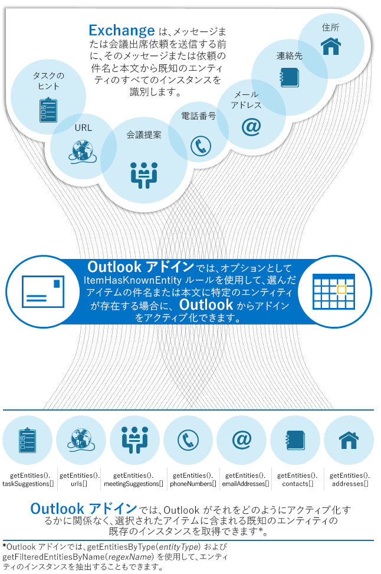

# <a name="match-strings-in-an-outlook-item-as-well-known-entities"></a>Outlook アイテム内の文字列を既知のエンティティとして照合する


メッセージおよび会議出席依頼のアイテムを送信する前に、Exchange Server によりアイテムの内容が解析され、件名と本文から、電子メール アドレス、電話番号、URL など、Exchange にとっての既知のエンティティに似た文字列が特定され、スタンプが付けられます。メッセージと会議出席依頼は、Exchange Server によって、既知のエンティティにスタンプが付けられた状態で、Outlook の受信トレイに配信されます。 

JavaScript API for Office を使用すれば、特定の既知のエンティティと一致するこれらの文字列を取得してさらに処理できます。さらに、既知のエンティティをアドイン マニフェスト内のルールで指定して、ユーザーがそのエンティティと一致するものを含んだアイテムを表示したときに、Outlook がアドインをアクティブにするように設定することもできます。その後で、エンティティと一致するものを抽出してアクションを実行することができます。 

選択したメッセージや予定からこのようなインスタンスを特定して抽出できることは、さまざまな目的に応用できます。たとえば、電話番号逆引きサービスを Outlook アドインとして作成することができます。このアドインは、アイテムの件名や本文から電話番号と思われる文字列を抽出し、その番号の登録されている所有者を探し当てて表示することができます。

このトピックでは既知のエンティティ、既知のエンティティに基づくアクティブ化ルールの例、およびアクティブ化ルール内でエンティティが使用されているかどうかに関係なく、一致するエンティティを抽出する方法を紹介します。


## <a name="support-for-well-known-entities"></a>既知のエンティティに対するサポート


Exchange Server は、ユーザーがメッセージや会議出席依頼アイテムを送信した後、それが受信者に配信される前に、アイテム内の既知のエンティティにスタンプを付けます。そのため、Exchange 内のトランスポートを通過したアイテムだけにスタンプが付けられ、Outlook はユーザーがそのようなアイテムを表示中にそれらのスタンプに基づいてアドインをアクティブにすることができます。しかし、ユーザーがアイテムを作成している間や、送信済みアイテム フォルダー内のアイテムを表示しているときは、そのアイテムがまだトランスポートを通過していないため、Outlook は既知のエンティティに基づいてアドインをアクティブにすることができません。 

同様に、作成中または送信済みアイテム フォルダー内のアイテムはトランスポートを通過しておらず、スタンプが付けられていないため、既知のエンティティを抽出できません。アクティブ化をサポートしているアイテムの種類の詳細については、「[Outlook アドインのアクティブ化ルール](../outlook/manifests/activation-rules.md#activation-rules-for-outlook-add-ins)」を参照してください。

次の表は、Exchange Server と Outlook でサポートされ、認識されるエンティティ (つまり、「既知のエンティティ」) と、各エンティティのインスタンスのオブジェクト タイプを一覧にしたものです。これらのエンティティの 1 つとしての文字列の自然言語認識は、大量のデータに対してトレーニングを行った学習モデルに基づきます。したがって、認識は決定論的ではありません。認識に関する条件の詳細については、「 [既知のエンティティを使用するためのヒント](#tips-for-using-well-known-entities)」を参照してください。

 **表 1.サポートされるエンティティとその型**


|**エンティティの型**|**認識に関する条件**|**オブジェクトの種類**|
|:-----|:-----|:-----|
|**住所**|米国の住所。次はその例です。1234 Main Street, Redmond, WA 07722.一般に、住所を認識するには、米国の住所の構造に従う必要があり、ほとんどには街路番号、街路名、都市、州、郵便番号といった要素が存在します。住所は 1 行または複数行で指定できます。|JavaScript  **String** オブジェクト|
|**連絡先**|自然言語で認識された人の情報の参照。連絡先の認識はコンテキストに依存します。たとえば、メッセージの最後にある署名や、電話番号、住所、電子メール アドレス、URL などの情報の近くにある人の名前などです。|[Contact](../../reference/outlook/simple-types.md) オブジェクト|
|**EmailAddress**|SMTP 電子メール アドレス。|JavaScript  **String** オブジェクト|
|**MeetingSuggestion**|イベントまたは会議の参照。たとえば、Exchange 2013では次のテキストは会議の提案として認識されます。 _明日、昼食会議を開きましょう。_|[MeetingSuggestion](../../reference/outlook/simple-types.md) オブジェクト|
|**PhoneNumber**|米国の電話番号。次はその例です。_(235) 555-0110_|[PhoneNumber](../../reference/outlook/simple-types.md) オブジェクト|
|**TaskSuggestion**|電子メールの対応可能な文言。たとえば、_スプレッドシートを更新してください。_|[TaskSuggestion](../../reference/outlook/simple-types.md) オブジェクト|
|**Url**|ネットワークの場所と Web リソースの識別子を明示的に指定した Web アドレス。Exchange Server は Web アドレス内のアクセス プロトコルを必要としないうえ、 **Url** エンティティのインスタンスとしてリンク テキスト内に埋め込まれた URL を認識しません。Exchange Server の例を以下に示します。 _www.youtube.com/user/officevideos_ _http://www.youtube.com/user/officevideos_|JavaScript  **String** オブジェクト|
図 1 は、アドインで Exchange Server と Outlook が既知のエンティティをサポートする仕組みと、既知のエンティティを使用してアドインでできる操作について説明しています。エンティティの利用方法について詳しくは、「 [アドインでのエンティティの取得](#retrieving-entities-in-your-add-in)」と「 [エンティティの存在に基づくアドインのアクティブ化](#activating-an-add-in-based-on-the-existence-of-an-entity)」をご覧ください。


**図 1.Exchange Server、Outlook、アドインが既知のエンティティをサポートする仕組み**




## <a name="permissions-to-extract-entities"></a>エンティティを抽出するためのアクセス許可


JavaScript コードでエンティティを抽出したり、特定の既知のエンティティの存在に基づいてアドインをアクティブ化したりする場合は、アドイン マニフェストで適切なアクセス許可を要求しておきます。

既定の制限付きのアクセス許可を指定している場合は、アドインで  **Address**、 **MeetingSuggestion**、 **TaskSuggestion** のエンティティを抽出できます。これら以外のエンティティを抽出するには、アイテムの読み取りアクセス許可、アイテムの読み取り/書き込みアクセス許可、またはメールボックスの読み取り/書き込みアクセス許可を指定します。マニフェスト内でこれを実行するには、 [Permissions](http://msdn.microsoft.com/en-us/library/c20cdf29-74b0-564c-e178-b75d148b36d1%28Office.15%29.aspx) 要素を使用し、適切なアクセス許可、すなわち、 **Restricted**、 **ReadItem**、 **ReadWriteItem**、または  **ReadWriteMailbox** を次の例のように指定します。


```XML
<Permissions>ReadItem</Permissions>
```


## <a name="retrieving-entities-in-your-add-in"></a>アドインでのエンティティの取得


ユーザーが表示しているアイテムの件名または本文に Exchange と Outlook で既知のエンティティとして認識される文字列が含まれていれば、アドインでそれらのインスタンスを利用できます。アドインが既知のエンティティに基づいてアクティブにされていない場合でもそれらを利用できます。適切なアクセス許可があれば、 **getEntities** メソッドまたは **getEntitiesByType** メソッドを使用して、現在のメッセージまたは予定の中に存在する既知のエンティティを取得できます。 **getEntities** メソッドは、アイテム内のすべての既知のエンティティを含んだ、 [Entities](../../reference/outlook/simple-types.md) オブジェクトの配列を返します。特定の種類のエンティティを取得する場合は、特定の種類のエンティティのみの配列を返す **getEntitiesByType** メソッドを使用します。 [EntityType](../../reference/outlook/Office.MailboxEnums.md) 列挙型は抽出可能なすべての既知のエンティティの種類を表します。

**getEntities** を呼び出した後、**Entities** オブジェクトの対応するプロパティを使用して、任意の型を持つエンティティのインスタンスの配列を取得できます。エンティティの型により、配列内のインスタンスは単なる文字列であることも、特定にオブジェクトにマップすることもあります。たとえば、図 1 のように、アイテムのアドレスを取得するには、`getEntities().addresses[]` により返される配列にアクセスします。**Entities.addresses** プロパティは、Outlook が郵便住所として認識する文字列の配列を返します。同様に、**Entities.contacts** プロパティは、Outlook が連絡先情報として認識する **Contact** オブジェクトの配列を返します。表 1 に、サポートされる各エンティティのインスタンスのオブジェクト型を示します。

以下の例では、メッセージ内で見つかった住所を取得する方法を示します。


```
// Get the address entities from the item.
var entities = Office.context.mailbox.item.getEntities();
// Check to make sure that address entities are present.
if (null != entities &amp;&amp; null != entities.addresses &amp;&amp; undefined != entities.addresses) {
   //Addresses are present, so use them here.
}

```


## <a name="activating-an-add-in-based-on-the-existence-of-an-entity"></a>エンティティの存在に基づくアドインのアクティブ化


既知のエンティティを利用するもう 1 つの方法は、現在表示されているアイテムの件名または本文に 1 つまたは複数の種類のエンティティが存在するかどうかに基づいて Outlook にアドインをアクティブ化させる方法です。これを実現するには、アドイン マニフェスト内で  **ItemHasKnownEntity** ルールを指定します。 [KnownEntityType](http://msdn.microsoft.com/en-us/library/432d413b-9fcc-eb50-cfea-0ed10a43bd52%28Office.15%29.aspx) 単純型は、 **ItemHasKnownEntity** ルールでサポートされる既知のエンティティのさまざまな種類を表します。アドインがアクティブ化されたら、前のセクション「 [アドインでのエンティティの取得](#retrieving-entities-in-your-add-in)」で説明したように、目的のエンティティのインスタンスを取得することもできます。 

オプションとして、 **ItemHasKnownEntity** ルールで正規表現を適用すると、エンティティのインスタンスをさらにフィルター処理によって絞り込んで、エンティティのインスタンスのサブセットに基づいてアドインを Outlook でアクティブ化できます。たとえば、"98" で始まるワシントン州の郵便番号を含むメッセージの中の街路住所エンティティを検出するフィルターを指定できます。エンティティ インスタンスにフィルターを適用するには、 **ItemHasKnownEntity** 型の **Rule** 要素で [RegExFilter](http://msdn.microsoft.com/en-us/library/56dfc32e-2b8c-1724-05be-5595baf38aa3%28Office.15%29.aspx) 属性と [FilterName](http://msdn.microsoft.com/en-us/library/87e10fd2-eab4-c8aa-bec3-dff92d004d39%28Office.15%29.aspx) 属性を使用します。

他のアクティブ化ルールと同様に、複数のルールを指定してアドインのルール コレクションを作成できます。以下は 2 つのルール ( **ItemIs** ルールと **ItemHasKnownEntity** ルール) に基づいて「AND」演算を適用する例です。このルール コレクションにより、現在のアイテムがメッセージである場合に、Outlook がそのアイテムの件名または本文から住所を認識すると、アドインがアクティブ化されます。


```XML
<Rule xsi:type="RuleCollection" Mode="And">
   <Rule xsi:type="ItemIs" ItemType="Message" />
   <Rule xsi:type="ItemHasKnownEntity" EntityType="Address" />
</Rule>
```

次の例では、現在のアイテムの  **getEntitiesByType** を使用して、変数 `addresses` を前のルール コレクションの結果に設定します。


```
var addresses = Office.context.mailbox.item.getEntitiesByType(Office.MailboxEnums.EntityType.Address);
```

次の  **ItemHasKnownEntity** ルールの例では、現在のアイテムの件名または本文に URL が存在し、URL に文字列 "youtube" (大文字小文字は区別しない) が含まれている場合、常にアドインをアクティブにします。


```XML
<Rule xsi:type="ItemHasKnownEntity" 
    EntityType="Url" 
    RegExFilter="youtube"
    FilterName="youtube"
    IgnoreCase="true"/>
```

次の例では、現在のアイテムの  **getFilteredEntitiesByName(name)** を使用して変数 `videos` を設定し、前の **ItemHasKnownEntity** ルールの正規表現に一致する結果の配列を取得します。


```
var videos = Office.context.mailbox.item.getFilteredEntitiesByName(youtube);
```


## <a name="tips-for-using-well-known-entities"></a>既知のエンティティを使用するためのヒント


アドインで既知のエンティティを使用する場合に知っておくべきいくつかの事実と制限があります。ユーザーが既知のエンティティと一致するものを含むアイテムを表示しているときにアドインがアクティブになっていれば、 **ItemHasKnownEntity** ルールを使用しているかどうかに関係なく、以下が適用されます。


1. 文字列が英語の場合にのみ、既知のエンティティである文字列を抽出できます。
    
2. アイテム本文の最初の 2,000 文字から既知のエンティティを抽出できます。2,000 を超える文字から抽出することはできません。このサイズ制限により、機能とパフォーマンスのニーズのバランスが維持されるため、大量のメッセージと予定の中の既知のエンティティのインスタンスを解析し特定しても、Exchange Server と Outlook が停止することがありません。この制限は、アドインで  **ItemHasKnownEntity** ルールを指定するかどうかには関係ないことに注意してください。アドインでそのようなルールを使用する場合には、Outlook リッチ クライアントに対する以下の 2 番目の項目のルール処理制限にも注意してください。
    
3. メールボックスの所有者以外の誰かが計画した会議である予定からエンティティを抽出できます。会議ではないカレンダー アイテムやメールボックスの所有者が計画した会議である予定からエンティティを抽出することはできません。
    
4. **MeetingSuggestion** 型のエンティティはメッセージからのみ抽出できます。予定から抽出することはできません。
    
5. アイテム本文に明示的に存在する URL を抽出することはできますが、HTML のアイテム本文のハイパーリンク テキストに埋め込まれている URL を抽出することはできません。明示的 URL と埋め込み URL の両方を取得するには、代わりに  **ItemHasRegularExpressionMatch** ルールの使用を検討してください。 **BodyAsHTML** を _PropertyName_ として指定し、URL に一致する正規表現を _RegExValue_ として指定します。
    
6. [送信済みアイテム] フォルダーのアイテムからエンティティを抽出することはできません。
    
また、 [ItemHasKnownEntity](http://msdn.microsoft.com/en-us/library/87e10fd2-eab4-c8aa-bec3-dff92d004d39%28Office.15%29.aspx) ルールを使用する場合には以下の動作が適用され、本来 (すなわち、その動作が適用されなけば) アドインが有効化されるはずであるシナリオに影響する可能性があります。


1. **ItemHasKnownEntity** ルールを使用するとき、マニフェストに指定されている既定のロケールに関係なく、Outlook は英語のエンティティ文字列だけを照合します。
    
2. アドインが Outlook リッチ クライアントで実行されている場合、Outlook は  **ItemHasKnownEntity** ルールをアイテム本文の最初の 1 メガバイトに適用し、その限度を超える本文の残りの部分には適用しません。
    
3. **ItemHasKnownEntity** ルールを使用して、 [送信済みアイテム] フォルダーのアイテムに対してアドインをアクティブ化することはできません。
    

## <a name="additional-resources"></a>その他のリソース


- [閲覧フォーム用の Outlook アドインを作成する](../outlook/read-scenario.md)
    
- [Outlook アイテムからエンティティ文字列を抽出する](../outlook/extract-entity-strings-from-an-item.md)
    
- [Outlook アドインのアクティブ化ルール](../outlook/manifests/activation-rules.md)
    
- [正規表現アクティブ化ルールを使用して Outlook アドインを表示する](../outlook/use-regular-expressions-to-show-an-outlook-add-in.md)
    
- [Outlook アドインのアクセス許可を理解する](../outlook/understanding-outlook-add-in-permissions.md)
    
