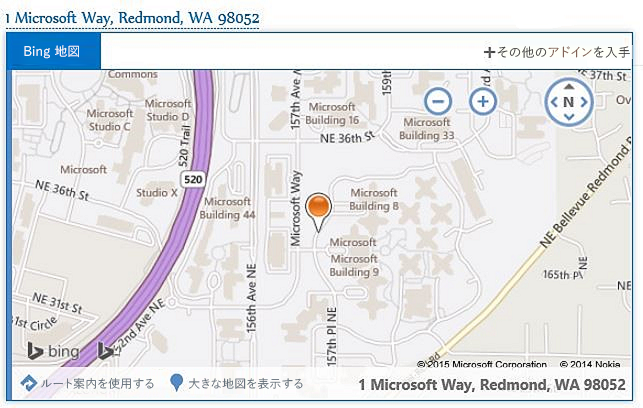

# Outlook アドイン

Outlook アドインは、新しい Web テクノロジ ベースのプラットフォームを使用してサードパーティ企業によって Outlook に組み込まれた統合です。Outlook アドインには次の 3 つの主な側面があります。

- Windows と Mac 用のデスクトップ Outlook、Web 版 (Office 365 と Outlook.com)、モバイル版すべてで機能する同じアドインとビジネス ロジック。
    
-  Outlook アドインは、マニフェスト (アドインが Outlook に統合する方法 (ボタンや作業ウィンドウなど) を説明する)、および JavaScript/HTML のコード (アドインの UI とビジネス ロジックを構成する) で構成される。
    
- Outlook アドインは、Office ストアから取得したり、エンドユーザーや管理者がサイドロードしたりできる。
    
Outlook アドインは、Windows で実行する Outlook に固有の古い統合である COM アドインや VSTO アドインとは異なります。COM アドインとは異なり、Outlook アドインには、ユーザーのデバイスや Outlook クライアントに物理的にインストールされたコードがありません。Outlook アドインの場合、Outlook はマニフェストを読み取り、指定された UI コントロールをフックして、JavaScript と HTML を読み込みます。このすべてが、サンドボックス内のブラウザーのコンテキストで実行されます。

メール アドインをサポートする Outlook アイテムには、メール メッセージ、会議出席依頼、会議出席依頼の返信、会議の取り消し、予定などがあります。それぞれのメール アドインでは、メール アドインが使用できるコンテキストを定義します。これにはアイテムの種類、およびユーザーがアイテムの読み取り (または作成) を行っているかどうかなどがあります。

## 拡張点

拡張点は、アドインが Outlook と統合する方法です。これを行う方法は以下のとおりです。

- アドインは、メッセージと予定のコマンド サーフェスに表示されるボタンを宣言できます。詳細は、「 [Outlook のアドイン コマンド](../outlook/add-in-commands-for-outlook.md)」をご覧ください。
    
    **リボン上の [コマンド] ボタンがあるアドイン**

    

- アドインは、メッセージおよび予定内の正規表現に一致するものや検出されたエンティティのリンクをオフにすることができます。 詳細は、「 [コンテキスト Outlook アドイン](../outlook/contextual-outlook-add-ins.md)」をご覧ください。
    
    **強調表示されたエンティティ (アドレス) 用のコンテキスト アドイン**

    

## アドインで使用可能なメールボックス アイテム

Outlook アドインは、作成中や読み取り中にメッセージや予定で使用することができますが、他のアイテムの種類では使用できません。新規作成フォームまたは閲覧フォームで現在のメッセージ アイテムが次のいずれかの場合、Outlook はアドインをアクティブ化しません。

- Information Rights Management (IRM) によって保護されている、S/MIME 形式である、または保護のためにその他の方法で暗号化されている場合。
    
- [迷惑メール] フォルダーにある場合。
    
- メッセージ クラスが IPM.Report.* である配信レポートまたは通知 (配信レポート、配信不能レポート (NDR)、開封通知、未開封通知、遅延通知など)。
    
- 別のメッセージに添付される .msg ファイルの場合。
    
- ファイル システムから開かれる .msg ファイルの場合。
    
既知のエンティティの文字列照合に基づいてアクティブ化されるアドインを除いて、通常、[送信済みアイテム] フォルダーのアイテムに対して Outlook は閲覧フォーム内でアドインをアクティブ化できます。この背後にある理由の詳細については、「[Outlook アイテム内の文字列を既知のエンティティとして照合する](../outlook/match-strings-in-an-item-as-well-known-entities.md)」の「既知のエンティティに対するサポート」を参照してください。

## サポートされるホスト

Outlook アドインは、Outlook 2013 以降のバージョン、Outlook 2016 for Mac、オンプレミスの Exchange 2013 用 Outlook Web アプリ、Office 365 および Outlook.com 用 Outlook Web アプリでサポートされています。すべての最新機能がすべてのクライアントで同時にサポートされるとは限りません。これらがどのホストでサポートされているのか (またはされていないのか) を確認するには、個々のトピックと API リファレンスを参照してください。

## Outlook アドインの作成を開始する

Outlook アドインの作成を開始するには、「[Office 365 の Outlook アドインを使用する](https://dev.outlook.com/MailAppsGettingStarted/GetStarted)」を参照してください。

## その他の技術情報

- [Outlook アドインのアーキテクチャと機能の概要](../outlook/overview.md)
- [Office アドイン開発のベスト プラクティス](../../docs/overview/add-in-development-best-practices.md)
- [Office アドインの設計ガイドライン](../../docs/design/add-in-design.md)
- [Office アドインおよび SharePoint アドインのライセンス](http://msdn.microsoft.com/library/3e0e8ff6-66d6-44ff-b0c2-59108ebd9181%28Office.15%29.aspx)
- [Office アドインを発行する](../publish/publish.md)
- [Office ストアに Office アドインと SharePoint アドインおよび Office 365 Web アプリを提出する](http://msdn.microsoft.com/library/ff075782-1303-4517-91cc-b3d730e9b9ae%28Office.15%29.aspx)

