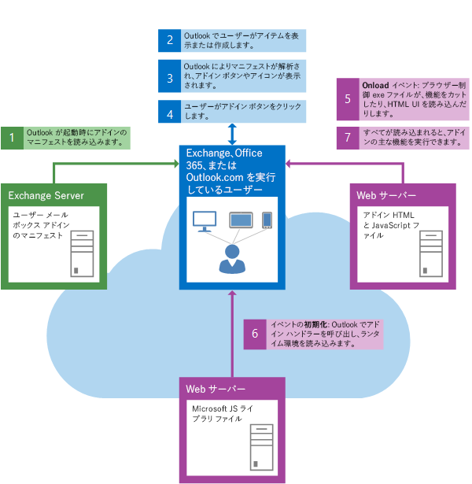

# Outlook アドインのアーキテクチャと機能の概要

Outlook アドインは、XML マニフェストとコード (JavaScript と HTML) で構成されます。マニフェストは、アドインの名前と説明に加えて、アドインを Outlook に統合する方法を指定します。開発者は、マニフェストを使用して、コマンド サーフェスへのボタンを配置したり、正規表現に一致するもののリンクをオフにしたりすることなどができます。また、マニフェストは、アドインの JavaScript と HTML のコードをホストする URL を定義します。

ユーザーまたは管理者がアドインを取得すると、アドインのマニフェストがユーザーのメールボックスまたは組織内に保存されます。Outlook は、起動時に、ユーザーがインストールしたマニフェストをすべて読み込んでから、そのマニフェストを処理してアドインのすべての拡張点を設定します (たとえば、コマンド サーフェスにボタンを表示したり、現在選択されているメッセージに対して正規表現を実行したりします)。その結果、ユーザーがそのアドインを使用できるようになります。

ユーザーがアドインを操作すると、マニフェストで指定されたホストの場所から JavaScript と HTML のファイルが読み込まれます。

アドインは、Office.js API を使用して Outlook アドイン API にアクセスして、Outlook とやり取りします。

**ユーザーが Outlook を起動したときの一般的なコンポーネントの動作**

### バージョン管理

Outlook クライアントとアドイン プラットフォームを発展させ、アドインを統合する新しい方法を追加していくときに、すべてのクライアント (Mac、Windows、Web、モバイル) に同時に機能を実装することができないことがあります。そういった状況に対処するため、Microsoft ではマニフェストと API の両方のバージョン管理を行っているため、プラットフォームは常時下位互換性をサポートします。つまり、開発者は、古いクライアントではダウン レベルの方法での動作をし、新しいクライアントでは新機能を利用することができるアドインを作成することができます。バージョン管理のしくみの詳細については、「 [Outlook アドインのマニフェスト](manifests/manifests.md)」をお読みください。

## Outlook アドインの機能

Outlook アドインは、さまざまなシナリオをサポートするために使用できる多数の豊富な機能を提供します。

|**機能**|**説明**|
|:-----|:-----|
|コンテキストに応じたアクティブ化|Outlook コンテキスト アドインは、次の条件に基づいてアクティブ化できます: <ul><li>(既定) メールボックスまたは予定表の任意のアイテム</li><li>特定のアイテムの種類 (メール メッセージ、会議出席依頼メッセージ、または予定) で。</li><li>アイテムのメッセージ クラス</li><li>メッセージまたは予定の特定のエンティティ。「[コンテキスト Outlook アドイン](contextual-outlook-add-ins.md)」を参照してください。</li><li>特定のルールまたは正規表現。「[Outlook アドインのアクティブ化ルール](manifests/activation-rules.md)」および「[正規表現アクティブ化ルールを使用して Outlook アドインを表示する](use-regular-expressions-to-show-an-outlook-add-in.md)」を参照してください。</li><li>プロパティの一致する文字列。「[Outlook アイテム内の文字列を既知のエンティティとして照合する](match-strings-in-an-item-as-well-known-entities.md)」を参照してください。</li></ul>|
|モジュール拡張機能|Outlook モジュール拡張機能は、アドインと Outlook のナビゲーション バーを統合します。詳細については、「[Outlook アドインと Outlook のナビゲーション バーの統合](../outlook/extension-module-outlook-add-ins.md)」を参照してください。モジュール拡張機能は、Windows 版の Outlook 2016 でのみ使用できます。|
|アドイン コマンド|Outlook アドイン コマンドは、リボンから特定のアドイン操作を開始する方法を提供します。これらのコマンドは、すべてのメールやイベントに適用されるモジュール拡張機能とアドインでのみ使用できます。詳細については、「[Outlook のアドイン コマンド](../outlook/add-in-commands-for-outlook.md)」を参照してください。 |
|ローミングの設定|Outlook アドインでは、ユーザーのメールボックスに固有のデータを、ユーザーが後の Outlook セッションでアクセスできるように保存しておくことができます。詳細は、「 [Outlook アドインのアドイン メタデータの取得と設定](../outlook/metadata-for-an-outlook-add-in.md)」を参照してください。 |
|カスタム プロパティ|Outlook アドインでは、ユーザーのメールボックス内のアイテムに固有なデータを、ユーザーが後の Outlook セッションでアクセスできるように保存しておくことができます。詳細は、「 [Outlook アドインのアドイン メタデータの取得と設定](../outlook/metadata-for-an-outlook-add-in.md)」を参照してください。|
|添付ファイルまたは選択されたアイテム全体を取得する|コンテキスト Outlook アドインは、サーバー側から添付ファイルおよび選択されたアイテム全体にアクセスできます。次のトピックを参照してください。<ul><li>添付ファイル - 「[サーバーから Outlook アイテムの添付ファイルを取得する](get-attachments-of-an-outlook-item.md)および「[Outlook で新規作成フォームのアイテムに添付ファイルを追加および削除する](add-and-remove-attachments-to-an-item-in-a-compose-form.md)」を参照してください。</li><li>選択されたアイテム全体 - これは、コールバック トークンを使用した添付ファイルの取得に似ています。次のトピックを参照してください。<ul><li>[Office.context.mailbox](../../reference/outlook/Office.context.mailbox.md) の **mailbox.getCallbackTokenAsync** メソッド - Exchange サーバーのアドインのサーバー側コードを識別するコールバック トークンを指定します。</li><li>[Office.context.mailbox](../../reference/outlook/Office.context.mailbox.item.md) の **item.itemId** プロパティ - ユーザーが読み取り、サーバー側コードが取得するアイテムを指定します。</li><li>
  [Office.context.mailbox](../../reference/outlook/Office.context.mailbox.md) の **mailbox.ewsUrl** プロパティ - EWS エンドポイント URL を指定します。サーバー側コードはこれをコールバック トークンやアイテム ID と一緒に使用して、[GetItem](http://msdn.microsoft.com/en-us/library/e3590b8b-c2a7-4dad-a014-6360197b68e4(Office.15).aspx) EWS 操作にアクセスし、アイテム全体を取得することができます。</li></ul></li></ul>|
|ユーザー プロファイル|メール アドインでは、ユーザーのプロファイル内の表示名、メール アドレス、タイム ゾーンにアクセスできます。詳しくは、「 [UserProfile](../../reference/outlook/Office.context.mailbox.userProfile.md) オブジェクト」をご覧ください。|

## Outlook アドインの作成を開始する

Outlook アドインの作成を開始するには、「[Office 365 の Outlook アドインを使用する](https://dev.outlook.com/MailAppsGettingStarted/GetStarted)」または「[Outlook アドインと Outlook のナビゲーション バーの統合](../outlook/extension-module-outlook-add-ins.md)」を参照してください。

## その他の技術情報

一般的に、Office アドインの開発に適用される概念については、以下の資料を参照してください。

- [Office アドインの設計ガイドライン](../../docs/design/add-in-design.md)

- [Office アドイン開発のベスト プラクティス](../../docs/design/add-in-development-best-practices.md)

- 
  [Office アドインおよび SharePoint アドインのライセンス](http://msdn.microsoft.com/library/3e0e8ff6-66d6-44ff-b0c2-59108ebd9181%28Office.15%29.aspx)

- 
  [Office ストアに Office アドインと SharePoint アドインおよび Office 365 Web アプリを提出する](http://msdn.microsoft.com/library/ff075782-1303-4517-91cc-b3d730e9b9ae%28Office.15%29.aspx)

- [JavaScript API for Office](../../reference/javascript-api-for-office.md)

- [Outlook アドインのマニフェスト](../outlook/manifests/manifests.md)

