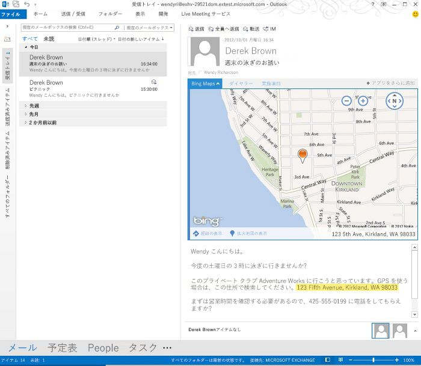

# 閲覧フォーム用の Outlook アドインを作成する

閲覧アドインは、Outlook の閲覧ウィンドウか閲覧インスペクター内でアクティブ化される Outlook アドインです。閲覧アドインは、作成アドイン (ユーザーがメッセージや予定を作成しているときにアクティブ化される Outlook アドイン) とは違って、次のユーザー シナリオで使用できます。

- 電子メール メッセージ、会議出席依頼、会議の返信、または会議の取り消しの表示。*
    
- ユーザーが出席者になっている会議アイテムの表示。
    
- ユーザーが会議の開催者になっている会議アイテムの表示 (Outlook 2013 および Exchange 2013 の RTM リリースのみ)
    
     >**注** Office 2013 SP1 リリースより、ユーザーが開催する会議アイテムを表示する場合、作成アドインのみをアクティブ化して使用することができます。 閲覧アドインは、このシナリオでは使用できなくなります。
* Outlook が閲覧フォームでアドインをアクティブ化しないメッセージの種類があります。これには、別のメッセージの添付ファイルになっているアイテムと、Outlook の [下書き] フォルダーや [迷惑メール] フォルダー内にあるアイテム、あるいは他の方法で暗号化または保護されているアイテムが含まれます。

これらの各閲覧シナリオで、アクティブ化の条件が満たされていると Outlook でアドインがアクティブ化されるので、ユーザーはアクティブ化されたアドインを閲覧ウィンドウか閲覧インスペクター内のアドイン バーで選択して開くことができます。図 1 は、ユーザーが住所を含むメッセージを閲覧するとアクティブ化されて開かれる  **[Bing マップ]** アドインを示しています。

**図 1. 選択されている住所を含んだ Outlook メッセージに対してアクティブ化されている [Bing マップ] アドインが表示されたアドイン ウィンドウ**

## 閲覧モードで使用できるアドインの種類

閲覧アドインでは、以下のいずれの種類の組み合わせも可能です。

- [Outlook のアドイン コマンド](../outlook/add-in-commands-for-outlook.md)
    
- [コンテキスト Outlook アドイン](../outlook/contextual-outlook-add-ins.md)
    
- [カスタム ウィンドウの Outlook アドイン](../outlook/custom-pane-outlook-add-ins.md)
    

## 閲覧アドインで使用できる API 機能

JavaScript API for Office が閲覧フォームで Outlook アドインに提供する機能の一覧については、「 [バージョンごとのメール アプリ機能](http://msdn.microsoft.com/library/f34e2f44-8c9d-4e90-b1d7-3f29506adb92%28Office.15%29.aspx)」の表 1 と表 2 を参照してください。 

関連項目:

- 閲覧フォームでアドインをアクティブ化することについては、「 [マニフェストでのアクティブ化ルールの指定](../outlook/manifests/activation-rules.md#specify-activation-rules-in-a-manifest)」の表 1 を参照してください。
    
- [正規表現アクティブ化ルールを使用して Outlook アドインを表示する](../outlook/use-regular-expressions-to-show-an-outlook-add-in.md)
    
- [Outlook アイテム内の文字列を既知のエンティティとして照合する](../outlook/match-strings-in-an-item-as-well-known-entities.md)
    
- [Outlook アイテムからエンティティ文字列を抽出する](../outlook/extract-entity-strings-from-an-item.md)
    
- [サーバーから Outlook アイテムの添付ファイルを取得する](../outlook/get-attachments-of-an-outlook-item.md)
    

## その他のリソース

- [Office 365 の Outlook アドインを使用する](https://dev.outlook.com/MailAppsGettingStarted/GetStarted.aspx)
    
- [Outlook アドイン](../outlook/outlook-add-ins.md)
    
