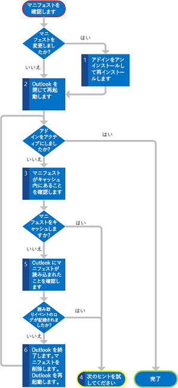

# <a name="troubleshoot-outlook-add-in-activation"></a>Outlook アドインのアクティブ化のトラブルシューティング


Outlook アドインのアクティブ化は、コンテキスト次第であり、アドイン マニフェストのアクティブ化ルールに基づきます。現在選択しているアイテムの条件がアドインのアクティブ化ルールを満たす場合、ホスト アプリケーションはアドイン ボタンをアクティブ化し、Outlook UI (新規作成アドインではアドイン選択ウィンドウ、閲覧アドインではアドイン バー) に表示します。しかし、アドインが想定どおりにアクティブ化されない場合、考えられる理由を探るために次のような点を調べる必要があります。

<a name="troubleshootingmailapps"></a>
## <a name="is-the-user-mailbox-on-a-version-of-exchange-server-that-is-at-least-exchange-2013"></a>ユーザーのメールボックスが、Exchange 2013 以降のバージョンの Exchange Server 上にあるか?


まず、テストしているユーザーの電子メール アカウントが、Exchange 2013 以降のバージョンの Exchange Server 上にあることを確認します。Exchange 2013 より後にリリースされた特定の機能を使用する場合は、ユーザーのアカウントが Exchange の適切なバージョン上にあることを確認してください。

Exchange 2013 のバージョンは、次の方法のいずれかを使用して確認できます。


- Exchange Server 管理者に確認します。
    
- スクリプト デバッガー (たとえば、Internet Explorer に付属する JScript デバッガーなど) で Outlook Web App またはデバイス用 OWA 上のアドインをテストしている場合は、スクリプトの読み込み元を指定する **script** タグの **src** 属性を探します。このパスには、**owa/15.0.516.x/owa2/...** という部分文字列があります。この中の **15.0.516.x** が Exchange Server のバージョン (**15.0.516.2** など) を表します。
    
- あるいは、[Office.context.mailbox.diagnostics.hostVersion](../../reference/outlook/Office.context.mailbox.diagnostics.md) プロパティを使用してバージョンを確認することもできます。Outlook Web App およびデバイス用 OWA 上で、このプロパティは Exchange Server のバージョンを返します。
    
- Outlook 上でアドインをテストできる場合は、次に示す Outlook オブジェクト モデルと Visual Basic エディターを使用した簡単なデバッグ方法を使用できます。
    
      1. 最初に、Outlook でマクロが有効になっていることを確認します。**[ファイル]**、**[オプション]**、**[セキュリティ センター]**、**[セキュリティ センターの設定]**、**[マクロの設定]** の順に選択します。セキュリティ センターで、**[すべてのマクロの通知]** が選択されていることを確認します。Outlook の起動時に **[マクロを有効にする]** も選択している必要があります。
    
      2. リボンの **[開発]** タブで **[Visual Basic]** を選択します。
    
     >**Note**  Not seeing the  **Developer** tab? See [How to: Show the Developer Tab on the Ribbon](http://msdn.microsoft.com/en-us/library/ce7cb641-44f2-4a40-867e-a7d88f8e98a9%28Office.15%29.aspx) to turn it on. 
	  3. Visual Basic エディターで、**[表示]**、**[イミディエイト ウィンドウ]** を選択します。
    
      4. イミディエイト ウィンドウに次のように入力し、Exchange Server のバージョンを表示します。戻される値のメジャー バージョンは、15 以上である必要があります。
    
        - ユーザーのプロファイルに Exchange アカウントが 1 つだけある場合:
        
            
            ?Session.ExchangeMailboxServerVersion
            
        
        - 同じユーザー プロファイルに複数の Exchange アカウントがある場合:
        
            
            ?Session.Accounts.Item(emailAddress).ExchangeMailboxServerVersion
         
        
        - _emailAddress_ は、ユーザーのプライマリ STMP アドレスを含む文字列を表します。たとえば、ユーザーのプライマリ SMTP アドレスが randy@contoso.com の場合は、次のように入力します。
        
            
            ?Session.Accounts.Item("randy@contoso.com").ExchangeMailboxServerVersion
        


## <a name="is-the-add-in-disabled"></a>アドインが無効化されていないか?


いずれかの Outlook リッチ クライアントで、パフォーマンス上の理由によりアドインが無効化されている可能性があります。たとえば、CPU コア使用率やメモリ使用量のしきい値、クラッシュ許容度、およびアドインに対するすべての正規表現の処理時間が超過した場合などです。このようなことが起きると、Outlook リッチ クライアントは、アドインを無効化していることを示す通知を表示します。 


 >**メモ**  リソース使用量を監視するのは Outlook リッチ クライアントだけですが、Outlook リッチ クライアントでアドインを無効化すると、Outlook Web App とデバイス用 OWA でもアドインが無効化されます。

次のどちらかの方法を使用して、アドインが無効化されているかどうかを確認します。 


- Outlook Web App の場合、電子メール アカウントに直接サインインして、[設定] アイコンを選択し、**[アドインの管理]** を選択して、Exchange 管理センターにアクセスします。ここで、アドインが有効化されているかどうかを確認できます。
    
- Outlook の場合、Backstage ビューに移動し、**[アドインの管理]** を選択します。それから、Exchange 管理センターにサインインし、アドインが有効化されているかどうかを確認します。
    
- Outlook for Mac の場合は、アドイン バーで **[アドインの管理]** を選択します。それから、Exchange 管理センターにサインインし、アドインが有効化されているかどうかを確認します。
    

## <a name="does-the-tested-item-support-outlook-add-ins-is-the-selected-item-delivered-by-a-version-of-exchange-server-that-is-at-least-exchange-2013"></a>テストするアイテムが Outlook アドインをサポートしているか? 選択されたアイテムが Exchange 2013 以降のバージョンの Exchange Server で配信されているか?


Outlook アドインが閲覧アドインであり、ユーザーがメッセージ (電子メール メッセージ、会議出席依頼、返信、キャンセルなど) や予定を表示するときにアクティブ化されるものである場合、これらのアイテムが通常はアドインをサポートしているとしても、選択しているアイテムが次のいずれかの場合は例外があります。


- Information Rights Management (IRM) によって保護されている場合。
    
- S/MIME 形式であるか、他の保護手段で暗号化されている場合。
    
- 下書きであるか (送信者が割り当てられていない)、Outlook の [下書き] フォルダーにある場合。
    
- [迷惑メール] フォルダーにある場合。
    
- メッセージ クラスが IPM.Report.* である配信レポートまたは通知 (配信レポート、配信不能レポート (NDR)、開封通知、未開封通知、遅延通知など)。
    
- 別のメッセージに添付されている .msg ファイル、またはファイル システムから開いた .msg ファイル。
    
また、予定は常にリッチ テキスト形式で保存されるので、[BodyAsHTML](http://msdn.microsoft.com/en-us/library/bfb726cd-81b0-a8d5-644f-2ca90a5273fc%28Office.15%29.aspx) の **PropertyName** 値を指定する **ItemHasRegularExpressionMatch** ルールでは、プレーン テキストやリッチ テキスト形式で保存された予定またはメッセージ上でアドインがアクティブ化されません。

メール アイテムが上記の種類のいずれかでなくても、アイテムが Exchange 2013 以降のバージョンの Exchange Server で配信されたものでない場合、そのアイテムでは、送信者の SMTP アドレスなどの既知のエンティティおよびプロパティが識別できません。これらのエンティティやプロパティに依存するアクティブ化ルールはどれも条件が満たされず、そのアドインはアクティブ化されません。

アドインが新規作成アドインであり、ユーザーがメッセージや会議出席依頼を作成するときにアクティブ化されるものである場合、そのアイテムが IRM によって保護されていないことを確認してください。


## <a name="is-the-add-in-manifest-installed-properly-and-does-outlook-have-a-cached-copy"></a>アドイン マニフェストが適切にインストールされているか? また Outlook にキャッシュ コピーがあるか?


このシナリオは Outlook for Windows にのみ適用されます。通常、メールボックスに Outlook アドインをインストールすると、Exchange Server は、アドイン マニフェストを指定の場所からその Exchange Server 上のメールボックスにコピーします。Outlook は起動するたびに、そのメールボックスにインストールされたすべてのマニフェストを、次の場所にある一時的なキャッシュに読み込みます。 

%LocalAppData%\Microsoft\Office\15.0\WEF 

たとえば、John というユーザーであれば、キャッシュは C:\Users\john\AppData\Local\Microsoft\Office\15.0\WEF にあります。

アドインがどのアイテムに対してもアクティブ化されない場合、マニフェストが Exchange Server 上に適切にインストールされなかったか、あるいは、Outlook が起動時に正しくマニフェストを読み取れなかった可能性があります。Exchange 管理センターを使用して、アドインがメールボックスにインストールされ、有効化されていることを確認し、必要に応じて Exchange Server を再起動します。

図 1 は、Outlook に有効なバージョンのマニフェストがあるかどうかを確認するステップの概要を示しています。 


**図 1.Outlook がマニフェストを適切にキャッシュしたかどうかを確認するステップのフローチャート**

以下の手順では、その詳細を説明します。


1. Outlook を開いている間にマニフェストを変更した場合で、アドインの開発に Napa、Visual Studio 2012、または Visual Studio の新しいバージョンを使用していない場合は、Exchange 管理センターを使用して、そのアドインをアンインストールし、再インストールする必要があります。 
    
2. Outlook を再起動し、Outlook がアドインをアクティブ化するようになったかどうかをテストします。
    
3. アドインがアクティブ化されない場合は、アドインのマニフェストの適切なキャッシュ コピーが Outlook にあるかどうかを確認します。次のパスの下を探してください。
    
    %LocalAppData%\Microsoft\Office\15.0\WEF
    
    次のサブフォルダーでマニフェストを見つけることができます。
```
    \<insert your guid>\<insert base 64 hash>\Manifests\<ManifestID>_<ManifestVersion>
```
    
     >**Note**  The following is an example of a path to a manifest installed for a mailbox for the user John:
    
    C:\Users\john\appdata\Local\Microsoft\Office\15.0\WEF\{8D8445A4-80E4-4D6B-B7AC-D4E6AF594E73}\GoRshCWa7vW8+jhKmyiDhA==\Manifests\b3d7d9d5-6f57-437d-9830-94e2aaccef16_1.2
    
    Verify whether the manifest of the add-in you're testing is among the cached manifests.
    
4. マニフェストがキャッシュにある場合は、このセクションの残りの部分をスキップして、このセクションの後の他に考えられる理由を検討します。
    
5. マニフェストがキャッシュにない場合は、Outlook が Exchange Server から実際にマニフェストを読み取ったかどうかを確認します。これを行うには、Windows イベント ビューアーを使用します。
    
      1. **[Windows ログ]** で **[アプリケーション]** を選択します。
    
      2. イベント ID が 63 に等しい比較的最近のイベントを探します。これは、Outlook が Exchange Server からマニフェストをダウンロードしたことを表します。
    
      3. Outlook によるマニフェストの読み取りが正常に行われた場合は、記録されたイベントに次の説明があります。
    
         **Exchange の Web サービス要求 GetAppManifests が成功しました。**
    
        このセクションの残りの部分をスキップして、このセクションの後の他に考えられる理由を検討します。
    

    Windows 7 でイベント ビューアーを開く方法については、「[イベント ビューアーを開く](http://windows.microsoft.com/en-US/windows7/Open-Event-Viewer)」を参照してください。
    
6. イベントの成功を確認できない場合は、Outlook を閉じて、次のパスにあるすべてのマニフェストを削除します。
```
    %LocalAppData%\Microsoft\Office\15.0\WEF\<insert your guid>\<insert base 64 hash>\Manifests\
```
    Start Outlook and test whether Outlook now activates the add-in.
    
7. アドインがアクティブ化されない場合は、手順 3 に戻り、Outlook がマニフェストを適切に読み取ったかどうかを再度確認します。
    

## <a name="is-the-add-in-manifest-valid"></a>アドイン マニフェストは有効か?

[ランタイム ログ](https://dev.office.com/docs/add-ins/develop/use-runtime-logging-to-debug-manifest)を使用して、アドイン マニフェストの問題をデバッグします。

## <a name="are-you-using-the-appropriate-activation-rules"></a>適切なアクティブ化ルールを使用しているか?


Office アドイン マニフェスト スキーマ バージョン 1.1 以降では、ユーザーが新規作成フォームを使用しているときにアクティブ化されるアドイン (新規作成アドイン) や閲覧フォームを使用しているときにアクティブ化されるアドイン (閲覧アドイン) を作成できます。アドインをアクティブ化するフォームの種類に適した正しいアクティブ化ルールを指定してください。たとえば、新規作成アドインをアクティブ化する場合は、[FormType](http://msdn.microsoft.com/en-us/library/f7dac4a3-1574-9671-1eda-47f092390669%28Office.15%29.aspx) 属性が **Edit** または **ReadOrEdit** に設定された **ItemIs** ルールのみを使用する必要があり、[ItemHasKnownEntity](http://msdn.microsoft.com/en-us/library/87e10fd2-eab4-c8aa-bec3-dff92d004d39%28Office.15%29.aspx) ルールや [ItemHasRegularExpressionMatch](http://msdn.microsoft.com/en-us/library/bfb726cd-81b0-a8d5-644f-2ca90a5273fc%28Office.15%29.aspx) ルールなど他の型のルールを新規作成アドイン用に使用することはできません。詳細については、「[Outlook アドインのアクティブ化ルール](../outlook/manifests/activation-rules.md)」を参照してください。


## <a name="if-you-use-a-regular-expression-is-it-properly-specified"></a>正規表現を使用している場合、正しく指定されていますか。


アクティブ化ルール内の正規表現は閲覧アドインの XML マニフェスト ファイルの一部であるため、正規表現で特定の文字を使用する場合は、XML プロセッサがサポートする対応するエスケープ シーケンスに従う必要があります。表 1 にこのような特殊文字を示します。 


**表 1.正規表現のエスケープ シーケンス**


|**文字**|**説明**|**使用するエスケープ シーケンス**|
|:-----|:-----|:-----|
|"|二重引用符|&amp;quot;|
|&amp;|アンパサンド|&amp;amp;|
|'|アポストロフィ|&amp;apos;|
|<|より小さい|&amp;lt;|
|>|より大きい|&amp;gt;|

## <a name="if-you-use-a-regular-expression-is-the-read-add-in-activating-in-outlook-web-app-or-owa-for-devices-but-not-in-any-of-the-outlook-rich-clients"></a>正規表現を使用する場合、閲覧アドインは Outlook Web App またはデバイス用 OWA ではアクティブ化されるが、どの Outlook リッチ クライアントでもアクティブ化されないか?


Outlook リッチ クライアントで使用される正規表現エンジンと、Outlook Web App またはデバイス用 OWA で使用される正規表現エンジンは異なります。Outlook リッチ クライアントでは、Visual Studio の標準テンプレート ライブラリの一部として提供される C++ 正規表現エンジンが使用されます。このエンジンは ECMAScript 5 標準に準拠しています。Outlook Web App またはデバイス用 OWA では JavaScript の一部である正規表現評価が使用されます。これはブラウザーによって提供され、ECMAScript 5 のスーパーセットをサポートしています。 

ほとんどの場合、アクティブ化ルール内の同じ正規表現に対して、これらのホスト アプリケーションは同じ一致を見つけますが、例外があります。たとえば、RegEx に定義済み文字クラスに基づくカスタム文字クラスが含まれている場合、Outlook リッチ クライアントの結果は Outlook Web App またはデバイス用 OWA の結果と異なる場合があります。たとえば、文字クラス内に短縮形の文字クラス `[\d\w]` が含まれていると、結果にばらつきが生じます。異なるホストで結果にばらつきが生じることを回避するには、`(\d|\w)` を使用してください。

正規表現を詳細にテストします。異なる結果が返される場合は、両方のエンジンとの互換性が実現されるように正規表現を書き直します。Outlook リッチ クライアントで評価結果を確認するには、照合しようとしているサンプル テキストに対して正規表現を適用する小さな C++ プログラムを作成します。C++ テスト プログラムを Visual Studio で実行すると標準のテンプレート ライブラリが使用されるので、Outlook リッチ クライアントが同じ正規表現を実行する場合の動作をシミュレートできます。Outlook Web App またはデバイス用 OWA で評価結果を確認するには、お気に入りの JavaScript 正規表現テスターを使用します。


## <a name="if-you-use-an-itemis-itemhasattachment-or-itemhasregularexpressionmatch-rule-have-you-verified-the-related-item-property"></a>ItemIs ルール、ItemHasAttachment ルール、または ItemHasRegularExpressionMatch ルールを使用する場合、関連するアイテム プロパティを確認しましたか。


**ItemHasRegularExpressionMatch** アクティブ化ルールを使用する場合は、**PropertyName** 属性の値が、選択されているアイテムの予期する値かどうかを確認します。対応するプロパティをデバッグするときのいくつかのヒントを次に示します。


- 選択されているアイテムがメッセージであり、**PropertyName** 属性に **BodyAsHTML** を指定する場合は、メッセージを開いて **[ソースの表示]** を選択し、そのアイテムの HTML 表現でのメッセージ本文を確認します。
    
- 選択されているアイテムが予定の場合、またはアクティブ化ルールで **PropertyName** に **BodyAsPlaintext** が指定される場合は、Outlook for Windows で Outlook オブジェクト モデルと Visual Basic エディター を使用できます。
    
      1. マクロが有効であり、Outlook のリボンに **[開発]** タブが表示されていることを確認します。この操作方法が不明な場合は、「[ユーザーのメールボックスが、Exchange 2013 以降のバージョンの Exchange Server 上にあるか?](#troubleshootingmailapps)」の手順 1. および手順 2. を参照してください。
    
      2. Visual Basic エディターで、**[表示]**、**[イミディエイト ウィンドウ]** を選択します。
    
      3. シナリオに応じて各種のプロパティを表示するには、次のように入力します。 
    
      - Outlook エクスプローラーで選択されているメッセージ アイテムまたは予定アイテムの HTML 形式の本文。
    
            
              ?ActiveExplorer.Selection.Item(1).HTMLBody
        


     - Outlook エクスプローラーで選択されているメッセージ アイテムまたは予定アイテムのプレーン テキスト形式の本文。
    
            
              ?ActiveExplorer.Selection.Item(1).Body
            


      - 現在の Outlook インスペクターで開かれているメッセージ アイテムまたは予定アイテムの HTML 形式の本文。
    
            
              ?ActiveInspector.CurrentItem.HTMLBody
        
      - 現在の Outlook インスペクターで開かれているメッセージ アイテムまたは予定アイテムのプレーン テキスト形式の本文。
    
            
              ?ActiveInspector.CurrentItem.Body
            

**ItemHasRegularExpressionMatch** アクティブ化ルールで **Subject** または **SenderSMTPAddress** が指定される場合、あるいは **ItemIs** ルールまたは **ItemHasAttachment** ルールを使用していて、MAPI の使用に精通しているか使用する必要がある場合は、[MFCMAPI](http://mfcmapi.codeplex.com/) を使用して、ルールで使用される表 2 の値を確認できます。


**表 2アクティブ化ルールと対応する MAPI プロパティ**


|**ルールの種類**|**確認する MAPI プロパティ**|
|:-----|:-----|
|**ItemHasRegularExpressionMatch** ルールと **Subject**|[PidTagSubject](http://msdn.microsoft.com/en-us/library/aa7ba4d9-c5e0-4ce7-a34e-65f675223bc9%28Office.15%29.aspx)|
|**ItemHasRegularExpressionMatch** ルールと **SenderSMTPAddress**|[PidTagSenderSmtpAddress](http://msdn.microsoft.com/en-us/library/321cde5a-05db-498b-a9b8-cb54c8a14e34%28Office.15%29.aspx) と [PidTagSentRepresentingSmtpAddress](http://msdn.microsoft.com/en-us/library/5ed122a2-0967-4de3-a2ee-69f81ae77b16%28Office.15%29.aspx)|
|**ItemIs**|[PidTagMessageClass](http://msdn.microsoft.com/en-us/library/1e704023-1992-4b43-857e-0a7da7bc8e87%28Office.15%29.aspx)|
|**ItemHasAttachment**|[PidTagHasAttachments](http://msdn.microsoft.com/en-us/library/fd236d74-2868-46a8-bb3d-17f8365931b6%28Office.15%29.aspx)|
プロパティ値を確認した後、正規表現評価ツールを使用して、正規表現がその値の中で一致を見つけるかどうかをテストできます。


## <a name="does-the-host-application-apply-all-the-regular-expressions-to-the-portion-of-the-item-body-as-you-expect"></a>ホスト アプリケーションはすべての正規表現をアイテムの本文の部分に予期したとおりに適用しますか。


このセクションは、正規表現を使用するすべてのアクティブ化ルール、特にアイテムの本文に適用されるアクティブ化ルールが対象です。このようなルールは、サイズが大きく、一致の評価に時間がかかる可能性があります。アクティブ化ルールで利用されるアイテム プロパティが予期したとおりの値を持つ場合であっても、ホスト アプリケーションが、アイテム プロパティの値全体についてすべての正規表現を評価できない場合があります。妥当なパフォーマンスを実現し、閲覧アドインが過度にリソースを使用しないように、Outlook、Outlook Web App およびデバイス用 OWA では、実行時のアクティブ化ルールにおける正規表現の処理について、次の制限に従います。


- 評価されるアイテムの本文のサイズ -- ホスト アプリケーションが正規表現を評価するアイテムの本文部分には制限があります。これらの制限は、ホスト アプリケーション、フォーム ファクター、およびアイテムの本文の形式によって異なります。詳細については、「[Outlook アドインのアクティブ化と JavaScript API の制限](../outlook/limits-for-activation-and-javascript-api-for-outlook-add-ins.md)」の表 2 を参照してください。
    
- 正規表現の一致件数 -- Outlook リッチ クライアント、Outlook Web App およびデバイス用 OWA から返される正規表現の最大一致件数は、それぞれ 50 個です。これらは一意の一致であり、重複する一致はこの制限の対象になりません。返される一致の順序は予測できず、Outlook リッチ クライアントにおける順序と Outlook Web App およびデバイス用 OWA における順序も同一とは限りません。アクティブ化ルールで正規表現の一致が大量に返されることが考えられるときに、返されていない一致がある場合、この制限を超えている可能性があります。
    
- 正規表現の一致の長さ -- 正規表現に一致する文字列としてホスト アプリケーションから返される文字列の長さには上限があります。ホスト アプリケーションは上限を超える文字列を一致に含めず、警告メッセージも表示しません。他の regex 評価ツールまたはスタンドアロンの C++ テスト プログラムで正規表現を実行して、このような制限を超える一致があるかどうかを確認できます。表 3 にこの制限の要約を示します。詳細については、「[Outlook アドインのアクティブ化と JavaScript API の制限](../outlook/limits-for-activation-and-javascript-api-for-outlook-add-ins.md)」の表 3 を参照してください。
    
    **表 3正規表現の一致の長さ制限**


|**正規表現の長さ制限**|**Outlook リッチ クライアント**|**Outlook Web App またはデバイス用 OWA**|
|:-----|:-----|:-----|
|アイテムの本文がテキスト形式の場合|1.5 KB|3 KB|
|アイテムの本文が HTML の場合|3 KB|3 KB|
- Outlook リッチ クライアント用閲覧アドインのすべての正規表現の評価にかかった時間 : 既定では、Outlook はアクティブ化ルール内のすべての正規表現の評価を閲覧アドインごとに 1 秒以内で完了する必要があります。完了しなかった場合、Outlook は最大 3 回まで再試行し、それでも評価を完了できないとアドインを無効化します。Outlook は、アドインが無効になったというメッセージを通知バーに表示します。正規表現に使用可能な時間の長さは、グループ ポリシーまたはレジストリ キーの設定で変更できます。 
    
     >**注** Outlook リッチ クライアントが、読み取りのアドインを無効にした場合、読み取りのアドインは、Outlook リッチ クライアント、Outlook Web App およびデバイス用 OWA の同じメールボックスで使用できないことに注意してください。

## <a name="additional-resources"></a>その他のリソース


- [テスト用に Outlook アドインを展開してインストールする](../outlook/testing-and-tips.md)
    
- [Outlook アドインのアクティブ化ルール](../outlook/manifests/activation-rules.md)
    
- [正規表現アクティブ化ルールを使用して Outlook アドインを表示する](../outlook/use-regular-expressions-to-show-an-outlook-add-in.md)
    
- [Outlook アドインのアクティブ化と JavaScript API の制限](../outlook/limits-for-activation-and-javascript-api-for-outlook-add-ins.md)
    
- [イベント ビューアーを開く](http://windows.microsoft.com/en-US/windows7/Open-Event-Viewer)
    
- [ItemHasAttachment complexType](http://msdn.microsoft.com/en-us/library/031db7be-8a25-5185-a9c3-93987e10c6c2%28Office.15%29.aspx)
    
- [ItemHasRegularExpressionMatch complexType](http://msdn.microsoft.com/en-us/library/bfb726cd-81b0-a8d5-644f-2ca90a5273fc%28Office.15%29.aspx)
    
- [ItemIs complexType](http://msdn.microsoft.com/en-us/library/926249ab-2d2f-39f5-1d73-fab1c989966f%28Office.15%29.aspx)
    
- [MailApp complexType](http://msdn.microsoft.com/en-us/library/696b9fcf-cd10-3f20-4d49-86d3690c887a%28Office.15%29.aspx)
    
- - [ランタイム ログを使用して、マニフェストをデバッグする](https://dev.office.com/docs/add-ins/develop/use-runtime-logging-to-debug-manifest)
    

