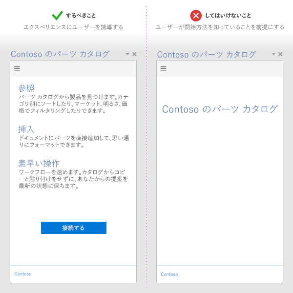
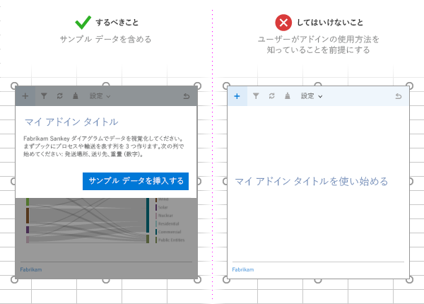
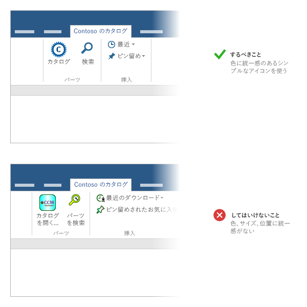
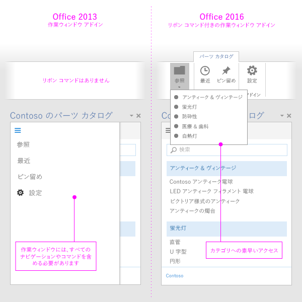

# Office アドイン開発のベスト プラクティス

効果的なアドインは、目で見て分かる方法で Office アプリケーションを拡張する、ユニークで頼もしい機能を提供します。優れたアドインを作成するには、魅力的な初回エクスペリエンスをユーザーに提供して、最高の UI エクスペリエンスを設計し、アドインのパフォーマンスを最適化します。この記事で説明するベスト プラクティスを適用して、ユーザーが迅速かつ効率的に仕事を遂行するための助けになるアドインを作成してください。

## 価値を明確にする

- ユーザーがタスクをすばやく効率的に完了するのに役立つアドインを作成します。Office アプリケーションに当てはまるシナリオに絞ります。次に例を示します。
 - コア オーサリング タスクをよりスピーディかつ簡単にし、中断を減らします。
 - Office 内で新しいシナリオを有効にします。
 - Office ホストに補助サービスを埋め込みます。
 - Office エクスペリエンスを向上させて生産性を高めます。
- [魅力的な初回実行時エクスペリエンス](#create-an-engaging-first-run-experience)を作成して、ユーザーがアドインの価値をすぐに感じられるようにしてください。
- 
  [効果的な Office ストア リスト](http://msdn.microsoft.com/library/c66a6e6b-2e96-458f-8f8c-2a499fe942c9%28Office.15%29.aspx)を作成します。タイトルと説明から、アドインのメリットが明確に分かるようにします。アドインの内容を伝えるのに、ブランドだけに頼ることはしないでください。

## 魅力的な初回実行時エクスペリエンスを作成する

- 非常に使いやすく、直観で理解しやすいファースト エクスペリエンスによって、新しいユーザーを引き込みます。ユーザーは、アドインをストアからダウンロードした後も、使用するか中止するかを判断しています。

 - ユーザーがアドインを使用するのに必要な手順を明確にします。ビデオ、マット、ページング パネル、その他のリソースを使用して、ユーザーを誘導します。

 - 単純にユーザーにサインを求めるのではなく、起動時にアドインの価値を強調します。

 - 使い方や UI を個人用に設定する方法を説明する UI を提供します。

    

  - コンテンツ アドインがユーザーのドキュメント内のデータにバインドされている場合は、サンプル データまたはテンプレートを含めて、使用するデータ形式をユーザーに表示します。

    

- 
  [無料の試用版](http://msdn.microsoft.com/library/145d9466-3c3d-4294-aa23-82068a8e7ae9.aspx%28Office.15%29.aspx#sectionSection1)を提供します。アドインでサブスクリプションを要求する場合は、一部の機能をサブスクリプションなしでも利用できるようにします。

- サインアップをシンプルにします。情報 (電子メール、表示名) を事前に入力し、電子メールの確認はスキップします。

- ポップアップは使用しないようにします。使用する必要がある場合は、ポップアップを有効にするようユーザーに指示します。

- [シングルサインオン (SSO) 認証](../outlook/authenticate-a-user-with-an-identity-token.md)を使用します。

最初の実行エクスペリエンスを開発する際に適用できるパターンを示すテンプレートについては、「[Office アドインの UX 設計パターン](https://github.com/OfficeDev/Office-Add-in-UX-Design-Patterns-Code)」を参照してください。

## アドイン コマンドを使用する

- [アドイン コマンド](../design/add-in-commands.md)を使用することで、アドインに関連する UI エントリ ポイントを提供します。

- ユーザーに対して、特定のアクションとともにアクションの結果を明確かつ具体的に表すコマンドを使用します。複数のアクションを 1 つのボタンにまとめないでください。

- アドイン内の一般的なタスクをより効率的に実行できるように、アクションは細分化して提供します。1 つのアクションを完了するまでのステップ数は最小限に抑えます。

- Office リボンを拡張するアドイン:
    - 提供する機能が適応する場合は既存のタブ (挿入、レビューなど) にコマンドを配置します。たとえば、アドインを使用することでユーザーがメディアを挿入できる場合は、[挿入] タブにグループを追加します。Office のすべてのバージョンで、すべてのタブが使用可能なわけではない点に注意してください。詳細については、「[Office アドイン XML マニフェスト](../overview/add-in-manifests.md)」を参照してください。 
    - 別のタブに機能が適応せず、トップ レベル コマンドが 6 個未満の場合は、[ホーム] タブにコマンドを配置します。Office デスクトップと Office Online など、Office の複数のバージョン間でアドインを操作する必要があり、タブがどのバージョンでも利用できるわけではない場合 (たとえば、[デザイン] タブは Office Online にはありません) は、[ホーム] タブにコマンドを追加できます。  
    - 6 個以上のトップ レベル コマンドがある場合は、コマンドをカスタム タブに配置します。 
  - グループに、アドインの名前と一致する名前を指定します。グループが複数ある場合は、そのグループのコマンドが提供する機能に基づいた名前を各グループに付けます。
  - アドインの使用スペースを増やす余分なボタンを追加しないでください。

     >
  **Note**  Add-ins that take up too much space might not pass [Office Store validation](https://msdn.microsoft.com/library/cd90836a-523e-42f5-ab02-5123cdf9fefe(Office.15).aspx).

- すべてのアイコン:
    - ユーザーが実行しているアクションを明確に示すわかりやすいアイコンと [ラベル](http://msdn.microsoft.com/library/8cef4fce-e6a1-459b-951f-47ac03ec95a6%28Office.15%29.aspx)をボタンに指定します。

 - 背景が透明な PNG 形式を使用します。

 - 
  [サポートされている 8 つすべてのサイズ](https://msdn.microsoft.com/EN-US/library/mt267547.aspx#bk_resources) を含めます。これにより、サポートされているすべての解像度で最高のエクスペリエンスを生み出します。

  - Office の表示スタイルに合わせます。次にその例を示します。

    - 図形は単純なものにし、単色にします。複雑なグラフィックスは、サイズや解像度が小さい場合に見づらくなります。

    - 異なるコマンドに対してビジュアル メタファーを再利用しないでください。異なるアクションに同じアイコンを使用すると混乱が生じます。

    - ボタンのラベルを明確で簡潔なものにします。意味を伝えるには、ビジュアルとテキストの情報を組み合わせます。

    - Office の明るいテーマと暗いテーマ、またハイ コントラスト設定でアイコンをテストします。暗い背景やハイ コントラスト モードではアイコンが見にくい場合があることに注意してください。

    - アイコン サイズと位置を一定にして、リボン上で見やすいように配置します。

    

- コマンドをサポートしていないホストでも動作するアドインのバージョンを提供します。1 つのアドインのマニフェストは、コマンド対応 (コマンドを使用) ホストとコマンド非対応 (作業ウィンドウとして) ホストの両方で動作します。

    

## UX 設計原則を適用する

- アドインの機能とルック アンド フィールと機能が、Office のエクスペリエンスと合っていることを確認します。[Office UI Fabric](https://dev.office.com/fabric) を使用します。

- クロムよりもコンテンツを優先します。ユーザー エクスペリエンスの価値を高めない余分な UI 要素を追加しないようにします。

- ユーザーをよく管理します。ユーザーが重要な決定事項を理解し、アドインが実行するアクションを簡単に取り消すことができるようにします。

- ユーザーの信頼を得て、ユーザーを引き込むために
ブランドを利用します。ユーザーを圧倒するためや、宣伝のためにブランドを使用しないでください。

- スクロールしないようにします。1366 x 768 の解像度用に最適化します。

- 使用許可を得ていないイメージを含めないでください。

- アドインでは [明確でシンプルな表現](http://msdn.microsoft.com/library/8cef4fce-e6a1-459b-951f-47ac03ec95a6%28Office.15%29.aspx)を使用してください。

- 
  [アクセシビリティ](http://msdn.microsoft.com/library/3be1abbb-237a-48ec-8e17-72caa25a3cb2%28Office.15%29.aspx)を考慮してください。すべてのユーザーにとって操作しやすいアドインにして、画面リーダーなどの支援テクノロジが利用できるようにしてください。

- すべてのプラットフォームと入力方法 (マウスやキーボード、および [タッチ](#optimize-for-touch)など) に対応するように設計してください。UI が様々なフォーム ファクターに対応するようにしてください。

設計原則を適用し、アドインの開発時に使用したりカスタマイズすることができるテンプレートについては、「[Office アドインの UX 設計パターン](https://github.com/OfficeDev/Office-Add-in-UX-Design-Patterns-Code)」を参照してください。

### タッチ用に最適化する

- アドインを実行するホスト アプリケーションがタッチに対応しているかどうかを検出するには、[Context.touchEnabled](../../reference/shared/office.context.touchenabled.md) プロパティを使用します。

     >**注**  このプロパティは、Outlook ではサポートされていません。
- すべてのコントロールがタッチ操作に適したサイズになっていることを確認します。たとえば、ボタンに適切なタッチ ターゲットを設定し、入力ボックスはユーザーが入力するのに十分な大きさにします。

- ホバーや右クリックなどの非タッチの入力方法に依存しないようにしてください。

- 縦向きと横向きの両方のモードでアドインが機能することを確認します。タッチ デバイスで、アドインの一部がソフトキーボードの後ろに隠れることがあることに注意してください。

- [サイドロード](../testing/sideload-an-office-add-in-on-ipad-and-mac.md)を使用して、アドインを実際のデバイスでテストしてください。

 >**メモ**  [Office UI Fabric](https://github.com/OfficeDev/Office-UI-Fabric) をデザイン要素に使用している場合は、これらの要素の多くが適切に設定されます。

## アドインのパフォーマンスを最適化して監視する

- UI が素早く応答する感覚を与えるようにします。アドインが 500 ミリ秒以内で読み込まれるようにする必要があります。

- すべてのユーザー操作が 1 秒以内で応答することを確認します。

-  長時間実行する操作には、読み込みインジケーターを提供します。

- 画像、リソース、および一般的なライブラリを CDN を使用してホストします。可能な限り多くのものを 1 つの場所から読み込みます。

- Web ページを最適化するには、標準的な Web の慣習に従います。運用環境では、ライブラリの縮小バージョンのみを使用します。必要なリソースのみを読み込み、リソースが読み込まれる方法を最適化します。

- 操作の実行に時間がかかる場合は、ユーザーにフィードバックを提供します。次の表のしきい値に注意してください。「 [Office アドインのリソースの制限とパフォーマンスの最適化](../../docs/develop/resource-limits-and-performance-optimization.md)」も参照してください。

|**インタラクション クラス**|**ターゲット**|**上限値**|**人間の知覚**|
|:-----|:-----|:-----|:-----|
|即時|50 ミリ秒以下|100 ミリ秒|顕著な遅延はない。|
|速く|50 から 100 ミリ秒|200 ミリ秒|最低限知覚される遅延。フィードバックは不要。|
|普通|100-300 ミリ秒|500 ミリ秒|速い。しかし、高速とまではいかない。フィードバックは不要。|
|速い|300-500 ミリ秒|1 秒|高速ではないが、速いという実感はある。フィードバックは不要。|
|連続|500 ミリ秒より長い|5 秒|中程度の待ち時間。速いという実感はない。フィードバックが必要な可能性あり。|
|キャプティブ|500 ミリ秒より長い|10 秒|長い。しかし、何か他のことを行えるほどの長さではない。フィードバックが必要な可能性あり。|
|拡張|500 ミリ秒より長い|10 秒より長い|待機中に他のことを行うのに十分な長さ。フィードバックが必要な可能性あり。|
|長時間実行|5 ミリ秒より長い|1 分より長い|ユーザーは確実に別のことを行えます。|
- サービスの正常性を監視し、テレメトリを使用して、ユーザーが正常に完了したか監視します。

## アドインを売り込む

- アドインを [Office ストア](http://msdn.microsoft.com/library/ff075782-1303-4517-91cc-b3d730e9b9ae%28Office.15%29.aspx)に公開して、Web サイトで [それを宣伝](http://msdn.microsoft.com/library/b19e21f8-76f5-44e1-9971-bef79cad4c71%28Office.15%29.aspx)します。 [効果的な Office ストア リストを作成します](http://msdn.microsoft.com/library/c66a6e6b-2e96-458f-8f8c-2a499fe942c9%28Office.15%29.aspx)。

- アドイン タイトルを簡潔でわかりやすいものにします。128 文字以下にします。

- アドインの短くて魅力的な説明を作成します。「このアドインでどんな問題が解決しますか？」という質問への答えを提供します。

- タイトルと説明でアドインの価値提案を行います。ブランドに依存しないでください。

- ユーザーがアドインを見つけて使うことができる Web サイトを作成します。

