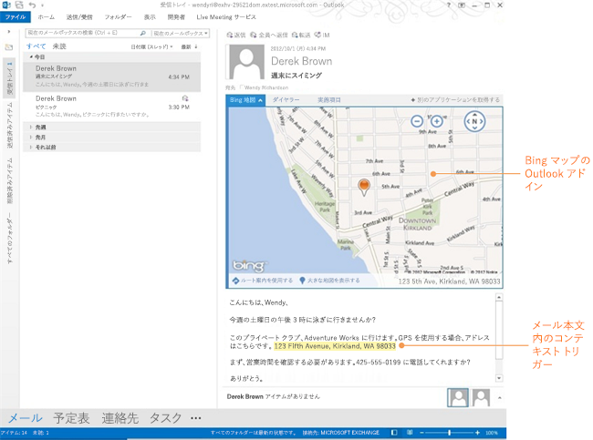
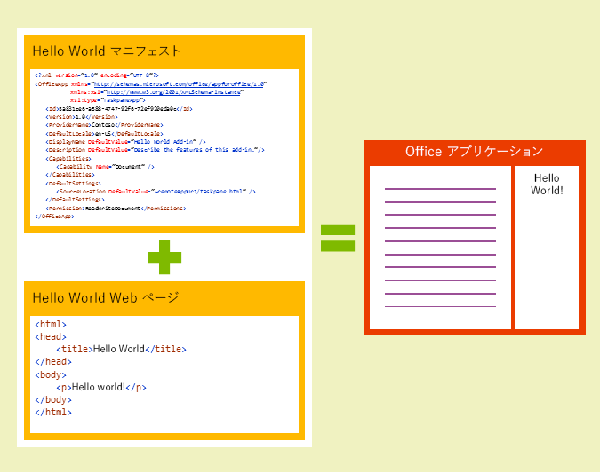

# Office アドイン プラットフォームの概要

Office アドインは、HTML、CSS、JavaScript などの Web テクノロジを使用して、Word、Excel、PowerPoint、および Outlook などの Office クライアントを拡張できます。 

Office アドインを使用すると、次の操作を実行できます。 

-  **Office クライアントに新しい機能を追加する** - たとえば、Office ドキュメントやメール アイテムとの対話、外部データの Office への取り込み、Office ドキュメントの処理、Office クライアントへのサードパーティ機能の公開などにより、Word、Excel、PowerPoint および Outlook を強化します。 
    
-  **Office ドキュメントに埋め込み可能な充実した対話型のオブジェクトを新しく作成する** - たとえば、マップやグラフ、ユーザーが自分の Excel スプレッドシートや PowerPoint プレゼンテーションに追加できる対話型の視覚化など。
    
**Office アドインを複数のバージョンの Office で実行する** - Windows デスクトップ版 Office、Office Online、Office for the Mac、および Office for the iPad が含まれます。

>**メモ:**現時点での Office アドインのサポート状況について、概要は「[Office アドインを使用できるホストおよびプラットフォーム](http://dev.office.com/add-in-availability)」ページを参照してください。 

## Office アドインで実行可能な操作

Office アドインでは、ブラウザー内で Web ページが実行できる操作のほとんどすべてを実行できます。たとえば、次のような操作を実行できます。

- カスタムのリボン ボタンやタブの作成による Office のネイティブ UI の拡張。

- HTML および JavaScript による対話型 UI およびカスタム ロジックの提供。
    
- JavaScript フレームワークの使用 (jQuery、Angular など多数)。
    
- HTTP および AJAX による REST エンドポイントや Web サービスへの接続。
    
- サーバー側のコードまたはロジックの実行 (ASP、PHP など、サーバー側のスクリプト言語を使用してページが実装されている場合)。
    

さらに、Office アドインは Office アドインのインフラストラクチャが提供する [JavaScript API](../../docs/develop/understanding-the-javascript-api-for-office.md) を使用して、Office アプリケーションやアドイン ユーザーのコンテンツと対話できます。 

## Office アドインの種類

次に示す種類の Office アドインを作成できます。
 
- 機能を拡張する Word、Excel、および PowerPoint アドイン
- 新しいオブジェクトを作成する Excel および PowerPoint アドイン
- 機能を拡張する Outlook アドイン

### 機能を拡張する Word、Excel、および PowerPoint アドイン 
**作業ウィンドウのアドイン マニフェスト**を使用してアドインを登録することにより、Word、Excel、または PowerPoint に[新しい機能を追加](../design/add-in-commands.md)できます。このマニフェストは **2 つの統合モード**をサポートしています。

- アドイン コマンド
- 挿入可能な作業ウィンドウ

####アドイン コマンド
アドイン コマンドを使用すると、Windows デスクトップ版 Office と Office Online の UI を拡張できます。たとえば、**アドイン用のボタンをリボン**や選択したコンテキスト メニューに追加できます。これにより、ユーザーは Office 内のアドインに簡単にアクセスできます。コマンド ボタンは、**カスタムの HTML を使用したウィンドウの表示**や **JavaScript 関数の実行**など、別のアクションを起動できます。この機能についてさらに詳しく概説している、[この Channel9 ビデオを参照](https://channel9.msdn.com/events/Build/2016/P551)することをお勧めします。

**Excel デスクトップで実行するコマンドを含むアドイン**

**Excel Online で実行するコマンドを含むアドイン**

**VersionOverrides** を使用すると、アドイン マニフェストでコマンドを定義できます。Office プラットフォームでは、これらをネイティブの UI に解釈する処理を行います。開始するには、[GitHub のサンプル](https://github.com/OfficeDev/Office-Add-in-Commands-Samples/)をチェック アウトして、「[Excel、Word、PowerPoint のためのアドイン コマンド](../design/add-in-commands.md)」を参照してください。

####挿入可能な作業ウィンドウ
まだアドイン コマンドをサポートしていないクライアント (Office 2013、Office for Mac、および Office for iPad) では、マニフェストで提供される **DefaultUrl** を使用して、アドインを**作業ウィンドウ**として実行します。その後、アドインは [挿入] タブの **[個人用アドイン]** メニューから起動できます。 

>**重要:**1 つのマニフェストには、コマンドをサポートしないクライアントで実行する作業ウィンドウ アドインと、コマンドで実行するバージョンの両方があります。これにより、ユーザーは Office アドインをサポートするすべてのクライアントで動作する 1 つのアドインを持つことができます。
 
###新しいオブジェクトを作成する Excel および PowerPoint アドイン 

コンテンツ アドイン マニフェストを使用して、**ドキュメントに埋め込み可能な Web ベースのオブジェクト**を統合します。コンテンツ アドインにより、ユーザーは Web ベースのデータの可視化、埋め込まれたメディア (YouTube ビデオ プレーヤーや画像ギャラリーなど)、およびその他の外部コンテンツを統合できます。

**コンテンツ アドイン**

Excel 2013 または Excel Online で コンテンツ アドインを試用するには、[Bing Maps](https://store.office.com/bing-maps-WA102957661.aspx?assetid=WA102957661) アドインをインストールします。

### 機能を拡張する Outlook アドイン

Outlook アドインは Office のリボンを拡張したり、コンテキストに応じて、表示または作成時に Outlook アイテムの隣に表示したりすることもできます。アドインは、閲覧シナリオ (ユーザーは受信アイテムを表示) または作成シナリオ (ユーザーは返信または新しいアイテムを作成)で、電子メール メッセージ、会議出席依頼、会議出席依頼の返信、会議の取り消し、または予定を操作します。 

Outlook アドインはアイテムのコンテキスト情報 (アドレスや追跡 ID など) にアクセスし、そのデータを使用してサーバー上または Web サービスの追加の情報にアクセスして、魅力的なユーザー エクスペリエンスを作成することができます。ほとんどの場合、Outlook アドインはサポートする各種のホスト アプリケーション (Outlook、Outlook for Mac、Outlook Web App、デバイス用 OWA など) で実行できますが、その際に変更は不要であり、デスクトップ、Web、タブレットおよびモバイル デバイスにシームレスなエクスペリエンスを提供します。

詳細については、「[Outlook アドイン](../outlook/outlook-add-ins.md)」を参照してください。

 >**メモ**  Outlook アドインには、ユーザーのメールボックスをホストするために最小バージョンの Exchange 2013 または Exchange Online が必要です。POP および IMAP の電子メール アカウントはサポートされません。

**リボン上のコマンド ボタンと Outlook アドイン**

**コンテキスト Outlook アドイン**

Outlook アドインを Outlook、Outlook for Mac、または Outlook Web App で試用するには、[Package Tracker](https://store.office.com/package-tracker-WA104162083.aspx?assetid=WA104162083) アドインをインストールします。

## Office アドインの構造

Office アドインの基本的なコンポーネントは、XML マニフェスト ファイルとユーザー独自の Web アプリケーションです。マニフェストはユーザーのアドインを Office クライアントと統合する方法など、さまざまな設定を定義します。Web アプリケーションは Web サーバーか、[Microsoft Azure](../publish/host-an-office-add-in-on-microsoft-azure.md) などの Web ホスティング サービスでホストされる必要があります。

**Office アドインはマニフェストと Web ページによって構成されます。**

###マニフェスト

マニフェストには、次のようなアドインの設定や機能を指定します。
    
- アドインの表示名、説明、ID、バージョン、および既定のロケール。
    
- Office とアドインを統合する方法: - Word、Excel、PowerPoint、Outlook を拡張するアドインの場合:リボン上のボタンなどの機能を公開するためにアドインによって使用されるネイティブの拡張点。 
      - 新しい埋め込みオブジェクトを作成するアドインの場合:オブジェクトに読み込まれる既定のページの URL。
       
    
- アドインのアクセス許可レベルとデータ アクセスの要件。
    
詳細については、「[Office アドイン XML マニフェスト](../../docs/overview/add-in-manifests.md)」を参照してください。

###Web アプリケーション

Web アプリケーションの最小バージョンは、静的な HTML Web ページです。このページは 任意の Web サーバーか、[Microsoft Azure](../publish/host-an-office-add-in-on-microsoft-azure.md) などの Web ホスティング サービスでホストされる必要があります。ユーザーは、選択したサービスの Web アプリケーションをホストできます。  

最も基本的な Office アドインは、Office アプリケーション内に表示される静的な HTML ページで構成されますが、Office ドキュメントやその他のどんなインターネット リソースとの対話も実行しません。ただし、これは Web アプリケーションですので、ホスティング プロバイダーがサポートしているクライアント側とサーバー側の両方で、任意のテクノロジ (ASP.NET、PHP、Node.js など) を使用できます。提供されている office.js [JavaScript API](../../docs/develop/understanding-the-javascript-api-for-office.md) を使用すると、Office クライアントやドキュメントと対話できます。 

**Office アドイン Hello World のコンポーネント**

### JavaScript API

Word と Excel の JavaScript API は、Office アドインで使用できるホスト固有のオブジェクト モデルを提供します。 これらの API は、Word や Excel のアドイン作成を容易にする段落やブックなど、既知のオブジェクトへのアクセスを提供します。 これらの API の詳細については、「[Word アドイン](../word/word-add-ins-programming-overview.md)」および「[Excel アドイン](../excel/excel-add-ins-javascript-programming-overview.md)」を参照してください。

JavaScript API for Office には、アドインを作成したり、Office コンテンツおよび Web サービスと対話したりするためのオブジェクトとメンバーが含まれています。

JavaScript API for Office の詳細については、「[JavaScript API for Office について](../../docs/develop/understanding-the-javascript-api-for-office.md)」および「[JavaScript API for Office](../../reference/javascript-api-for-office.md)」のリファレンスを参照してください。
    
## その他のリソース

- [Office アドインの設計ガイドライン](../../docs/design/add-in-design.md)
    
- [API リファレンス](../../docs/develop/understanding-the-javascript-api-for-office.md)
    
