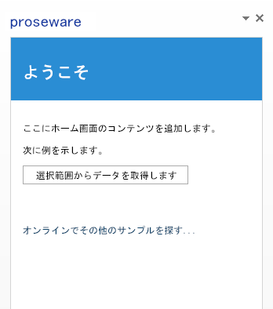

# Microsoft Azure で Office アドインをホストする

最も簡単な Office アドインは XML マニフェスト ファイルと HTML ページからできています。XML マニフェスト ファイルは、アドイン名、どんな Office クライアント アプリケーションでアドインが実行できるか、アドインの HTML ページの URL など、アドインの特性を記述しています。HTML ページは Office アドイン Web サイトに含まれており、ユーザーはアドインのインストールおよび実行時にこれを確認し、操作します。 

Office アドインの Web サイトは、Azure を含む多くの Web ホスティング プラットフォームでホストすることができます。Azure 上で Office アドインをホストするには、それを Azure Web サイトに発行します。 

このトピックは、ユーザーが初めて Azure を体験することを想定しています。終了すると、簡単な Office アドインが完成し、その Web サイトが Azure 上でホストされます。ここでは以下について説明します。

- 信頼できるアドイン カタログを Office 2013 に追加する方法
    
- Visual Studio 2015 または Azure の管理ポータルを使用して、Azure で Web サイトを作成する方法
    
- Azure Web サイト上で Office アドインの発行とホストを行う方法
    

**Azure にホストされた Office アドイン Web サイト**

## Azure SDK for .NET、Azure サブスクリプション、および Office 2013 で開発コンピューターをセットアップする

1. [Azure ダウンロード ページ](http://azure.microsoft.com/en-us/downloads/)から Azure SDK for .NETをインストールします。Visual Studio をインストールしていない場合は、Visual Studio Express for Web は、SDK と共にインストールされます。
    
    - **[言語]** から **[.NET]** を選びます。
    
    - 既に Visual Studio がインストールされている場合、Visual Studio のバージョンと一致する Azure .NET SDK のバージョンを選択します。
    
    - インストールの実行可能ファイルを実行または保存するかどうかを尋ねるメッセージが表示されたら、**[実行]** を選択します。
    
    - [Web プラットフォーム インストーラー] ウィンドウで、**[インストール]** を選びます。
    
2. Office 2013 をまだインストールしていない場合は、インストールします。 
    
     >**注:** 有効期限が [1 か月間の試用版](http://office.microsoft.com/en-us/try/?WT%2Eintid1=ODC%5FENUS%5FFX101785584%5FXT104056786)を入手できます。
3. Azure アカウントを取得します。
    
     >**注:** MSDN サブスクライバーである場合は、[MSDN サブスクリプションの一部として Azure サブスクリプションが提供されます](http://www.windowsazure.com/en-us/pricing/member-offers/msdn-benefits/)。 MSDN サブスクライバーでない場合でも、[Windows Azure の Web サイトで Azure の無料試用版を取得できます](https://azure.microsoft.com/en-us/pricing/free-trial/)。 

チュートリアルを複雑にせずにOffice アドインで Azure を使用することに焦点を当てるために、信頼できるカタログとしてローカル ファイル共有を使用します。そこは、アドインの XML マニフェスト ファイルを保存するところです。1 つまたは複数のビジネスで使うことを目的とするアドインでは、アドインのマニフェスト ファイルを SharePoint に保管するか、アドインを Office ストアに発行します。 

## 手順 1: アドインのマニフェスト ファイルをホストするネットワーク ファイル共有を作成する

1. 開発者用コンピューターで、ファイル エクスプローラー (Windows7 以前の Windows を使用している場合は Windows エクスプローラー) を開きます。
    
2. C:\ ドライブを右クリックしてから、**[新規]**  >  **[フォルダー]** を選択します。
    
3. 新規フォルダーの名前を「AddinManifests」とします。
    
4. AddinManifests フォルダーを右クリックしてから、**[共有相手]**  >  **[特定の人]** を選択します。
    
5. **[ファイル共有]** で、ドロップダウンの矢印を選択してから、**[すべてのユーザー]**  >  **[追加]**  >  **[共有]** の順に選択します。
    

## 手順 2: Office クライアント アプリケーションが Office アドインのインストール先の場所を信頼するよう、ファイル共有を信頼できるアドイン カタログに追加する

1.  Word 2013 を起動し、ドキュメントを作成します。(この例では Word 2013 を使用していますが、Excel、Outlook、PowerPoint、または Project 2013 のような Office アドインをサポートしている任意の Office アプリケーションを使用できます。)
    
2.  **[ファイル]**  >  **[オプション]** を選択します。
    
3.  **[Word のオプション]** で **[セキュリティ センター]** を選んでから、**[セキュリティ センター設定]** を選択します。 
    
4.  **[セキュリティ センター]** で、**[信頼できるアドイン カタログ]** をクリックします。先に**カタログ URL** として作成したファイル共有の汎用名前付け規則 (UNC) のパスを入力します (例: \\YourMachineName\AddinManifests)。次に、**[カタログの追加]** を選択します。 
    
5. **[メニューに表示する]** のチェックボックスを選択します。信頼できるアドイン カタログである共有にアドインの XML マニフェスト ファイルを保存すると、アドインが **[Office アドイン]** ダイアログボックスの **[共有フォルダー]** に表示されます。
    

## 手順 3: Azure に Web サイトを作成する

空のAzure Web サイトを作成するには、いくつかの方法があります。Visual Studio 2015 をお使いの場合は、「[Visual Studio 2015 を使用する](../publish/host-an-office-add-in-on-microsoft-azure.md#using-visual-studio-2015)」の手順に従って Visual Studio IDE 内から Azure Web サイトを作成します。また、「[Azure 管理ポータルを使用する](../publish/host-an-office-add-in-on-microsoft-azure.md#using-the-azure-management-portal)」の手順に従って Azure Web サイトを作成することもできます。

### Visual Studio 2015 を使用する

1. Visual Studio の **[表示]** メニューで、**[サーバー エクスプローラー]** を選択します。**[Azure]** を右クリックして、**[Microsoft Azure サブスクリプションへの接続]** を選択します。Azure サブスクリプションに接続するための指示に従います。
    
2. Visual Studio の**サーバー エクスプローラー**で、**Azure** を展開して、**[App Service]** を右クリックし、**[新しい Web アプリの作成]** を選択します。
    
3. **[Windows Azure で Web アプリを作成]** ダイアログ ボックスで、この情報を入力します。
    
      - サイトの一意の **[Web アプリの名前]** を入力します。Azure は、サイト名が azurewebsites.net ドメイン全体で一意であることを確認します。
    
  - この Web サイトの作成を承認するために使用する **[App Service プラン]** を選択します。新しいプランを作成する場合は、名前を付ける必要もあります。
    
  - サイトの **[リソース グループ]** を選択します。新しいグループを作成する場合は、名前をつける必要もあります。
    
  - 適切な地理的 **[地域]** を選びます。
    
  - **[データベース サーバー:]** で既定の **[データベースなし]** を指定し、**[作成]** を選択します。
    

    [**サーバー エクスプ ローラー**] の **Azure** の [**App Service**] で、選択したリソース グループの下に新しい Web サイトが表示されます。
    
4. 新しい Web サイトを右クリックしてから、**[ブラウザーで表示]** を選択します。お使いのブラウザーが開き、「Web サイトが正常に作成されました」というメッセージとともに Web ページが表示されます。
    
5. ブラウザーのアドレス バーで、HTTPS を使用するように Web サイトの URL を変更し、**Enter** キーを押して HTTPS プロトコルが有効であることを確認します。Office アドイン モデルでは、アドインは HTTPS プロトコルを使用する必要があります。
    
6. Visual Studio 2015 で、**サーバー エクスプローラー**にある新しい Web サイトを右クリックし、**[発行プロファイルのダウンロード]** を選択してから、お使いのコンピューターにプロファイルを保存します。発行プロファイルには資格情報が含まれるため、「[手順 5: Office アドインを Azure Web サイトに発行する](../publish/host-an-office-add-in-on-microsoft-azure.md#step-5-publish-your-office-add-in-to-the-azure-website)」を行えるようになります。
    

### Azure 管理ポータルを使用する

1. Azure アカウントを使用して、[Azure 管理ポータル](https://manage.windowsazure.com/)にログオンします。
    
2. **[新規]**  >  **[計算]**  >  **[Web アプリ]**  >  **[簡易作成]** の順に選択します。 
    
3. **[URL]** に、一意のサイト名を入力して Web サイト の URL を完成させます。管理ポータルは、サイト名が azurewebsites.net ドメイン全体で一意であることを確認します。
    
4. サイトに適した地理的な **[地域]** を選択します。
    
5. **[WEB アプリの作成]** をクリックします。Azure 管理ポータルは、Web サイトを作成し、**[Web サイト]** のページにリダイレクトします。ここでは Web サイトのステータスを確認できます。
    
    Web サイトの状態が [**実行中**] である場合、[**NAME**] 列で Web サイトの URL を選びます。 ブラウザーが開き、**Web アプリが作成されました。**というメッセージを含む Web ページを表示します。 
    
    ブラウザーのアドレス バーで、HTTPS を使用するように Web サイトの URL を変更し、**Enter** キーを押して HTTPS プロトコルが有効であることを確認します。Office アドイン モデルでは、アドインは HTTPS プロトコルを使用する必要があります。
    
6. **[Web アプリ]** ページで、新しい Web サイトを選択します。
    
7. **[アプリの発行]** で、**[発行プロファイルのダウンロード]** を選び、お使いのコンピューターに発行プロファイルを保存します。後で必要になるため、ファイル名と場所を覚えておきます。
    
    発行プロファイルには資格情報が含められます。これにより、Azure への発行を安全に行うことができます。 
    

## 手順 4: Visual Studio で Office アドインを作成する

1. 管理者として Visual Studio を起動します。
    
2. **[ファイル]**  >  **[新規]**  >  **[プロジェクト]** の順に選択します。
    
3. **[テンプレート]** の **[Visual C#]** (または **[Visual Basic]**) を展開し、**[Office/SharePoint]** を展開してから、**[Office アドイン]** を選択します。
    
4. **[Office アドイン]** を選択してから、**[OK]** を選択して、既定の設定を使用します。
    
5. **[Office アドインの作成]** が表示されたら、作業ウィンドウ アドインの既定の選択のまま **[次へ]** を選択します。
    
6. 次のページで、Word 以外のチェック ボックスをすべてクリアして、**[終了]** を選択します。
    
基本的な Office アドインが作成され、Azure に発行する準備ができました。Azure に発行する方法に焦点を当てているため、Visual Studio で標準的な Office アドインのテンプレートを使用して作成したサンプル アドインには変更を加えません。

## 手順 5: Office アドインを Azure Web サイトに発行する

1. Visual Studio でサンプルのアドインを開き、**ソリューション エクスプローラー**でソリューション ノードを展開して、ソリューションの両方のプロジェクトを表示できるようにします。
    
2. Web プロジェクトを右クリックしてから **[発行]** をクリックします。 
    
    Web プロジェクトには Office アドイン Web サイト ファイルが含まれ、これが Azure に発行するプロジェクトとなります。
    
3. **[Web の発行]** で **[インポート]** を選択します。 
    
4. **[発行の設定のインポート]** で、**[参照]** を選択してから、このトピックで以前に発行プロファイルを保存した場所を参照します。**[OK]** をクリックしてプロファイルをインポートします。
    
5. **[接続]** タブの **[Web の発行]** で、既定の設定を承諾して **[次へ]** をクリックします。 
    
    [**次へ**] をもう一度選んで、既定の設定をそのまま使用します。
    
6. **[プレビュー]** タブで、**[プレビューの開始]** をクリックします。Azure Web サイトに発行される Web プロジェクトのファイルがすべてプレビュー表示されます。
    
7. **[発行]** を選択します。Visual Studio が、Office アドインの Web プロジェクトを Azure Web サイトに発行します。 
    
8. Visual Studio が Web プロジェクトの発行を終了する際、お使いのブラウザーが開き、「Web アプリは正常に作成されました」と記載された Web ページが表示されます。これが Web サイトの現在の既定のページです。
    
    アドインの Web ページを表示するには、https: を使用するように URL を変更し、アドインの既定の HTML ページのパスを追加します。 たとえば、変更した URL は、https://YourDomain.azurewebsites.net/Addin/Home/Home.html のようになります。 これにより、アドインの Web サイトが Azure でホストされるようになったことを確認できます。 この URL は、このトピックの後半でアドイン マニフェスト ファイルを編集するときに必要になるため、コピーしておきます。
    

## 手順 6: アドインのマニフェスト ファイルを編集して Azure の Office アドインを指定する

1. **ソリューション エクスプローラー**で Visual Studio およびサンプルの Office アドイン が開いた状態で、両方のプロジェクトが表示されるようにソリューションを展開します。
    
2. Office アドイン プロジェクトを展開します (例: **OfficeAdd-in1**)。マニフェスト フォルダーを右クリックしてから、**[開く]** をクリックします。アドインのマニフェストのプロパティ ページが表示されます。
    
3. **[ソースの場所:]** で、アドインの発行後に前の手順でコピーしたアドインのメイン HTML ページの URL を入力します (例: https://YourDomain.azurewebsites.net/Addin/Home/Home.html)。 
    
4. **[ファイル]**、**[すべて保存]** の順にクリックします。アドインのマニフェストのプロパティ ページを閉じます。
    
5. **ソリューション エクスプローラー**に戻り、マニフェスト フォルダーを右クリックし、**[ファイル エクスプローラーでフォルダーを開く]** を選択します。
    
6. アドインのマニフェスト ファイル (例: OfficeAdd-in1.xml) をコピーします。 
    
7. このトピックで前に作成したネットワーク ファイル共有を参照し、マニフェスト ファイルをフォルダーに貼り付けます。
    

## 手順 7: Office クライアント アプリケーションにアプリを挿入し、実行する

1. Word を起動して、新規ドキュメントを開きます。
    
2. リボンで、**[挿入]**  >  **[マイ アプリ]** の順に選択し、**[すべて表示]** を選びます。
    
3. **[Office 用アプリ]** ダイアログボックスで、**[共有フォルダー]** を選択します。Office アドイン モデルで機能する Office クライアント アプリケーションは、信頼できるアドイン カタログとして一覧表示されたフォルダーをスキャンし、アドインをダイアログに表示します。サンプル アドインのアイコンが表示されます。
    
4. アドインのアイコンを選択してから、**[挿入]** をクリックします。アドインがクライアント アプリケーション側に挿入されます。
    
5. ドキュメントでテキストを作成してからそれを選択し、**[選択対象からデータを取得]** をクリックして、アドインが動作しているかどうかをテストします。
    

## その他のリソース

- [Office アドインを発行する](../publish/publish.md)
    
- [発行のための準備として Napa または Visual Studio を使用してアドインをパッケージ化する](../publish/package-your-add-in-using-napa-or-visual-studio.md)
    
