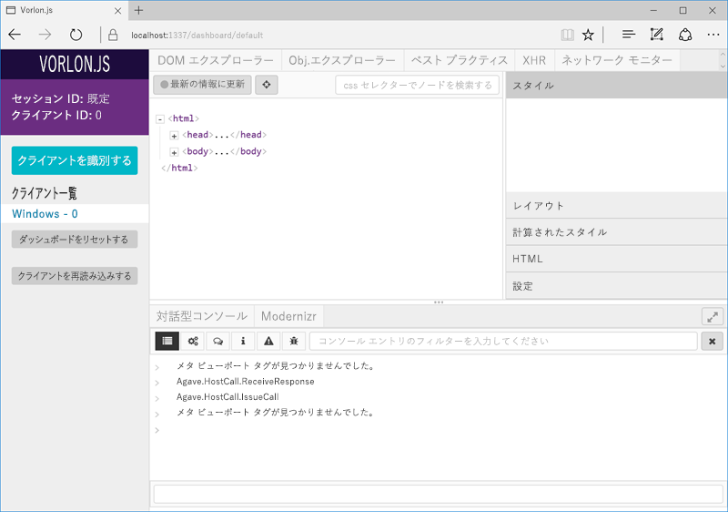
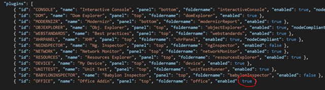

# iPad と Mac で Office アドインをデバッグする

Windows でのアドインの開発とデバッグには Visual Studio を使用できますが、iPad と Mac で使用して アドインをデバッグすることはできません。アドインは HTML と Javascript を使用して開発されているため、さまざまなプラットフォームで機能するように設計されていますが、さまざまなブラウザーで HTML の表示方法に微妙な違いがあります。この記事では、iPad または Mac で動作するアドインをデバッグする方法を説明します。 

## Vorlon.js を使用したデバッグ 

Vorlon.js は、リモートで動作しさまざまなデバイスで Web ページをデバッグできる、F12 ツールに似た Web ページ用のデバッガーです。詳しくは、[Vorlon の Web サイト](http://www.vorlonjs.com)をご覧ください。  

Vorlon をインストールして設定するには 

1.  [Node.js](https://nodejs.org) をまだインストールしていない場合は、インストールします。 

2.  npm を使用して、次のコマンドで Vorlon をインストールします。 `sudo npm i -g vorlon` 

3.  コマンド `vorlon` を使用して Vorlon サーバーを実行します。 

4.  ブラウザー ウィンドウを開き、Vorlon インターフェイスである [http://localhost:1337](http://localhost:1337) に進みます。

5.  次のスクリプト タグを、アドインの home.html ファイル (またはメイン HTML ファイル) の `<head>` セクションに追加します。
```    
<script src="http://localhost:1337/vorlon.js"></script>    
```  

>**注:**Vorlon の HTTPS を有効にして、Vorlon.js を使用してアドインをデバッグする必要があります。 手順については、「[VorlonJS plugin for debugging Office Addin](https://blogs.msdn.microsoft.com/mim/2016/02/18/vorlonjs-plugin-for-debugging-office-addin/)」 (Office アドインをデバッグするための VorlonJS プラグイン) をご覧ください。

これで、デバイスでアドインを表示したときに、アドインは常に Vorlon のクライアントのリスト (Vorlon インターフェイスの左側) に表示されます。リモートでの DOM 要素の強調表示、リモートでのコマンドの実行、その他多くの処理を実行できます。  



Office アドイン専用の Vorlon プラグインを使用すると、Office.js API との対話など、追加の機能を使用できるようになります。詳細については、ブログ投稿「[Office アドインをデバッグするための VorlonJS プラグイン](https://blogs.msdn.microsoft.com/mim/2016/02/18/vorlonjs-plugin-for-debugging-office-addin/)」を参照してください。Office アドイン プラグインを有効にするには 

1.  次のコマンドを使用して、ローカルで Vorlon.js GitHub リポジトリの dev 分岐のクローンを作成します。 
```
git clone https://github.com/MicrosoftDX/Vorlonjs.git
git checkout dev
npm install
```

2.  /Vorlon/Server/config.json にある **config.json** ファイルを開きます。Office アドイン プラグインをアクティブにするには、**enabled** プロパティを **true** に設定します。

 
