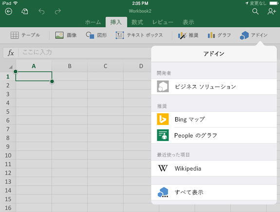
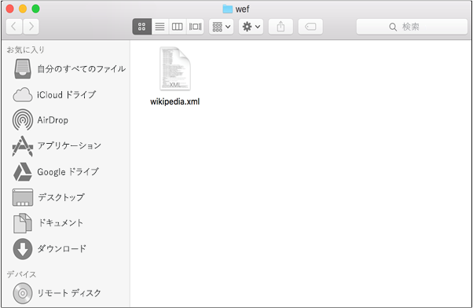
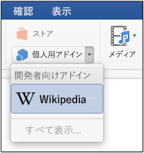
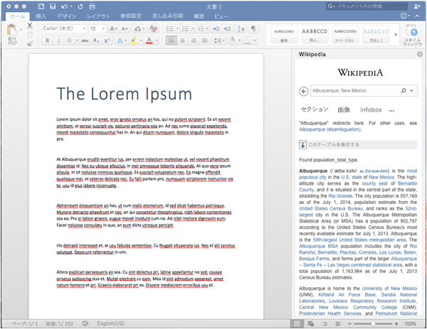

# テストのために iPad と Mac で Office アドインをサイドロードする

Office for iOS でアドインを実行するしくみを確認するには、iTunes を利用し、アドインのマニフェストを iPad にサイドロードするか、Office for Mac で直接、アドインのマニフェストをサイドロードします。このアクションでは、実行中、ブレークポイントを設定したり、アドインのコードをデバッグしたりできませんが、その動作を確認したり、UI が使えることと適切にレンダリングされることを確認できます。 

## Office for iOS の前提条件

- [iTunes](http://www.apple.com/itunes/download/) がインストールされた Windows または Mac コンピューター。
    
- [iPad 用 Excel](https://itunes.apple.com/us/app/microsoft-excel/id586683407?mt=8) がインストールされた iOS 8.2 以上の iPad と同期ケーブル。
    
- テスト対象アドインのマニフェスト .xml ファイル。
    

## Office for Mac の前提条件

- OS X v10.10 "Yosemite" 以降が動作し、 [Office for Mac](https://products.office.com/en-us/buy/compare-microsoft-office-products?tab=omac) がインストールされている Mac。
    
- Word for Mac バージョン 15.18 (160109)。
   
- Excel for Mac バージョン 15.19 (160206)。

- PowerPoint for Mac バージョン 15.24 (160614)
    
- テスト対象アドインのマニフェスト .xml ファイル。
    

## iPad 用 Excel または Word のアドインをサイドロードする

1. 同期ケーブルを使用し、iPad をコンピューターに接続します。iPad を初めてコンピューターに接続する場合、**[このコンピューターを信頼しますか?]** と問われます。**[信頼する]** を選択して続行します。

2. iTunes で、メニュー バーの下にある **[iPad]** のアイコンをクリックします。
    
    

3. iTunes の左側の  **[設定]** で、 **[App]** をクリックします。
    
    

4. iTunes の右側で、 **[ファイル共有]** までスクロールしてから、 **[アドイン]** 列で **[Excel]** または **[Word]** をクリックします。
    
    

5. **[Excel]** 列または **[Word ドキュメント]** 列の下部で、 **[ファイルの追加]** をクリックしてから、サイドロードするアドインのマニフェスト .xml ファイルを選択します。 
    
6. iPad で Excel または Word アプリを開きます。Excel または Word アプリがすでに実行されている場合は、 **[ホーム]** ボタンを選択して、アプリを閉じて再起動します。
    
7. ドキュメントを開きます。
    
8. **[挿入]** タブで **[アドイン]** をクリックします。 **[アドイン]** UI の **[開発者]** という見出しの下に、サイドロードしたアドインが表示され、挿入のために選択できるようになっています。
    
    

## Office for Mac でアドインをサイドロードする

> **注:**Outlook 2016 for Mac アドインをサイドロードするには、「[テストのために Outlook アドインをサイドロードする](sideload-outlook-add-ins-for-testing.md)」をご参照ください。

1. **Terminal** を開き、次のフォルダーの 1 つに移動します。そこにアドインのマニフェスト ファイルを保存します。`wef` フォルダーがコンピューターにない場合、作成します。
    
    - Word の場合: `/Users/<username>/Library/Containers/com.microsoft.Word/Data/documents/wef`    
    - Excel の場合: `/Users/<username>/Library/Containers/com.microsoft.Excel/Data/documents/wef`
    - PowerPoint の場合: `/Users/<username>/Library/Containers/com.microsoft.Powerpoint/Data/documents/wef`
    
2. **Finder** で `open .` コマンドを使用してフォルダーを開きます (ピリオドまたはドットを含みます)。アドインのマニフェスト ファイルをこのフォルダーにコピーします。
    
    

3. Word を起動し、ドキュメントを開きます。既に起動している場合は、Word を再起動します。
    
4. Word で、**[挿入]** > **[アドイン]** > **[個人用アドイン]** (ドロップダウン メニュー) を選択し、アドインを選択します。
    
    

  > **重要:**サイドロードしたアドインは [マイアドイン] ダイアログに表示されません。ドロップダウン メニュー内にのみ表示されます ([マイアドイン] の右にある小さい下向き矢印)。サイドロードしたアドインは、このリストに "Developer Add-ins" という見出しで表示されます。 
    
5. アドインが Word に表示されることを確認します。
    
    
    
> **注:**アドインはパフォーマンス上の利用から、Office for Mac でキャッシュされることが多いです。アドインの開発中に再読み込みする必要がある場合は、Users/<usr>/Library/Containers/com.Microsoft.OsfWebHost/Data/ フォルダーをクリアできます。 

## その他のリソース

- [iPad と Mac で Office アドインをデバッグする](../testing/debug-office-add-ins-on-ipad-and-mac.md)
    
