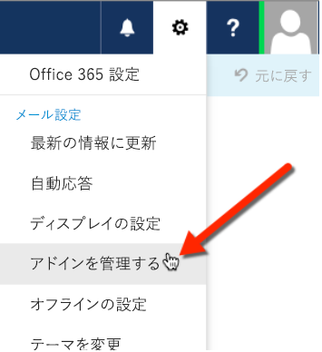
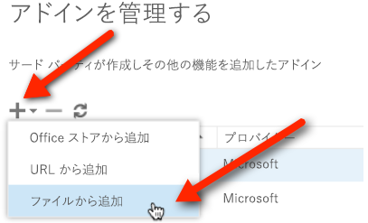

# テストのために Outlook アドインをサイドロードする

まずアドイン カタログに置かなくても、サイドロードを使用すると、テスト用に Outlook アドインをインストールすることができます。

 >**注** 他の Office スイート アプリケーションのアドインもサイドロードできます。詳細については、「[テストのために Office アドインをサイドロードする](create-a-network-shared-folder-catalog-for-task-pane-and-content-add-ins.md)」を参照してください。

## Outlook アドインをサイドロードするには

1. [Outlook Web App](https://outlook.office365.com) に移動します。
    
2. 右上のセクションにあるギア アイコンを選択し、 **[アドインの管理]** を選択します。
    
    

3. **[アドインの管理]** ページで、 **+** アイコンを選択して、 **[ファイルから追加]** を選択します。
    
    

4. カスタム アドインのマニフェスト ファイルを探してインストールします。インストール中にすべてのプロンプトを受け入れます。
    
これが終了したら、既存のメールを選択すると、アドインの含まれるメールのヘッダーの下に水平バーが表示されます。次に、メールを作成して、 **[アドイン]** (または **[アプリ]**) メニュー項目を選択すると、作業ウィンドウが表示されます。アドインを選択して、作業ウィンドウに表示されることを確認します。

    
