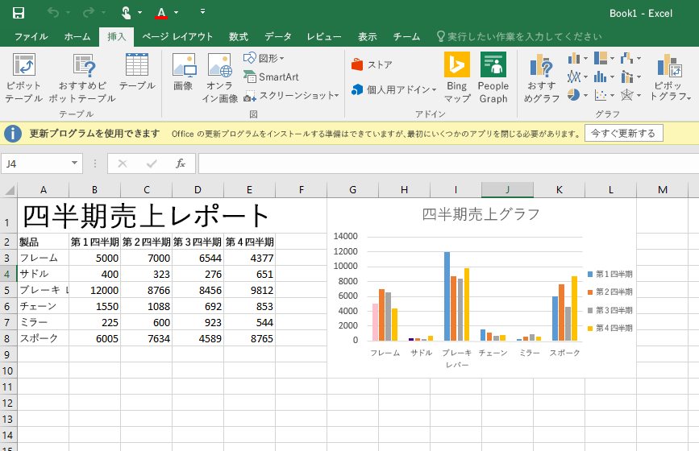

# Excel アドインのコード サンプル

_適用対象: Excel 2016、Office 2016_

クイック リファレンスとして、Excel 2016 の JavaScript API を使用するアドインのコード サンプルを以下に示します。 

**[四半期売上レポートのサンプル](https://github.com/OfficeDev/Excel-Add-in-JS-QuarterlySalesReport)**: Excel 2016 でデータをワークシートに読み込んでから、基本のグラフを作成する簡単な作業ウィンドウ アドイン。 

**[大学予算追跡ツールのサンプル](https://github.com/OfficeDev/Excel-Add-in-JS-CollegeBudgetTracker)**: Excel 2016 の JavaScript API を使用して大学予算追跡ツールを作成する方法を示す作業ウィンドウ アドイン。 

**[大学単位追跡ツールのサンプル](https://github.com/OfficeDev/Excel-Add-in-JS-CollegeCreditsTracker)**: Excel 2016 の JavaScript API を使用して大学単位追跡ツールを作成する方法を示す作業ウィンドウ アドイン。 

**[シート切り替えツールのサンプル](https://github.com/OfficeDev/Excel-Add-in-JS-SheetSwitcher)**: Excel 2016 でブックに新しいシートを追加して移動する方法を示す作業ウィンドウ アドイン。 

**[統合された売上レポートのサンプル](https://github.com/OfficeDev/Excel-Add-in-JS-ConsolidatedSalesReport)**: Excel 2016 で JavaScript API を使用して複数のワークシートからデータを統合する方法を示す作業ウィンドウ アドイン。 

**[範囲の蛍光ペンのサンプル](https://github.com/OfficeDev/Excel-Add-in-JS-RangeHighlighter)**: Excel 2016 で範囲 API を使用して一般的な操作を行う方法を示す作業ウィンドウ アドイン。

[Office 2016 JavaScript スニペット エクスプローラー](http://officesnippetexplorer.azurewebsites.net/#/snippets/excel) を使用して、一般的なシナリオのコード サンプル全体を参照し、新しい API の動作を理解することができます。 

### その他の技術情報

アドインを開発する際に Excel JavaScript API でできることは他にも数多くあります。以下は、利用可能なリソースのほんの一例です。 

*  [最初の Excel アドインをビルドする](build-your-first-excel-add-in.md)
*  [Excel アドインのプログラミングの概要](excel-add-ins-programming-overview.md)
*  [Excel アドインの JavaScript API リファレンス](excel-add-ins-javascript-reference.md)
