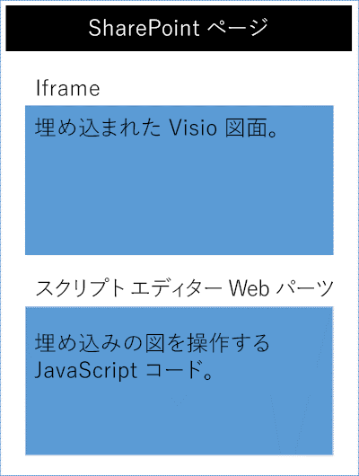

# <a name="visio-javascript-apis-reference"></a>Visio JavaScript API リファレンス

>**注:**Visio JavaScript API は、現在プレビューまたは運用環境では使用できません。 

Visio JavaScript API を使うと、SharePoint Online で Visio の図を埋め込むことができます。埋め込んだ Visio の図は、SharePoint ドキュメント ライブラリに保存され、SharePoint ページに表示されます。Visio 図を埋め込むには、その図を HTML の &lt;iframe&gt; 要素に表示します。そうすると、Visio JavaScript API を使用して、プログラムで埋め込み済みの図を使った作業ができるようになります。



Visio JavaScript API を使用して、次のことを行えます。

* ページや図形などの Visio 図の要素を操作する 
* Visio 図のキャンバスにビジュアル マークアップを作成する 
* 図面の中でのマウス イベントのカスタム ハンドラーを記述する 
* 図形テキスト、図形データ、およびハイパーリンクなどの図のデータをソリューションに公開する。

この記事では、Visio Online で Visio JavaScript API を使って SharePoint Online にソリューションをビルドする方法について説明します。また、**EmbeddedContext**、**RequestContext**、JavaScript プロキシ オブジェクトなどの API、および **sync()**、**Visio.run()**、**load()** のメソッドを使用するために知っておくべき主な概念について紹介します。コード例により、これらの概念を適用する方法を示します。

## <a name="embeddedcontext"></a>EmbeddedContext

EmbeddedContext オブジェクトは、開発者のフレームと Visio Online のフレームの間の通信を初期化します。

```js
OfficeExtension.Embedded.getEmbeddedContext({
                sessionInfo: sessionInfo,
                timeoutInMilliseconds: 60000,
                forceRefresh: true
            })
```

## <a name="requestcontext"></a>RequestContext

RequestContext オブジェクトは、Visio アプリケーションへの要求を容易にします。開発者のフレームと Visio Online アプリケーションは、異なる 2 つの iframe で実行するため、要求コンテキストは、開発者のフレームから Visio と、ページや図形などの関連するオブジェクトへのアクセスを取得する必要があります。次の例は、要求コンテキストを作成する方法を示しています。

```js
var ctx = new Visio.RequestContext();
```

## <a name="proxy-objects"></a>プロキシ オブジェクト

アドインで宣言され使用される Visio の JavaScript オブジェクトは、Visio 図面の実際のオブジェクトのプロキシ オブジェクトになります。プロキシ オブジェクトで実行されたすべてのアクションは、Visio では認識されません。また、Visio ドキュメントの状態は、ドキュメントの状態が同期されるまでプロキシ オブジェクトで認識されません。ドキュメントの状態は、```context.sync()``` の実行時に同期されます。

たとえば、ローカルの JavaScript オブジェクト getActivePage は、選択されたページを参照するように宣言されています。これは、このオブジェクトのプロパティと呼び出しメソッドの設定をキューに登録するために使用できます。Sync() メソッドが実行されるまで、これらのオブジェクトのアクションは認識されません。

```js
var activePage = ctx.document.getActivePage();
```

## <a name="sync"></a>sync()

要求のコンテキストで使用可能な **sync()** メソッドは、JavaScript のプロキシ オブジェクトと Visio の実際のオブジェクトの間で状態を同期させます。これは、このコンテキストでキューに入れられた命令を実行し、コードで使用するために読み込まれた Office オブジェクトのプロパティを取得することによって行われます。このメソッドは、同期処理が完了したときに解決される約束を返します。 

## <a name="visiorunfunctioncontext--batch-"></a>Visio.run(function(context) { batch })

**Visio.run()** は、Visio オブジェクト モデルに対してアクションを実行するバッチ スクリプトを実行します。このバッチ コマンドには、JavaScript のローカル プロキシ オブジェクトの定義と、ローカル オブジェクトと Visio オブジェクトの間で状態を同期し、解決される約束を返す **sync()** メソッドが含まれます。**Visio.run()** で要求をバッチ処理する利点は、約束が解決されるときに、実行中に割り当てられたすべての追跡ページ オブジェクトが自動的に解放されることです。run メソッドは、RequestContext を取り込み、約束 (通常は、単なる **ctx.sync()** の結果) を返します。バッチ操作は **Visio.run()** の外部で実行することができます。ただし、このようなシナリオでは、ページ オブジェクトの参照は、手動で追跡および管理する必要があります。 

## <a name="load"></a>load()

**load()** メソッドは、アドインの JavaScript レイヤーで作成されたプロキシ オブジェクトに設定を取り込むために使用されます。ドキュメントなどのオブジェクトを取得しようとすると、まず JavaScript レイヤーでローカル プロキシ オブジェクトが作成されます。このようなオブジェクトは、そのプロパティと呼び出しメソッドの設定をキューに登録するために使用できます。しかし、オブジェクトのプロパティや関係を読み取るためには、最初に **load()** メソッドと **sync()** メソッドを呼び出す必要があります。load() メソッドは、**sync()** メソッドが呼び出されたときに読み込まれる必要があるプロパティと関係を取り込みます。

以下に示すのは **load()** メソッドの構文です。

```js
object.load(string: properties); //or object.load(array: properties); //or object.load({loadOption});
```

1. **properties** は、読み込まれるプロパティ名やリレーションシップ名の一覧で、名前のコンマ区切りの文字列または配列として指定されます。詳細は、各オブジェクトの下の **.load()** メソッドを参照してください。
2. **loadOption** は、selection、expansion、top、skip の各オプションについて説明するオブジェクトを指定します。詳細については、オブジェクトの読み込みの[オプション](loadoption)を参照してください。

## <a name="example-printing-all-shapes-text-in-active-page"></a>例:アクティブ ページですべての図形テキストを印刷する

次の例では、図形の配列オブジェクトから図形テキストの値を印刷する方法を示します。**Visio.run()** メソッドには、命令のバッチが含まれています。このバッチの一部として、作業中のドキュメントの図形を参照するプロキシ オブジェクトが作成されます。これらのすべてのコマンドがキューに入れられ、**ctx.sync()** が呼び出されたときに実行されます。**sync()** メソッドが返す約束は、このメソッドを他の操作とチェーンにするために使用できます。

```js
Visio.run(function (ctx) {
   var page = ctx.document.getActivePage();
   var shapes = page.shapes;
   shapes.load();
   return ctx.sync().then(function () {
        for(var i=0; i<shapes.items.length;i++)
 {
            var shape = shapes.items[i];
     console.log("Shape Text: " + shape.text );
 }
});
}).catch(function(error) {
  richApiLog("Error: " + error);
  if (error instanceof OfficeExtension.Error) {
       console.log ("Debug info: " + JSON.stringify(error.debugInfo));
  }
});
```

## <a name="error-messages"></a>エラー メッセージ

エラーは、コードとメッセージで構成される error オブジェクトを使用して返されます。次の表は、発生する可能性があるエラー状態の一覧を示しています。

| error.code            | error.message |
|-----------------------|----------------------------------------------------------------|
|  InvalidArgument      | 引数が無効であるか、存在しません。または形式が正しくありません。 |
| GeneralException      | 要求の処理中に内部エラーが発生しました。 |
| NotImplemented        | 要求された機能は実装されていません。  |
| UnsupportedOperation  | 試行中の操作はサポートされていません。 |
| AccessDenied          | 要求された操作を実行できません。 |
| ItemNotFound          | 要求されたリソースは存在しません。 |

## <a name="get-started"></a>作業の開始

このセクションの例を使用して作業を開始できます。この例では、選択した図形の図形テキストを表示する方法を示します。最初に、SharePoint Online のページを作成するか、既存のページを編集します。ページで、スクリプト エディターの Web パーツを追加し、次のコードをコピーして貼り付けます。その後は、SharePoint Online に保存されている Visio 図面の URL を追加するだけです。

```js
<script src='https://visioonlineapi.azurewebsites.net/visio.embed.js' type='text/javascript'/> </script> 
 
Enter Visio File Url:<br/> 
<script language="javascript"> 
document.write("<input type='text' id='fileUrl' size='120'/>"); 
document.write("<input type='button' value='InitEmbeddedFrame' onclick='initEmbeddedFrame()' />"); 
document.write("<br />"); 
document.write("<input type='button' value='SelectedShapeText' onclick='getSelectedShapeText()' />"); 
document.write("<textarea id='ResultOutput' style='width:350px;height:60px'> </textarea>"); 
document.write("<div id='iframeHost' />"); 
 
var textArea; 
// Loads the Visio application and Initializes communication between developer frame and Visio online frame 
function initEmbeddedFrame() { 
        textArea = document.getElementById('ResultOutput'); 
 var sessionInfo = Math.random().toString(); 
 var origin = window.location["origin"] || window.location.protocol + "//" + window.location.host; 
 var iframeElement =  document.createElement("iframe"); 
 iframeElement.id = "embed-iframe"; 
 iframeElement.style.height = "900px"; 
 iframeElement.style.width = "100%"; 
 var url = document.getElementById('fileUrl').value; 
 if (!url) { 
     window.alert("File URL should not be empty"); 
 } 
 // APIs are enabled for EmbedView action only.    
 url = url.replace("action=view","action=embedview"); 
 url = url.replace("action=interactivepreview","action=embedview"); 
     
 iframeElement.src = url + "&EmbeddingPageOrigin=" + encodeURIComponent(origin) + "&EmbeddingPageSessionInfo=" + encodeURIComponent(sessionInfo); 
     // load the Visio online application in Iframe     
 document.getElementById("iframeHost").appendChild(iframeElement);   
          
      OfficeExtension.Embedded.getEmbeddedContext({ 
      sessionInfo: sessionInfo, 
     timeoutInMilliseconds: 60000, 
      forceRefresh: true 
 }).then(function (context) { 
     // Initilization is successful  
     OfficeExtension.Embedded._initInternalConfiguration("webembedrichapi.debug.js"); 
     textArea.value  = "Initilization is successful"; 
  }).catch(function (ex) { 
           // Initilization is failed :-( 
     textArea.value  = "Initilization is failed :-("; 
        }); 
     } 
 
// Code for getting selected Shape Text using the shapes collection object 
function getSelectedShapeText() { 
    Visio.run(function (ctx) {   
    var page = ctx.document.getActivePage(); 
     var shapes = page.shapes; 
       shapes.load(); 
           return ctx.sync().then(function () { 
          textArea.value = "Please select a Shape in the Diagram"; 
          for(var i=0; i<shapes.items.length;i++) 
      { 
         var shape = shapes.items[i]; 
                if ( shape.select == true) 
            { 
             textArea.value = shape.text; 
                 return; 
                } 
      } 
   }); 
     }).catch(function(error) { 
  textArea.value = "Error: "; 
  if (error instanceof OfficeExtension.Error) { 
   textArea.value += "Debug info: " + JSON.stringify(error.debugInfo); 
  } 
    }); 
} 
</script>
```

## <a name="open-api-specifications"></a>Open API の仕様

新しい API の設計と開発にあたり、[Open API の仕様](https://dev.office.com/reference/add-ins/openspec)ページでこれらに対するフィードバックの提供が可能になります。パイプラインの新機能をご確認いただき、設計の仕様に関する情報をお寄せください。 
