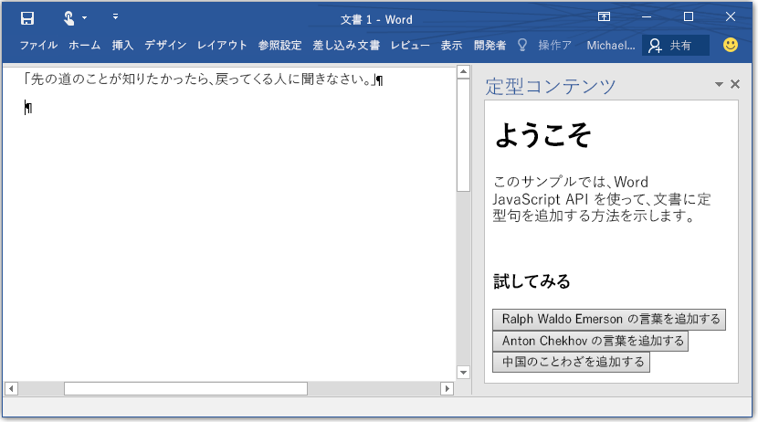

# Word アドイン

_適用対象:Word 2016、Word for iPad、Word for Mac_

Word アドイン JavaScript API ドキュメントへようこそ。Word JavaScript API は、Microsoft Office アプリケーションを拡張するための Office アドイン プログラミング モデルの一部です。このアドイン プログラミング モデルでは、Word の拡張機能をホストするために Web アプリケーションを使用してます。どの Web プラットフォームや言語でも Word を拡張できるようになりました。 

## API の概要

JavaScript API for Word の詳細を見ていく前に、この新しい Word アドイン オブジェクト モデルは Office 2013 のWord 用のモデルとは異なるものであるということを知っておくことは重要です。Office 2013 のアドイン モデルは型指定がなく、Office クライアントを拡張するための汎用 API を備えていました。以前のモデルもまだ Word 2016 に適用できますが、新しい Word オブジェクト モデルのほうを使用し始めることをお勧めします。アドイン プラットフォームの操作に慣れていない場合は、[プラットフォームの概要](https://msdn.microsoft.com/EN-US/library/office/jj220082.aspx)をお読みになることをお勧めします。 

新しい Word の JavaScript API では、ドキュメントや段落などのオブジェクトとの対話方法が変わります。新しい API は、これらのそれぞれのオブジェクトの取得や更新をする個々の非同期の API を提供するのではなく、Word で実行されている実際のオブジェクトに対応する JavaScript の “プロキシ”  オブジェクトを提供します。プロキシ オブジェクトのプロパティの読み取りと書き込みを同期的に行い、プロキシ オブジェクトに操作を実行する同期メソッドを呼び出すことによって、それらのプロキシ オブジェクトを直接操作することができます。プロキシ オブジェクトに対するこうした操作は実行中のスクリプトですぐには認識されません。そのために、**sync()** という名前のコンテキスト メソッドが用意されています。context.sync メソッドは、スクリプトのキューに入れられた命令を実行し、また読み込まれた Word オブジェクトのプロパティをスクリプトで使用するために取得することで、実行中の JavaScript オブジェクトと Office の実際のオブジェクトとの間で状態を同期します。  

## 最初の Word アドインを作成する

Word アドインは Word 内で実行され、Word 2016 で使用可能なWord JavaScript API を使用してドキュメントのコンテンツを操作することができます。実際のアドインの作成には、次の 2 つのパーツがあります。1) 任意の場所をホストできる Web アプリケーションと、2) Web アプリケーションがホストされている場所を検出するために Word で使用される[アドイン マニフェスト](https://msdn.microsoft.com/EN-US/library/office/fp161044.aspx) (マニフェストが提供する事柄はこれだけではありません。詳細については、「[プログラミングの概要](word-add-ins-programming-guide.md)」をご参照ください) です。

&gt;**Word アドイン = manifest.xml + Web アプリ**

### 設定する
このセクションでは、簡単な Web アプリとアプリ マニフェストを作成します。この Web アプリは、Word 文書に定型句を追加するためのアプリです。 

1 - ローカル ドライブに BoilerplateAddin という名前のフォルダーを作成します (たとえば、C:\\BoilerplateAddin)。以下の手順で作成するファイルはすべてこのフォルダーに保存します。

2 - アドイン ビュー用に home.html という名前のファイルを作成します。このアドインには 3 つのボタン (選択されると定型句を追加するもの) を含めます。home.html に次のコードを貼り付けます。

```html
    <!DOCTYPE html>
    <html>
      <head>
        <meta charset="UTF-8" />
        <meta http-equiv="X-UA-Compatible" content="IE=Edge" />
        <title>Boilerplate text app</title>    
        <script src="https://ajax.aspnetcdn.com/ajax/jQuery/jquery-2.1.4.min.js"></script>
        <script src="https://appsforoffice.microsoft.com/lib/1/hosted/office.js" type="text/javascript"></script>
        <script src="home.js" type="text/javascript"></script>
        </head>
        <body>
            <div>
                    <h1>Welcome</h1>
            </div>
            <div>
                    <p>This sample shows how to add boilerplate text to a document by using the Word JavaScript API.</p>
                    <br />
                    <h3>Try it out</h3>
                    <button id="emerson">Add quote from Ralph Waldo Emerson</button>
                    <button id="checkhov">Add quote from Anton Chekhov</button>
                    <button id="proverb">Add Chinese proverb</button>
            </div>
            <h3><div id="supportedVersion"/></h3>
        </body>
    </html>
```

3 - home.js という名前のファイルを作成して、そのファイルに次のコードを貼り付けます。これには、初期化コードと、Word 文書を変更するためのアドイン コードのすべてが含まれています。このコードは、Word 文書のカーソル位置、または選択部分に基づいて、テキストを挿入します。 

```javascript
    (function () {
        "use strict";

        // The initialize function is run each time the page is loaded.
        Office.initialize = function (reason) {
            $(document).ready(function () {
                
                // Use this to check whether the API is supported in the Word client.
                if (Office.context.requirements.isSetSupported('WordApi', 1.1)) {
                    // Do something that is only available via the new APIs
                    $('#emerson').click(insertEmersonQuoteAtSelection);
                    $('#checkhov').click(insertChekhovQuoteAtTheBeginning);
                    $('#proverb').click(insertChineseProverbAtTheEnd);
                    $('#supportedVersion').html('This code is using Word 2016 or greater.');
                }
                else {
                    // Just letting you know that this code will not work with your version of Word.
                    $('#supportedVersion').html('This code requires Word 2016 or greater.');
                }    
            });
        };

        function insertEmersonQuoteAtSelection() {
            Word.run(function (context) {

                // Create a proxy object for the document.
                var thisDocument = context.document;

                // Queue a command to get the current selection. 
                // Create a proxy range object for the selection.
                var range = thisDocument.getSelection();

                // Queue a command to replace the selected text.
                range.insertText('"Hitch your wagon to a star."\n', Word.InsertLocation.replace);

                // Synchronize the document state by executing the queued commands, 
                // and return a promise to indicate task completion.
                return context.sync().then(function () {
                    console.log('Added a quote from Ralph Waldo Emerson.');
                });  
            })
            .catch(function (error) {
                console.log('Error: ' + JSON.stringify(error));
                if (error instanceof OfficeExtension.Error) {
                    console.log('Debug info: ' + JSON.stringify(error.debugInfo));
                }
            });
        }

        function insertChekhovQuoteAtTheBeginning() {
            Word.run(function (context) {

                // Create a proxy object for the document body.
                var body = context.document.body;

                // Queue a command to insert text at the start of the document body.
                body.insertText('"Knowledge is of no value unless you put it into practice."\n', Word.InsertLocation.start);

                // Synchronize the document state by executing the queued commands, 
                // and return a promise to indicate task completion.
                return context.sync().then(function () {
                    console.log('Added a quote from Anton Chekhov.');
                });  
            })
            .catch(function (error) {
                console.log('Error: ' + JSON.stringify(error));
                if (error instanceof OfficeExtension.Error) {
                    console.log('Debug info: ' + JSON.stringify(error.debugInfo));
                }
            });
        }    

        function insertChineseProverbAtTheEnd() {
            Word.run(function (context) {

                // Create a proxy object for the document body.
                var body = context.document.body;

                // Queue a command to insert text at the end of the document body.
                body.insertText('"To know the road ahead, ask those coming back."\n', Word.InsertLocation.end);

                // Synchronize the document state by executing the queued commands, 
                // and return a promise to indicate task completion.
                return context.sync().then(function () {
                    console.log('Added a quote from a Chinese proverb.');
                });  
            })
            .catch(function (error) {
                console.log('Error: ' + JSON.stringify(error));
                if (error instanceof OfficeExtension.Error) {
                    console.log('Debug info: ' + JSON.stringify(error.debugInfo));
                }
            });
        }    
    })();
```

4 - BoilerplateManifest.xml という名前の XML ファイルを作成して、このファイルに次のコードを貼り付けます。これは、場所または表示名などのアドインに関する情報を検出するために Word が使用するマニフェスト ファイルです。
```xml
<?xml version="1.0" encoding="UTF-8"?>
    <OfficeApp xmlns="http://schemas.microsoft.com/office/appforoffice/1.1" 
               xmlns:xsi="http://www.w3.org/2001/XMLSchema-instance" 
               xsi:type="TaskPaneApp">
        <Id>2b88100c-656e-4bab-9f1e-f6731d86e464</Id>
        <Version>1.0.0.0</Version>
        <ProviderName>Microsoft</ProviderName>
        <DefaultLocale>en-US</DefaultLocale>
        <DisplayName DefaultValue="Boilerplate content" />
        <Description DefaultValue="Insert boilerplate content into a Word document." />
        <Hosts>
            <Host Name="Document"/>
        </Hosts>
        <DefaultSettings>
            <SourceLocation DefaultValue="\\MyShare\boilerplate\home.html" />
        </DefaultSettings>
        <Permissions>ReadWriteDocument</Permissions>
    </OfficeApp>
```

5 - GUID を生成して、<code>OfficeApp/Id</code> 要素の値を GUID に置き換えます。

6 - すべてのファイルを保存します。これで、最初の Word アドインが作成できました。 

7 - ネットワーク フォルダー (\\\MyShare\boilerplate など) を作成するか、または[フォルダーをネットワークで共有](https://technet.microsoft.com/ja-jp/library/cc770880.aspx)して、home.js、home.html、BoilerplateManifest.xml をその場所にコピーします。

8 - BoilerplateManifest.xml の<code>SourceLocation</code> を編集して、home.html の場所を指すようにします。 

この時点で、初めてのアドインが配置されたことになります。次に、Word がアドインを検索する場所を把握できるようにする必要があります。

1. Word を起動し、ドキュメントを開きます。
2. [**ファイル**] タブを選択し、[**オプション**] を選択します。
3. [**セキュリティ センター**] を選択し、[**セキュリティ センターの設定**] ボタンを選択します。
4. **[信頼されているアドイン カタログ]** を選択します。
5. **[カタログの URL]** ボックスに、BoilerplateManifest.xml があるフォルダー共有へのパスを入力して、**[カタログの追加]** を選択します。
6. [**メニューに表示する**] チェック ボックスをオンにし、[**OK**] を選択します。
7. これらの設定が Office を次回起動したときに適用されることを示すメッセージが表示されます。Word を終了して、再起動します。 

### 試してみる

次は、作成したアドインを実行します。次の手順を実行して、動作を確認します。

1. Word 文書を開きます。 
2. Word 2016 の**[挿入]** タブで、**[マイ アドイン]** を選択します。 
3. **[共有フォルダー]** タブを選択します。
4. **[定型コンテンツ]**、**[挿入]** の順に選択します。
5. アドインが作業ウィンドウに読み込まれます。読み込まれたときの状態については、図 1 を参照してください。
6. 定型句を Word 文書に入力するボタンを選択します。


**図 1.Word に読み込まれた定型句のコンテンツ アドイン**


## 詳細を見る

Word の拡張の詳細については、[「Word アドインのプログラミング ガイド」](word-add-ins-programming-guide.md)をご参照ください。利用可能なオブジェクトの詳細については、[「Word アドイン JavaScript リファレンス」](word-add-ins-javascript-reference.md)をご参照ください。

## フィードバックをお寄せください

お客様からのフィードバックを重視しています。 

* ドキュメントを確認していだだき、ドキュメントに関する質問や問題があれば、直接このリポジトリに[問題を送信](https://github.com/OfficeDev/office-js-docs/issues)してお知らせください。
* プログラミングの経験と、今後のバージョン、コード サンプルなどで希望されるものについてお知らせください。ご提案やアイデアの入力には、[このサイト](http://officespdev.uservoice.com/)をご使用ください。

## その他の技術情報

* [Office アドイン](https://msdn.microsoft.com/en-us/library/office/jj220060.aspx)
* [Office アドインを使う](http://dev.office.com/getting-started/addins)
* &lt;a herf="https://github.com/OfficeDev?utf8=%E2%9C%93&amp;query=Word"&gt;Word add-ins on GitHub&lt;/a&gt;
